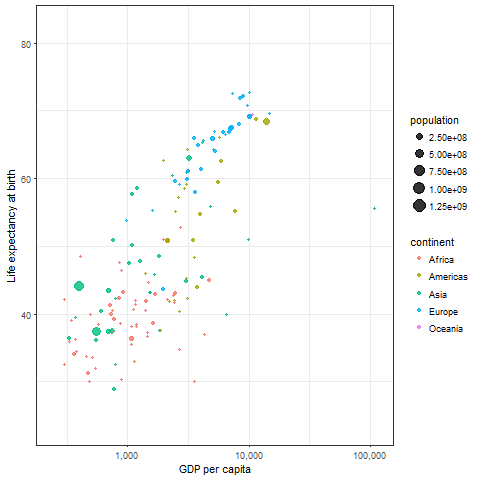
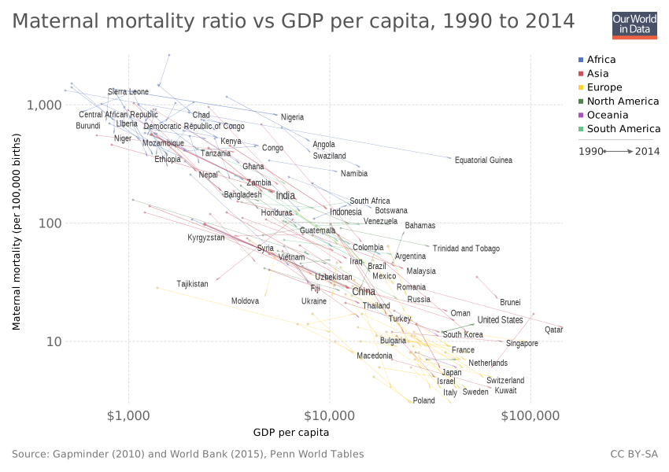
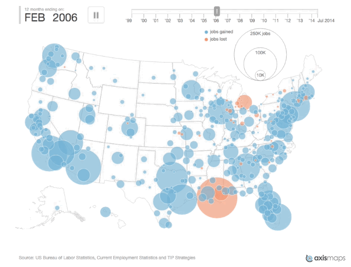
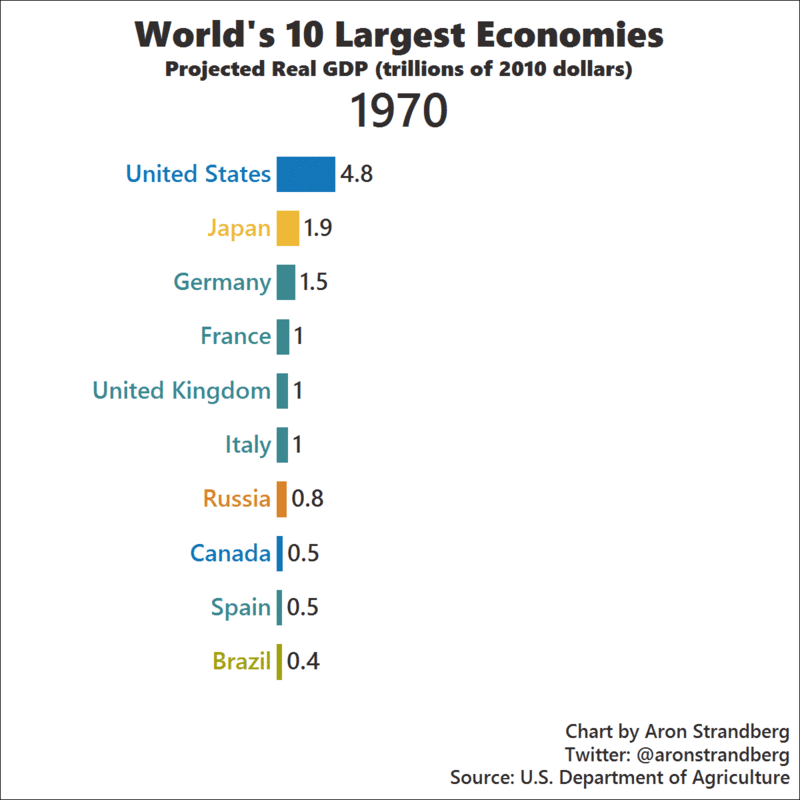
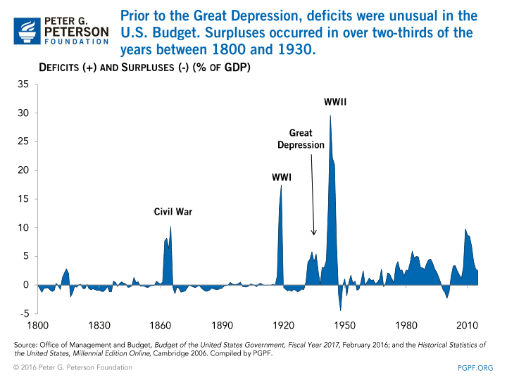
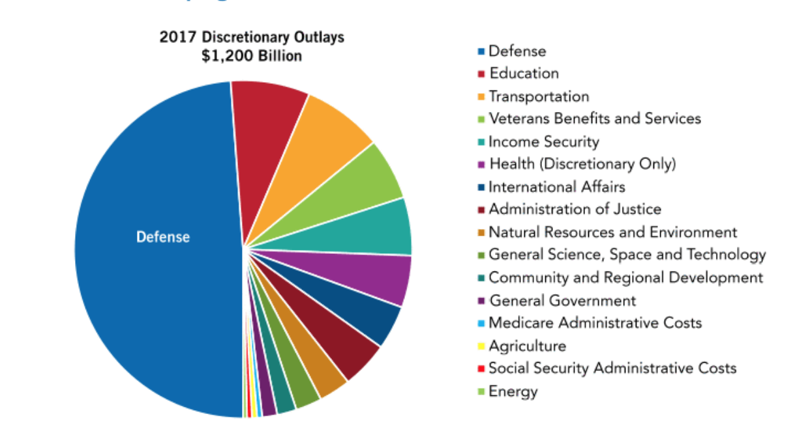
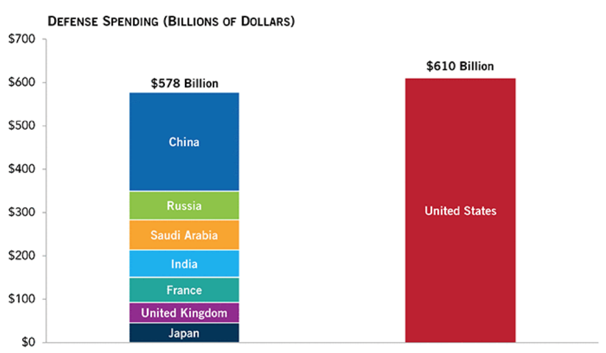

```{r Setup, include = F}
options(htmltools.dir.version = FALSE)
library(pacman)
p_load(leaflet, ggplot2, ggthemes, viridis, dplyr, magrittr, knitr)
# Define pink color
red_pink <- "#e64173"
# Notes directory
dir_slides <- "~/Dropbox/UO/Teaching/EC421W19/LectureNotes/01Intro/"
# Knitr options
opts_chunk$set(
  comment = "#>",
  fig.align = "center",
  fig.height = 7,
  fig.width = 10.5,
  # dpi = 300,
  # cache = T,
  warning = F,
  message = F
)
```

class: inverse, center, middle

# Book Chapter 1, 2 


---
class: inverse, center, middle

# About Me

---
# About Me

## Education

- .hi[Ph.D.] student in the Department of .mono[Economics]

- .hi[M.A.] in .mono[Economics] from the University of Oregon

- .hi[B.A.] in .mono[Computer Science] from Nanjing University

  - .mono[Economics] at the University of Sydney and the University of Cambridge

- Research interests: .mono[Macroeconomics Theory, Computational Methods, Heterogeneous Agent Modeling, Monetary Policy.]

---
# About Me

## Availability

- Office hours: .hi[Friday] from .hi[12:15 to 13:45pm]
- Zoom Link: See the announcement on Canvas or Syllabus. 
- email: .hi[jungangl@uoregon.edu]

---
# About Me

## Teaching Style

- I bring .hi[real-world] connections

- I train you to be a .hi[critical thinker]

- I ask .hi[questions], and I expect you to answer

--

- __

## Good Dynamics

- Raise your hand and .hi[ask] me to slow down

- .hi[Ask] me to repeat any materials you didn't get

- Be proactive and .hi[ask] for help whenever you need

--

---

class: inverse, center, middle
# Syllabus

---
# Syllabus

## Final Grade 

- .hi[Homework 28%]: Seven Short Homeworks: Six 3.5%'s and one 7%  
- .hi[In-class Quizzes 8%]: Two Quizzes: 4% each (redeemable)

- .hi[Midterm 32%]: Tuesday, Nov 3 at 12:15 pm 

- .hi[Final 32%]: Wednesday, Dec 9 at 8:00 am

---

# Syllabus

## Final Grade 

- .hi[Bonus 5%]: Ten In-class Bonus Questions: 0.5% each, five of them will be not be graded, and you will get the full credit for simply submitting it. I won't tell you which five are these.


---

# Syllabus

## Letter Grade
 
- The letter grade is what matters to your GPA. 

- Letter grades are given based on your Final Grade. Depending on the class performance, I reserve the right to curve the letter grades:
  - 92 - 105: __A__
  - 90 - 92: __A-__
  - 87 - 89: __B+__
  - 83 - 86: __B__
  - 80 - 82: __B-__
  - 70 - 79: __C+__
  - 60 - 69: __C__
  - 0 - 59: __F__ 
 
 
---

class: inverse, center, middle
# Course Objective


---

# Course Objective

## Become an Economist

- Learn .hi[Vocabulary] 

- Use and Read .hi[Data]

- Understand Human .hi[Incentives]

- Describe Macroeconomic .hi[Dynamics] ( .hi[Intuition] and .hi[Models])

- Evaluate .hi[Policies]

---

# Course Objective

## Become Analytic

- .hi.purple[Think] Critically 

- .hi.purple[Present] Arguments

- .hi.purple[Transfer] Skills & Knowledge  

- .hi.purple[Read] Economics News 

---

class: inverse, center, middle
# Macroeconomics Overview

---

# Macroeconomics

## What?

- __Definition__: A branch of economics dedicated to understanding an economy as a whole.

- __Aspects__: Performance, Structure, Behavior, Decision-Making

--

- __

## Why?

- __Intellectual Curiosity__: Understand (a part of) the World 

- __Career__: Business is subject to the impact of macroeconomics 

- __Life__: Make better life decisions

--

---

# Macroeconomics - GDP

## GDP

GDP per capita is .hi[closely related] to life expectancy:

<center>
 
</center>

---

# Macroeconomics - GDP

## GDP

GDP per capita is .hi.purple[closely related] to maternal mortality rate:

<center>
 
</center>

---

# Macroeconomics - GDP

## GDP

- Economics is a social science that studies __people__

- At the end of the day, __People__ want to be happy

- Measuring the __performance of an economy__ boils down to how happy the people are. 

- __GDP__ (Gross Domestic Production) is a  commonly used measure for happiness (standard of living). 

- If a country produces more goods in value during a period (higher GDP), __in general__, the people in that country have more resources to be __happier__. 

---

# Macroeconomics - GDP

## GDP

- In the 19th century, economists had __no measure of aggregate activity__. They had to put bits and pieces of information such as the shipments of iron ore or sales at some department stores to __infer__ what was happening to the economy. 

- Measures of aggregate output have been published on a __regular basis__ in the United States since October 1947.

- The measure of aggregate output in the national income accounts is called the gross domestic product, or __GDP__, for short.

---

# Macroeconomics - GDP

## GDP Calculation 

There are .hi[two ways] to calculate GDP

- Production Side

- Income Side

Theoretically, these two sides should give you the .hi[same results]. 

---

# Macroeconomics - GDP

## GDP - Production Side

- GDP Is the .hi[Sum of Value Added] in the Economy .hi[during] a Given Period. 

  - Suppose there are firms index by $j$, and there are $J$ of them in the economy. Firm $j$ produces good $j$.
  
  - The quantity of good $\mathop{j}$ is $\mathop{q_j}$ during this period. 
  
  - Choose a year, say 2010, and get the market value (price) of good $j$ is $p_j$ for that year.
  
  - The GDP measured in 2010 dollar is $Y = q_1 p_1 + q_2 p_2 + \dots + q_J p_J$

---

# Macroeconomics - GDP

```{r echo = F, cache = T}
library(knitr)
library(kableExtra)
dt <- data.frame("Firms" = c("Pizza", "Beer", "Coffee"),
                 "Quantity2010" = c(50, 100, 150),
                 "Quantity2018" = c(100, 200, 300),
                 "Price2010" = c(8, 4, 1), 
                 "Price2018" = c(10, 5, 2))
dt %>%
  kable() %>%
  kable_styling(bootstrap_options = c("striped", "hover", "condensed", "responsive"))
```

- __

--

- Compute GDP of the year 2010 measured in 2018 dollar $Y_{2010}^{2018}$

--

  - $q_1, q_2, q_3 = 50, 100, 150$ and $p_1, p_2, p_3 = 10, 5, 2$
  
  - $Y_{2010}^{2018} = q_1 p_1 + q_2 p_2 + q_3 p_3 = 50 \times 10 + 100 \times 5 + 150 \times 2 = 1300$
  
---

# Macroeconomics - GDP
  
```{r echo = F, cache = T}
library(knitr)
library(kableExtra)
dt <- data.frame("Firms" = c("Pizza", "Beer", "Coffee"),
                 "Quantity2010" = c(50, 100, 150),
                 "Quantity2018" = c(100, 200, 300),
                 "Price2010" = c(8, 4, 1), 
                 "Price2018" = c(10, 5, 2))
dt %>%
  kable() %>%
  kable_styling(bootstrap_options = c("striped", "hover", "condensed", "responsive"))
```

--

- Compute GDP of the year 2018 measured in 2010 dollar

--

  - $q_1, q_2, q_3 = 100, 200, 300$ and $p_1, p_2, p_3 = 8, 4, 1$
  
  - $Y_{2018}^{2010} = q_1 p_1 + q_2 p_2 + q_3 p_3 = 100 \times 8 + 200 \times 4 + 300 \times 1 = 1900$
  
--

---

# Macroeconomics - GDP

## GDP - Income Side

- GDP Is the .hi[Sum of Incomes] in the Economy .hi[during] a Given Period.

  - Suppose there are people index by $i$ and there are $I$ of them in the economy
  
  - Person $i$ works $h_i$ hours during this period
  
  - Person $i$'s wage (dollar per hour) is $w_i$ during this period. 
  
  - The GDP is $Y = h_1 w_1 + h_2 w_2 + \dots + h_N w_N$


---

# Macroeconomics - Inflation

## (Hyper) Inflation

<center>
 
</center>


---

# Macroeconomics - Inflation

## (Hyper) Inflation

<center>
 
</center>


---
# Inflation

## Inflation Computation (Pt.1)

- .hi[Inflation] measures the .hi[price change in percentage]. When we compute the inflation, we need three things: 
  1. Base Year: $\tau$ 
  2. Start Year: $T_0$
  3. End Year:  $T_1$
  
  - Formula: $\Pi_{T_1, T_0}^{\tau} = \frac{CPI^{\tau}_{T_1}}{CPI^{\tau}_{T_0}} - 1$

---

# Inflation

## Inflation Computation (Pt.2)

- __Price (CPI)__ measures the __value of the basket of goods__ relative to the __base year__. When we compute the CPI, we need two things:
  1. Value of Basket of Goods Evaluated at the __Base Year Price__: $V_\tau$ 
  2. Value of Basket of Goods Evaluated at the __Year of Interest's Price__: $V_T$
  - Formula: $CPI^{\tau}_{T} = V_{T} / V_{\tau}$

---

# Inflation

## Inflation Computation (Pt.3)

- __The basket of goods__ is a fixed set of consumer products and services. 

- This basket contains what an __average consumer__ consumes for that year. 

- The basket is __updated__, and CPI will need revisions as long as there are significant changes in consumer buying habits or shifts in population distribution or demographics.

- [Check out the full list through this link](https://docs.google.com/spreadsheets/d/1C2nJ12sdxMae7tsC76ba6Hfe9DgXTxckcUCVGr6Eygs/edit)

---

# Inflation

Suppose in an __imaginary country__, the basket of goods only contains __pizza, beer, coffee__, and the base year is $2010$. The consumption quantities and prices are given by 

```{r echo = F, cache = T}
library(knitr)
library(kableExtra)
dt <- data.frame("Firms" = c("Pizza", "Beer", "Coffee"),
                 "Quantity" = c(50, 100, 150),
                 "Price2010" = c(8, 4, 1), 
                 "Price2015" = c(8, 3, 2),
                 "Price2018" = c(10, 5, 2))
dt %>%
  kable() %>%
  kable_styling(bootstrap_options = c("striped", "hover", "condensed", "responsive"))
```


---

# Macroeconomics - Recession

## Recession

<center>
 
</center>

---

# Macroeconomics - Recession

## Recession 

- A period of __temporary__ economic __decline__. Characterized by lower output and higher unemployment than what we normally observe.

- Recession is __bad__. People lose their jobs, houses, insurance. 

- __Who__ gets hurt the most when a recession hits the economy?

- __Causes__ for recessions. 

- What should __we__ (as you and me) do? (Consumption, Saving, Asset Portfolio)

- What should __policymakers__ do? (Monetary Policy, Fiscal Policy)


---

# Macroeconomics - Interest Rate

## Interest Rate

<center>
 
</center>


---

# Macroeconomics - Growth

## Growth

<center>
 
</center>

---
# Macroeconomics - Growth

## Growth

.center[<video width="500" height="470" controls>
  <source src="https://cdn.howmuch.net/content/images/world-economy-as-a-living-organism.mp4" type="video/mp4">
</video>]

---

# Macroeconomics - Growth

## Growth

- Is growth a __historical trend__? 

- What makes an economy grow in the first place? __Human Capital, Physical Capital, Technology, Institution, Culture__ ...

- Why do __some__ economies grow __whereas__ some others do not? 

- Can the less prosperous countries __learn from__ the prosperous countries? 

---

# Macroeconomics - Government Deficit

## Government Deficit

<center>
 
</center>


---

# Macroeconomics - Deficit

## Government Deficit

<center>
 
</center>


---

# Macroeconomics - Deficit

## Government Deficit

<center>
 
</center>

---

# Macroeconomics - Deficit

## Government Deficit

- The U.S. federal budget deficit for the fiscal year 2020 is __$1.103 trillion__

- The __deficit__ occurs because the U.S. __government spending__ of $4.746 trillion is higher than its __tax revenue__ of 
__$3.422 trillion__.

- The deficit is __18 percent greater__ than last year.

---

# Macroeconomics - Deficit

## Government Deficit

- Deficit = __Government Spending__ - __Tax Revenue__

- Why do we need __Government Spending__ 

  - __Boost Economy__ (That's why political parties overspend on purpose)

  - Provide __Public Goods__ 
  
      - Flood Control in the Netherlands v.s. Hurricane Katrina
      
      - Education
      
      - Defense
---

# Macroeconomics - Deficit

## Government Deficit

- Why do we need __Tax__

  - To Finance __Government Spending__
  
  - To Provide __Incentives (Externalities)__
   
- Why don't we like __Tax__

  - American __Traditional Value__ (Small Government)
  
  - __Market Distortion__ (Can be partially avoided)
  
  - __Coporation Lobbying__ (Tax Cuts $\implies$ Efficiency $\implies$ More Revenue)
    

---

# Macroeconomics - The Big Picture

## Money Flow

*Reverse the money flow, you get the goods/assets flow*

<center>
 
</center>

---


# Macroeconomics - The Big Picture

## Money Flow

Markets: 

- .hi[Goods Market] - *Next Two Lectures*

- Money Market

- Labor Market

- International Financial Market

Policies

- Monetary Policy

- Fiscal Policy


---
exclude: true

```{R, generate pdfs, include = F}
system("decktape remark 01_intro_overview.html 01_intro_overview.pdf --chrome-arg=--allow-file-access-from-files")
```


