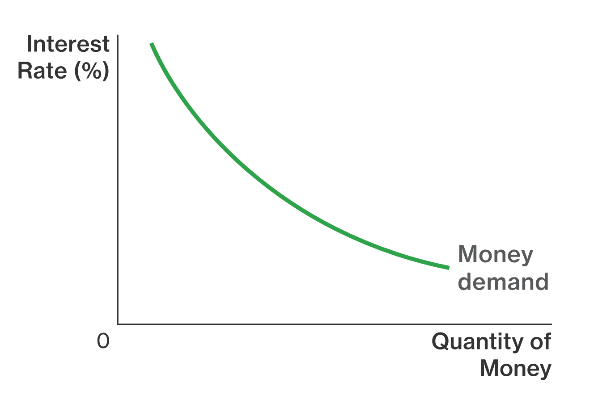
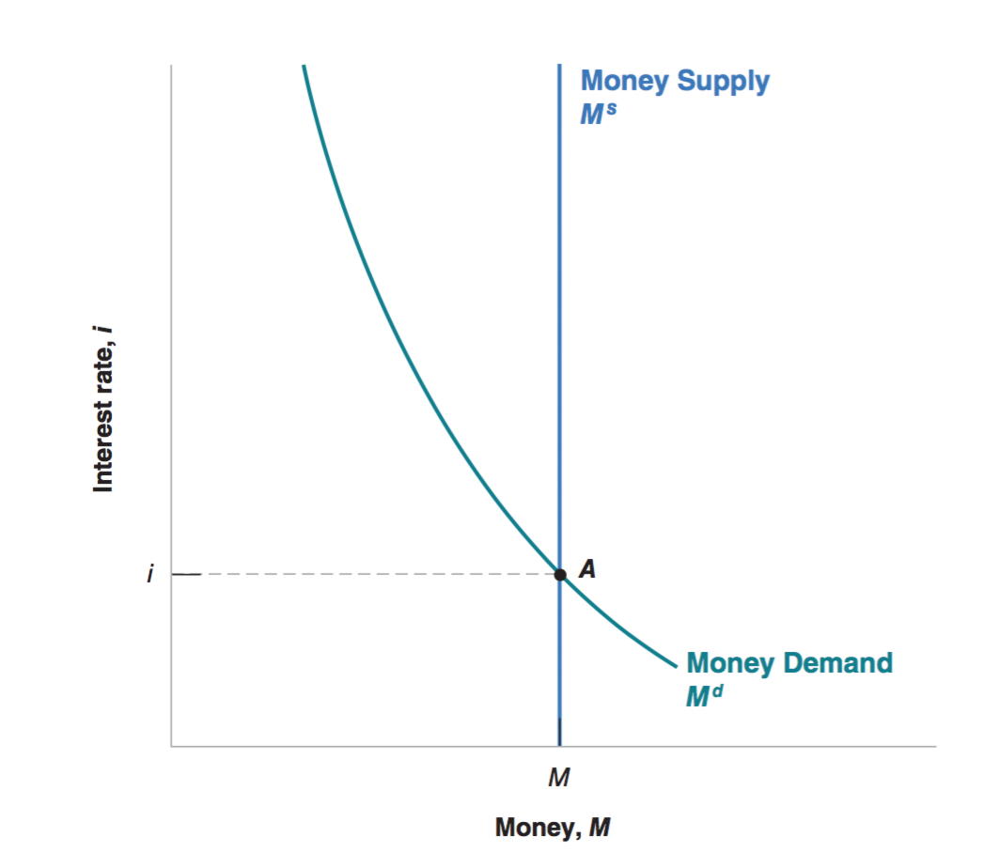

class: inverse, center, middle

```{R, setup, include = F}
options(htmltools.dir.version = FALSE)
library(pacman)
p_load(
  broom, here, tidyverse,
  latex2exp, ggplot2, ggthemes, viridis, extrafont, gridExtra,
  kableExtra,
  dplyr, magrittr, knitr, parallel
)
# Define pink color
red_pink <- "#e64173"
turquoise <- "#20B2AA"
grey_light <- "grey70"
grey_mid <- "grey50"
grey_dark <- "grey20"
# Dark slate grey: #314f4f
# Knitr options
opts_chunk$set(
  comment = "#>",
  fig.align = "center",
  fig.height = 7,
  fig.width = 10.5,
  warning = F,
  message = F
)
opts_chunk$set(dev = "svg")
options(device = function(file, width, height) {
  svg(tempfile(), width = width, height = height)
})
# A blank theme for ggplot
theme_empty <- theme_bw() + theme(
  line = element_blank(),
  rect = element_blank(),
  strip.text = element_blank(),
  axis.text = element_blank(),
  plot.title = element_blank(),
  axis.title = element_blank(),
  plot.margin = structure(c(0, 0, -0.5, -1), unit = "lines", valid.unit = 3L, class = "unit"),
  legend.position = "none"
)
theme_simple <- theme_bw() + theme(
  line = element_blank(),
  panel.grid = element_blank(),
  rect = element_blank(),
  strip.text = element_blank(),
  axis.text.x = element_text(size = 18, family = "STIXGeneral"),
  axis.text.y = element_blank(),
  axis.ticks = element_blank(),
  plot.title = element_blank(),
  axis.title = element_blank(),
  # plot.margin = structure(c(0, 0, -1, -1), unit = "lines", valid.unit = 3L, class = "unit"),
  legend.position = "none"
)
theme_axes_math <- theme_void() + theme(
  text = element_text(family = "MathJax_Math"),
  axis.title = element_text(size = 22),
  axis.title.x = element_text(hjust = .95, margin = margin(0.15, 0, 0, 0, unit = "lines")),
  axis.title.y = element_text(vjust = .95, margin = margin(0, 0.15, 0, 0, unit = "lines")),
  axis.line = element_line(
    color = "grey70",
    size = 0.25,
    arrow = arrow(angle = 30, length = unit(0.15, "inches")
  )),
  plot.margin = structure(c(1, 0, 1, 0), unit = "lines", valid.unit = 3L, class = "unit"),
  legend.position = "none"
)
theme_axes_serif <- theme_void() + theme(
  text = element_text(family = "MathJax_Main"),
  axis.title = element_text(size = 22),
  axis.title.x = element_text(hjust = .95, margin = margin(0.15, 0, 0, 0, unit = "lines")),
  axis.title.y = element_text(vjust = .95, margin = margin(0, 0.15, 0, 0, unit = "lines")),
  axis.line = element_line(
    color = "grey70",
    size = 0.25,
    arrow = arrow(angle = 30, length = unit(0.15, "inches")
  )),
  plot.margin = structure(c(1, 0, 1, 0), unit = "lines", valid.unit = 3L, class = "unit"),
  legend.position = "none"
)
theme_axes <- theme_void() + theme(
  text = element_text(family = "Fira Sans Book"),
  axis.title = element_text(size = 18),
  axis.title.x = element_text(hjust = .95, margin = margin(0.15, 0, 0, 0, unit = "lines")),
  axis.title.y = element_text(vjust = .95, margin = margin(0, 0.15, 0, 0, unit = "lines")),
  axis.line = element_line(
    color = grey_light,
    size = 0.25,
    arrow = arrow(angle = 30, length = unit(0.15, "inches")
  )),
  plot.margin = structure(c(1, 0, 1, 0), unit = "lines", valid.unit = 3L, class = "unit"),
  legend.position = "none"
)
```

# Book Chapter 4

---
class: inverse, middle, center

# Overview

---

# Overview

## Overview

Why study .hi[financial markets]?

A: To understand how the .hi[interest rate] is determined in the short run!


The goods market we outlined in Chapter 3 did not include an interest rate, but in the real world, the interest rate is mentioned in the news almost every day!

The Goods Market model does not have a role for a Central Bank like .hi[the Federal Reserve].
In short, we study financial markets to understand a realistic element of our economic activity!

---

# Overview

## Overview

Recall that the goods market model is built to study one specific .hi[macroeconomic variable] - .hi.purple[aggregate output]. The financial market model we are going to build is intended to study the behavior of another macroeconomics variable - .hi.purple[interest rate]. 

Just like any other market where selling and buying happens, the financial market has its own commodity - .hi[money]. 

- How many types of money are there? 

- How can we sell and buy money? 

- What do you use to buy money? 

- Who buys money? 


---

# Overview

## Overview

There are .hi[two types of money]: 

.hi.purple[Now Money] - we also call this .hi[money]. It is the money we use to buy goods like *groceries, services, food*.  

.hi.purple[Future Money] - we call this .hi[asset]. It is just like the other commodities, it is something we can buy using money today. 

Each household decides on how much now money they should hold and how much future money they should hold. 
---

# Overview

## Overview

.hi.purple[Now Money]:

(Now) Money, which you can use for .hi[transactions], .hi[pays no interest]. 

- __Currency__: paper money, coins, etc.

- __Checkable Deposits__: deposits you have stored with a bank. 

Money is used to make transactions, but it earns __no interest__. 


---

# Overview

## Overview

.hi.purple[Now Money]: 

__Demand__ for (now) money comes from each individual. At the end of the day, it is people who need cash to complete transactions. 

Money can be used for transactions because money is .hi[liquid] compared to assets (future money). 

---

# Overview

## Overview

.hi.purple[Now Money]: 

__Supply__ for (now) money comes from:


--

.hi[The federal reserve bank] and .hi[commerical banks]

(Monetary Policy)

---

# Overview

## Overview

.hi.purple[Now Money]:

- Now money is used to fulfill the transactions they need to make. 

- The more transactions they need to make, the more now money they need. 

- What is the .hi[opportunity cost] of now money? - having .hi[less future money]

---

# Overview

## Overview

.hi.purple[Future Money]: 

There are lots of types of .hi[future money (assets)] one can buy. 

- Government bonds

- Houses

- Stock Investments (Securities)

- etc

However, to simplify our analysis, we abstract from these various types of assets and only focus on a simple asset - .hi[bond]. 

---

# Overview

## Overview

.hi.purple[Future Money]: 

.hi[Bonds] are, simply put, .hi[IOUs] (read: I owe yous) whose price is less than the face value. 

Suppose the price for a one-year bond is $P_b$ and the face value is $F$, the interest rate is given by

\begin{align}
i = \frac{F - P_b}{P_b} = \frac{F}{P_b} - 1
\end{align}

__Note__: bond price goes up, the interest rate goes down. 

---

# Overview

## Overview

__Note__: bond price goes up, the interest rate goes down.

<center>
 
</center>


---

# Overview

## Overview

For example, you go to the bonds market and buy a piece of paper that will give you a claim of $1000 in a year at the price of $900. The yearly interest rate of this bond is:

\begin{align}
\left(\frac{$1000 - $900}{$900}\right) * 100\% = 11.11\%
\end{align}

$11.11\%$ is a very high interest rate in the United States

---

# Overview

## Overview

We will focus on the .hi[(now) money market] and analyze the behavior of the economy at equilibrium

\begin{align}
\text{Money Demand = Money Supply}
\end{align}


Notice the supply for money comes from the __Central Bank (the Fed)__. This model gives us insight into how __the central bank can influence the money market__. 

---

class: inverse, center, middle 

# Money Demand 

---

# Money Demand 

## Money Demand

__Why does an average household hold a mixture of bonds and money?__

--

- I need to make transactions! Ex: I buy food and beer almost every day. I cannot use bonds to purchase beer, so I make sure that I have some money.

--

- Thankfully, I do not spend ALL of my money on beer and food. If I’m not using all of my money, I should buy bonds so that I can earn interest.

---

# Money Demand 

## Money Demand

__What determines an average household's proportion of bond holdings and money holdings?__

- Level of Transactions: the more purchases I make, the more money (and fewer bonds) I will hold (for a fixed interest rate).

- Interest Rate on Bonds: the higher the interest rate on bonds, the more bonds I would like to purchase.

---

# Money Demand 

## Money Demand 

Use $M^D$ to denote money demand. This can be thought of as the demand for liquidity by all indivisuals: 

\begin{align}
M^D = \color{#e64173}{$Y} L(i)
\end{align}

where __"$Y"__ is nominal GDP, and "i" is the nominal interest rare. 

--

__"$Y"__ captures the fact that money holdings depend on the level of transactions, which is proportional to nominal income.

--

  - Nominal GDP: used because both higher real income and a higher price level lead to increased money demand!

---

# Money Demand 

## Money Demand 

Use $M^D$ to denote money demand. This can be thought of as the demand for liquidity by all indivisuals: 

\begin{align}
M^D(i) = \color{#e64173}{$Y} L(i)
\end{align}

where __"$Y"__ is nominal income, and $i$ is the nominal interest rare. 

__Q__: Do you think $L(i)$ is increasing or decreasing in $i$?

__A__: __DECREASING!__

---

# Money Demand 

## Money Demand - Graph


<center>
 
</center>

---

# Money Demand 

## Money Demand - Graph

__Q__: What happens when the interest rate increases or decreases in our graph?

__A__: We __move along__ the curve MD.

__Q__: What happens when nominal GDP increases or decreases in our
graph?

__A__: We __shift__ the MD curve!

---

# Money Demand 

## Money Demand - Graph

Interest Rate on Bonds: the higher the interest rate on bonds, the more bonds and less money I will hold (for a fixed level of transactions).

--

- The $M^D$ curve is graphed for a fixed level of nominal income.

--

- Therefore, a change in the interest rate moves us along the MD
curve!

--

- Also, i is on our vertical axis. __If a variable is on one of the axes of a graph, changing that variable moves us along a curve.__


---

class: inverse, center, middle 

# Money Supply

---

# Money Supply

## Money Supply

In the real world, there are two types of money:

- .hi[Currency]: Money supplied by __central banks__. This is the paper (or coin) money that we use daily.
  
   - Currency is the physical money that we carry around. 
   
   - The Federal Reserve in the U.S supplies currency.
   
---

# Money Supply

## Money Supply

In the real world, there are two types of money:
   
- .hi[Checkable Deposits]: Money supplied by __commercial banks__.

  - When your paycheck is directly deposited to your bank account, this is a checkable deposit.
  
  - This is money that you can spend with a check (hence checkable deposit) or your debit card.

---

# Money Supply

## Money Supply

Recall that both the __Federal Reserve__ and __Commercial Banks__ can supply money. 

 - The Federal Reserve supplies money by providing .hi[central bank money]

- The Commerical Banks supply money by .hi[money recreation]. 

---

# Money Supply

## Money Supply

In this lecture, let's make a simplifying assumption: 

__Assumption__: There are no commercial banks in our economy. 

We will relax this assumption in the next lecture by including the commercial banks in our model. 

---

# Money Supply

## Money Supply

 - Now we can characterize money supply $M^S$. Since the money supply is entirely determined by the central bank, it is reasonable to assume the money supply is __exogeneous__  
 
- Money supply being exogenous means it doesn't depend on the variable of interest in our model, which is the interest rate. 
 
- The interest rate is determined by setting $M^D$ = $M^S$

---

# Money Supply

## Money Supply

__Q: If the money supply is exogenous, what will the equation for MS look like?__

$$M^S =M$$
- Recall, M, is assumed to be __exogenous__. We assume the Central Bank arbitrarily chooses M, and its choice is independent of interest rates, output, consumption, government spending, investment, etc.

- We use the word "arbitrarily" because __the model can't predict what money supply the federal reserve bank is going to choose__, but we can still use the model to predict the __effects of their choices on interest rate__. 

---

class: inverse, center, middle

# Money Market Equilibrium

---

# Money Market Equilibrium

## Equilibrium - Math Model

In equilibrium, we have the following equations.

\begin{align}
M^D & = $Y L(i) \\
M^S & = M \\
M^D & = M^S
\end{align}

Solve these equations, we get 

\begin{align}
M & = $Y L(i)
\end{align}

The above equation is known as the .hi[LM] (L for __liquidity__, M for __Money__) relationship, and it characterizes money market equilibrium in our model.

---

# Money Market Equilibrium

## Equilibrium - Math Model

__Q__: What happens to equilibrium $i$ when nominal income ($Y) decreases?


__A__: Recall

\begin{align}
M & = $Y L(i)
\end{align}

- The __left-hand side__ $M$ is unchanged.

- The __right-hand side__ should also be unchanged. 

- $Y goes __down__ 

- L(i) goes __up__

- How should i change for L(i) to go up? Recall that L(i) is a decreasing function in i. 

---

# Money Market Equilibrium

## Equilibrium - Math Model

__Q__: What happens to equilibrium $i$ when money supply (M) decreases?


__A__: Recall

\begin{align}
M & = $Y L(i)
\end{align}

- The __left-hand side__ $M$ goes __down__.

- The __right-hand side__ should also go __down__. 

- $Y is unchanged 

- L(i) must go __down__

- How should i change for L(i) to go down? 

---

# Money Market Equilibrium

## Equilibrium - Graphs Demo

<center>
 
</center>

- What happens to equilibrium $i$ when nominal income ($Y) decreases?

- What happens to equilibrium $i$ when money supply (M) decreases?

---

# Money Market Equilibrium

## Equilibrium - Intuition

__Q__: What happens to equilibrium $i$ when nominal income ($Y) decreases?

- Households need less money because the level of transactions goes down. 

- Households want to buy future money (bonds). 

- Demand for bonds for future money goes up. 

- The bond price goes up. 

- The interest rate goes down. 

---

# Money Market Equilibrium

## Equilibrium - Intuition

__Q__: What happens to equilibrium $i$ when money supply (M) decreases?

- There is less money supply from the central bank. 

- To meet the needs of the money demand, households need to sell their future money (bonds). 

- The supply for bonds goes up. 

- The price for bonds goes down. 

- The interest rate goes up.

---

# Money Market Equilibrium

## Equilibrium - Recession and QE

During the great recession (around 2008), we witnessed that interest rates dropped in most countries. Use what we learned in today's class (math model, graphs, and intuitions) to explain this phenomenon. 

__Hint: During the recession, most central banks around the world also increased their money supply as a response. __

<center>
 
</center>

---

# Money Market Equilibrium

## Choosing Money Or Choosing the Interest Rate

We have described the central bank as .hi[choosing the money supply] and letting the interest rate be determined at the point where money supply equals money demand.

\begin{align}
M & = $Y L(i)
\end{align}

It is useful to think about the central bank as choosing the interest rate. 

When you listen to the news, you do not hear: “The Fed decided to increase the money supply today.” Instead, you hear: “The Fed decided to decrease the interest rate today.”

---

# Money Market Equilibrium

## Choosing Money Or Choosing the Interest Rate

We have described the central bank as .hi[choosing the money supply] and letting the interest rate be determined at the point where money supply equals money demand.

\begin{align}
M & = $Y L(i)
\end{align}

Given the nominal GDP $Y and function $L(\cdot)$, the government can achieve (almost) any $i$ they want by choosing the right amount of $M$.


---
exclude = true

```{R, generate pdfs, include = F} 
system("decktape remark 04_moneymarket_part1.html 04_moneymarket_part1.pdf --chrome-arg=--allow-file-access-from-files")
```

