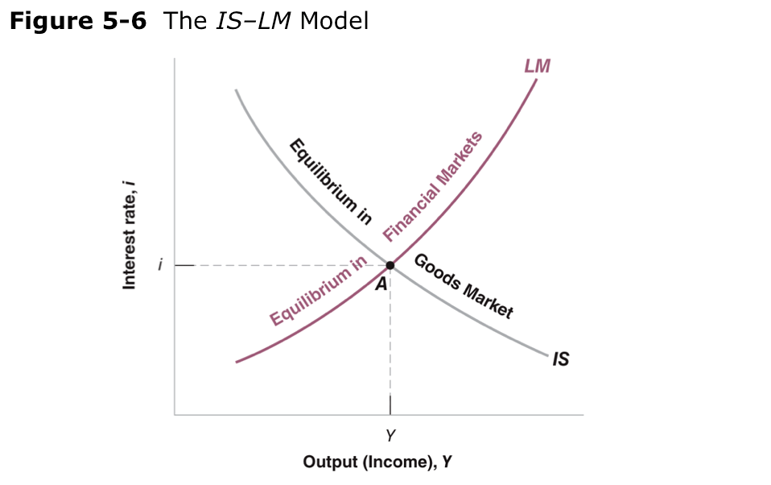

class: inverse, center, middle

```{R, setup, include = F}
options(htmltools.dir.version = FALSE)
library(pacman)
p_load(
  broom, here, tidyverse,
  latex2exp, ggplot2, ggthemes, viridis, extrafont, gridExtra,
  kableExtra,
  dplyr, magrittr, knitr, parallel
)
# Define pink color
red_pink <- "#e64173"
turquoise <- "#20B2AA"
grey_light <- "grey70"
grey_mid <- "grey50"
grey_dark <- "grey20"
# Dark slate grey: #314f4f
# Knitr options
opts_chunk$set(
  comment = "#>",
  fig.align = "center",
  fig.height = 7,
  fig.width = 10.5,
  warning = F,
  message = F
)
opts_chunk$set(dev = "svg")
options(device = function(file, width, height) {
  svg(tempfile(), width = width, height = height)
})
# A blank theme for ggplot
theme_empty <- theme_bw() + theme(
  line = element_blank(),
  rect = element_blank(),
  strip.text = element_blank(),
  axis.text = element_blank(),
  plot.title = element_blank(),
  axis.title = element_blank(),
  plot.margin = structure(c(0, 0, -0.5, -1), unit = "lines", valid.unit = 3L, class = "unit"),
  legend.position = "none"
)
theme_simple <- theme_bw() + theme(
  line = element_blank(),
  panel.grid = element_blank(),
  rect = element_blank(),
  strip.text = element_blank(),
  axis.text.x = element_text(size = 18, family = "STIXGeneral"),
  axis.text.y = element_blank(),
  axis.ticks = element_blank(),
  plot.title = element_blank(),
  axis.title = element_blank(),
  # plot.margin = structure(c(0, 0, -1, -1), unit = "lines", valid.unit = 3L, class = "unit"),
  legend.position = "none"
)
theme_axes_math <- theme_void() + theme(
  text = element_text(family = "MathJax_Math"),
  axis.title = element_text(size = 22),
  axis.title.x = element_text(hjust = .95, margin = margin(0.15, 0, 0, 0, unit = "lines")),
  axis.title.y = element_text(vjust = .95, margin = margin(0, 0.15, 0, 0, unit = "lines")),
  axis.line = element_line(
    color = "grey70",
    size = 0.25,
    arrow = arrow(angle = 30, length = unit(0.15, "inches")
  )),
  plot.margin = structure(c(1, 0, 1, 0), unit = "lines", valid.unit = 3L, class = "unit"),
  legend.position = "none"
)
theme_axes_serif <- theme_void() + theme(
  text = element_text(family = "MathJax_Main"),
  axis.title = element_text(size = 22),
  axis.title.x = element_text(hjust = .95, margin = margin(0.15, 0, 0, 0, unit = "lines")),
  axis.title.y = element_text(vjust = .95, margin = margin(0, 0.15, 0, 0, unit = "lines")),
  axis.line = element_line(
    color = "grey70",
    size = 0.25,
    arrow = arrow(angle = 30, length = unit(0.15, "inches")
  )),
  plot.margin = structure(c(1, 0, 1, 0), unit = "lines", valid.unit = 3L, class = "unit"),
  legend.position = "none"
)
theme_axes <- theme_void() + theme(
  text = element_text(family = "Fira Sans Book"),
  axis.title = element_text(size = 18),
  axis.title.x = element_text(hjust = .95, margin = margin(0.15, 0, 0, 0, unit = "lines")),
  axis.title.y = element_text(vjust = .95, margin = margin(0, 0.15, 0, 0, unit = "lines")),
  axis.line = element_line(
    color = grey_light,
    size = 0.25,
    arrow = arrow(angle = 30, length = unit(0.15, "inches")
  )),
  plot.margin = structure(c(1, 0, 1, 0), unit = "lines", valid.unit = 3L, class = "unit"),
  legend.position = "none"
)
```

# Book Chapter 5

---
class: inverse, middle, center

# Review

---

# Review

## The IS relation:

The IS relation: $Y =f^C(Y −T, i) + f^I(Y,i) + G$

- The IS relation follows from the goods market equilibrium (Y = Z). It tells us how the __interest rate affects output__.

- The IS curve is constructed by __varying i__ and analyzing the goods market equilibrium change in Y.

---

# Review

## The LM relation:

The LM relation: $\frac{M}{P} = Y L(i)$

- The LM relation follows from the real money market equilibrium. It tells us how __output affects the interest rate__.

- The LM curve is constructed by __varying Y__ and analyzing the money market equilibrium change in i.

---

class: inverse, middle, center

# General Equilibrium

---

# General Equilibrium

## General Equilibrium

General Equilibrium (or economy-wide equilibrium) requires __both the goods market and money market to be in equilibrium__!

- Every point on the IS curve represents a __unique__ Goods Market Equilibrium.

- Every point on the LM curve represents a __unique__ Money Market Equilibrium.

---

# General Equilibrium

## General Equilibrium

General Equilibrium (or economy-wide equilibrium) requires __both the goods market and money market to be in equilibrium__!

<center>
 
</center>

---

# General Equilibrium

## General Equilibrium

__Note__: All shifts of the IS and LM graphs can be constructed by analyzing the Goods Market and Money Market as we have in class. However, the following table should help you to check your intuition:


<center>
 
</center>

---

# General Equilibrium

## General Equilibrium

By exploring equilibrium in the __goods market (IS relation)__ and the __money market (LM relation)__, we can derive the IS and LM Curves to study Short Run General Equilibrium.

__Q__: Why should we care about General Equilibrium?

--

__A__: IS-LM provides a framework to thoroughly understand the Short Run effects of Monetary and Fiscal Policy!

- Recall: __Fiscal Policy__ refers to changes in taxes (T) or government spending (G) initiated by the government.

--

- Recall: __Monetary Policy__ refers to changes in the Money Supply (M) initiated by the Central Bank.

---

# General Equilibrium

## Comparative Statics

__Comparative Statics__ refers to analyzing the change in endogenous variables (Y, i) when exogenous variables change!

__Initially__: We are in equilibrium, and then some exogenous variable (G, T, M, or P) changes:

- Ask yourself how the change affects equilibrium in the goods market and how it affects equilibrium in the money market.

--

  - That is, does it shift the Goods Demand, Money Demand, or Money Supply?

---

# General Equilibrium

## Comparative Statics

__Comparative Statics__ refers to analyzing the change in endogenous variables (Y, i) when exogenous variables change!

__Initially__: We are in equilibrium, and then some exogenous variable (G, T, M, or P) changes:

- Characterize the effect of these shifts on the IS and LM curve.

--

  - Does the IS shift? Does the LM shift? If so, by how much?
  
---

# General Equilibrium

## Comparative Statics

__Comparative Statics__ refers to analyzing the change in endogenous variables (Y, i) when exogenous variables change!

__Initially__: We are in equilibrium, and then some exogenous variable (G, T, M, or P) changes:

- Find the new equilibrium where IS and LM intersect __after, taking into account all shifts__!

---

# General Equilibrium

## Solution Methods

There are several ways to solve comparative statics problems. Exam questions may prompt you to use a specific method, or you may be given the choice of your favorite:

- Draw or describe the initial effect of an exogenous change in the Goods Market and Money Market. Show how this effect impacts the IS and LM curve. Find the new IS-LM equilibrium.

---

# General Equilibrium

## Solution Methods

There are several ways to solve comparative statics problems. Exam questions may prompt you to use a specific method, or you may be given the choice of your favorite:

- Draw the initial effect of an exogenous change in the Goods Market and Money Market. Show how this effect impacts the IS and LM curve. Find the new IS-LM equilibrium. Show that the Goods Market and Money Market are in equilibrium at this new point.

---

# General Equilibrium

## Solution Methods

There are several ways to solve comparative statics problems. Exam questions may prompt you to use a specific method, or you may be given the choice of your favorite:

- Look at the IS relation and LM relation equations. Show how a change in some exogenous variables impacts the IS curve and LM curve. Find the new IS-LM equilibrium.

---

class: inverse, middle, center

# Fiscal Policy in General Equilibrium

---

# Fiscal Policy in General Equilibrium

## Fiscal Policy

Recall: The budget deficit is the difference between government revenue (Taxes) and Government spending. In our model, $T - G$.

Fiscal Policy can be divided into two types:

- .hi[Fiscal contraction]: Government policies that reduce the budget deficit.

  - Increase Taxes
  
  - A decrease in Government Spending
  
---

# Fiscal Policy in General Equilibrium

## Fiscal Policy

Recall: The budget deficit is the difference between government revenue (Taxes) and Government spending. In our model, $T - G$.

Fiscal Policy can be divided into two types:

- .hi[Fiscal expansion]: Government policies that increase the budget deficit.

  - Decrease Taxes
  
  - Increase in Government Spending

---

# Fiscal Policy in General Equilibrium

## Describing What Happens (Method 1)

Shock: The government wants to reduce the budget deficit, so taxes increase.

__(1) What is the initial impact of this effect on the goods market and money market? What is the general equilibrium effect of this policy?__

- __Goods Market and IS__:

  - Increased T leads to __decrease in the goods demand__.
  
  - For every value of i, __equilibrium output__ is now lower.
  
  - The .hi[IS] curve .hi[Shifts Left].
  
---

# Fiscal Policy in General Equilibrium

## Describing What Happens (Method 1)

Shock: The government wants to reduce the budget deficit, so taxes increase.

__(1) What is the initial impact of this effect on the goods market and money market? What is the general equilibrium effect of this policy?__

- __Money Market and LM__:

  - T does not affect $M^D$ or $M^S$, so nothing changes in the money market.
  
  - The .hi[LM] curve .hi[Doesn't Shift].

---

# Fiscal Policy in General Equilibrium

## Describing What Happens (Method 1)

<center>
 
</center>

---

# Fiscal Policy in General Equilibrium

## Describing What Happens (Method 1)

<center>
 
</center>

---

# Fiscal Policy in General Equilibrium

## Describing What Happens (Method 2)

Shock: The government wants to reduce the budget deficit, so taxes increase.

__(2) What is the general equilibrium effect of this policy on Output and the interest rate? Hint: Look at the IS and LM relation equations!__
\begin{align}
IS: Y & = f^C (Y − T, i) + f^I (Y , i ) + G\\
LM: M & = Y L(i)
\end{align}

- If T increases, then $f^C (Y − T, i)$ decreases, and Y is lower for all values of i. Thus, IS shifts left to IS′.

- LM curve is unaffected by a change in T, so the LM does not shift.


---

# Fiscal Policy in General Equilibrium

## Describing What Happens (Method 2)

<center>
 
</center>

---

# Fiscal Policy in General Equilibrium

## Describing What Happens (Method 2)

<center>
 
</center>

---

# Fiscal Policy in General Equilibrium

## Why General Equilibrium (IS-LM)

<center>
 
</center>

---

# Fiscal Policy in General Equilibrium

## Why General Equilibrium (IS-LM)

__If we only look at the goods market:__

  - A tax decrease would appear to have a significant impact on output, reducing equilibrium from $Y_0$ to $Y ′$.

__If we only look at the money market:__

  - A tax decrease would appear not to affect interest rates.
  
---

# Fiscal Policy in General Equilibrium

## Why General Equilibrium (IS-LM)
  
__By looking at the IS-LM SR equilibrium:__

  - A tax decrease leads to __output decreasing__ from $Y_0$ to $Y_A$ (a smaller change than the goods market alone predicts).
  
  - A tax decrease leads to the __interest rate decreasing__ (a larger change than the money market alone predicts).
  
__NOTE__: The general equilibrium output decreases by less than what the goods market alone predicts exactly __because__ the interest rate decreases in general equilibrium!

---

# Fiscal Policy in General Equilibrium

## Equilibrium Changes

__Q__: When taxes increase, what happens to the components of demand? 

- $G$: by assumption, G is unchanged.

--

- $Y^D$: In equilibrium, income is lower, and taxes are higher, so disposable income has decreased. 

--

- $C$: consumption $f^C(Y_D, i)$ depends on both disposable income (+) and interest rate (-). First, disposable income decreases, consumption decreases. Second, interest rate decreases, consumption increases. Change in Consumption is unclear. 

--

- $I$: investment $f^I(Y, i)$ depends on both income (+) and interest rate (-). First, income decreases, investment decreases. Second, interest rate decreases, investment increases. Change in Investment in unclear.

---

class: clear, middle, center

# Monetary Policy in General Equilibrium

---

# Monetary Policy in General Equilibrium

## Monetary Policy

Recall: Monetary Policy can be divided into two types:

.hi[Monetary contraction]: The Fed decreases money supply $M$. 

.hi[Monetary expansion]: The Fed increases money supply $M$.

---

# Monetary Policy in General Equilibrium

## Describe What Happens (Method 1)

__Shock__: The Fed decides to increase the Money Supply.
What Happens? (Be sure you understand how to apply both two solution methods!)

- __Goods Market and IS__:

  - M does not affect goods market demand.
  
  - The IS curve is unaffected.
  
- __Money Market and LM__:

  - Increased M leads to increased Money Supply.
  
  - For every value of Y, equilibrium interest is now lower.
  
  - The LM curve Shifts Down. 
  
---

# Monetary Policy in General Equilibrium

## Describe What Happens (Method 1)

<center>
 
</center>

---

# Monetary Policy in General Equilibrium

## Describe What Happens (Method 1)

<center>
 
</center>

---

# Monetary Policy in General Equilibrium

## Describing What Happens (Method 2)

Shock: The Fed decides to increase the Money Supply.

__(2) What is the general equilibrium effect of this policy on Output and the interest rate? Hint: Look at the IS and LM relation equations!__
\begin{align}
IS: Y & = f^C (Y − T, i) + f^I (Y , i ) + G\\
LM: \frac{M}{P} & = Y L(i)
\end{align}

- IS curve is unaffected by a change in M, so the IS does not shift. 

- M increases, given a fixed level of Y, interest rate $i$ decreases. LM curve shifts down.

---

# Monetary Policy in General Equilibrium

## Describe What Happens (Method 2)

<center>
 
</center>

---

# Monetary Policy in General Equilibrium

## Describe What Happens (Method 2)

<center>
 
</center>

---

# Monetary Policy in General Equilibrium

## Why General Equilibrium

<center>
 
</center>

---
# Monetary Policy in General Equilibrium

## Why General Equilibrium?

__If we only look at the goods market:__

- A money supply increases would appear not to affect equilibrium output.

__If we only look at the money market:__

- A money supply increases would appear to have a significant impact on interest rates, reducing equilibrium interest from $i_0$ to $i′$.

---
# Monetary Policy in General Equilibrium

## Why General Equilibrium?

__By looking at the IS-LM SR equilibrium:__

- An increase in M leads to output increasing (a larger change than the goods market alone predicts).

- An increase in M leads to interest rates decreasing from $i_0$ to $i_A$ (a smaller change than the money market alone predicts).

__NOTE__: The general equilibrium interest rate decreases by less than what the money market alone predicts exactly __because__ output increases in general equilibrium!

---

# Monetary Policy in General Equilibrium

## Equilibrium Changes

__Q__: When the money supply increases, what happens to the components of demand? 

- $Y^D$: In equilibrium, income is higher, and taxes are unchanged, so disposable income increases. 

--

- $C$: consumption $f^C(Y_D, i)$ depends on both disposable income (+) and interest rate (-). First, disposable income increases, consumption increases. Second, the interest rate decreases consumption increases. Consumption must increase.  

--

- $I$: investment $f^I(Y, i)$ depends on both income (+) and interest rate (-). First, income increases, investment increases. Second, interest rate decreases, investment increases. Investment must increase 

---
class: inverse, middle, center

# Applications

---
# Applications

## Government Spending in Bonds Market
  
__Q:__ What is the effect of an increase in Government Spending (or a decrease in Taxes) on Bond Prices in the Short Run?

- Step 1: An increase in government spending will increase goods demand. It will not change the money demand or money supply.

- Step 2: Following Step 1, we know the IS curve shifts right, and the LM curve stays the same. This means equilibrium output and equilibrium interest rates are higher.

- Step 3: $P_B = \frac{F}{1 + i}$ . Thus, if equilibrium i increases, then in equilibrium bond prices must fall!

---

# Applications

## Policy Mix

When Bill Clinton was elected President in 1992, he prioritized reducing the budget deficit by reducing Government spending and increasing taxes.

__Q__: What is the effect of this policy on output?

__Q__: Would this be a popular policy?

To combat the reduction in output that would occur from contractionary fiscal policy, the Fed performed expansionary monetary policy (M increased).

__Q__: What is the net effect of contractionary Fiscal Policy and expansionary Monetary Policy on Y and i?

---
exclude: true

```{R, generate pdfs, include = F, eval = T}
system("decktape remark 07_ISLM_part2.html 07_ISLM_part2.pdf --chrome-arg=--allow-file-access-from-files")
```


  