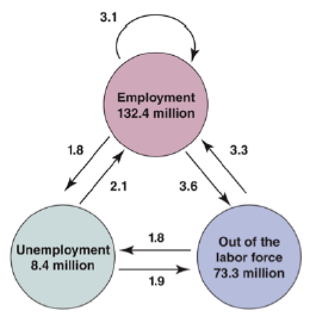
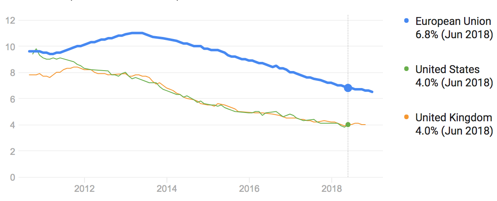
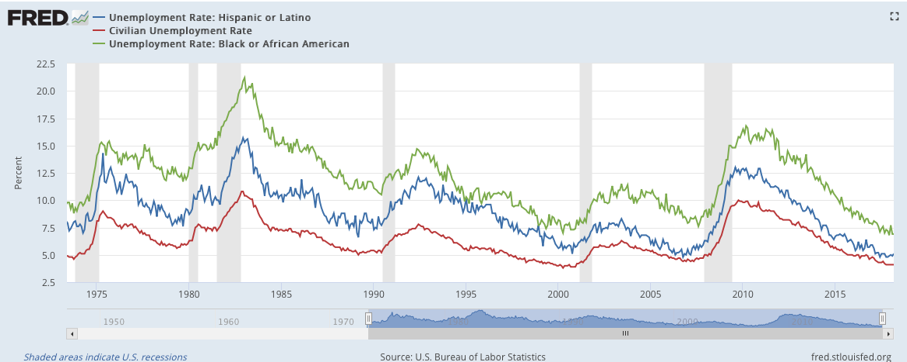
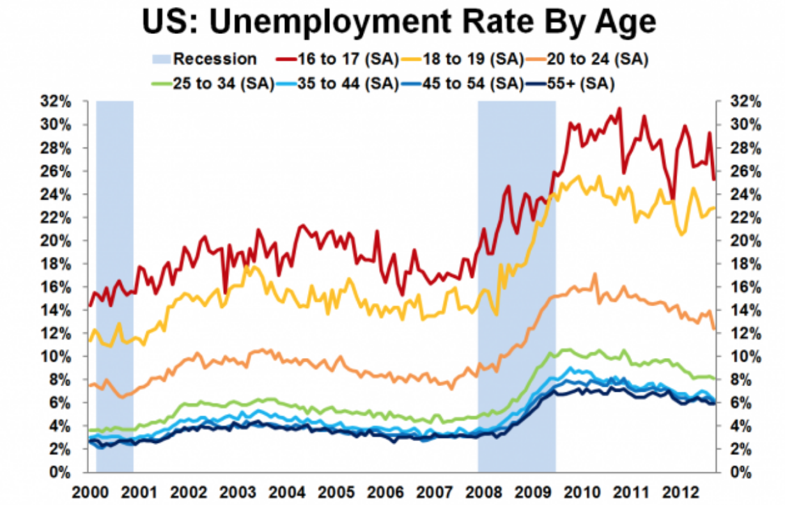
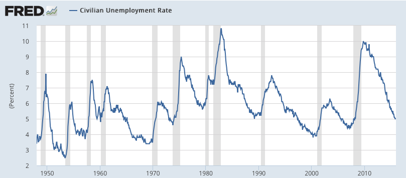
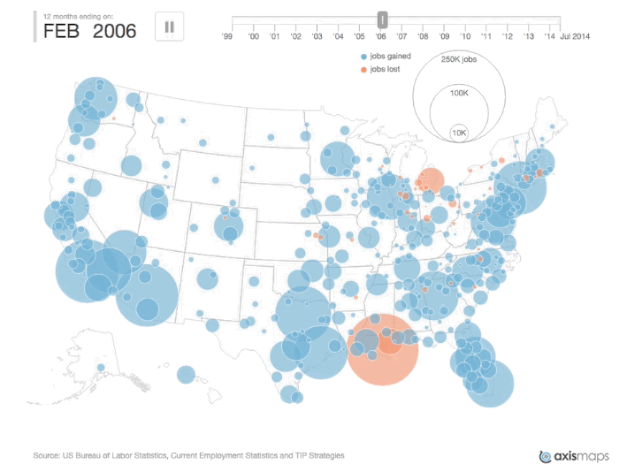

class: inverse, center, middle

```{R, setup, include = F}
options(htmltools.dir.version = FALSE)
library(pacman)
p_load(
  broom, here, tidyverse,
  latex2exp, ggplot2, ggthemes, viridis, extrafont, gridExtra,
  kableExtra,
  dplyr, magrittr, knitr, parallel
)
# Define pink color
red_pink <- "#e64173"
turquoise <- "#20B2AA"
grey_light <- "grey70"
grey_mid <- "grey50"
grey_dark <- "grey20"
# Dark slate grey: #314f4f
# Knitr options
opts_chunk$set(
  comment = "#>",
  fig.align = "center",
  fig.height = 7,
  fig.width = 10.5,
  warning = F,
  message = F
)
opts_chunk$set(dev = "svg")
options(device = function(file, width, height) {
  svg(tempfile(), width = width, height = height)
})
# A blank theme for ggplot
theme_empty <- theme_bw() + theme(
  line = element_blank(),
  rect = element_blank(),
  strip.text = element_blank(),
  axis.text = element_blank(),
  plot.title = element_blank(),
  axis.title = element_blank(),
  plot.margin = structure(c(0, 0, -0.5, -1), unit = "lines", valid.unit = 3L, class = "unit"),
  legend.position = "none"
)
theme_simple <- theme_bw() + theme(
  line = element_blank(),
  panel.grid = element_blank(),
  rect = element_blank(),
  strip.text = element_blank(),
  axis.text.x = element_text(size = 18, family = "STIXGeneral"),
  axis.text.y = element_blank(),
  axis.ticks = element_blank(),
  plot.title = element_blank(),
  axis.title = element_blank(),
  # plot.margin = structure(c(0, 0, -1, -1), unit = "lines", valid.unit = 3L, class = "unit"),
  legend.position = "none"
)
theme_axes_math <- theme_void() + theme(
  text = element_text(family = "MathJax_Math"),
  axis.title = element_text(size = 22),
  axis.title.x = element_text(hjust = .95, margin = margin(0.15, 0, 0, 0, unit = "lines")),
  axis.title.y = element_text(vjust = .95, margin = margin(0, 0.15, 0, 0, unit = "lines")),
  axis.line = element_line(
    color = "grey70",
    size = 0.25,
    arrow = arrow(angle = 30, length = unit(0.15, "inches")
  )),
  plot.margin = structure(c(1, 0, 1, 0), unit = "lines", valid.unit = 3L, class = "unit"),
  legend.position = "none"
)
theme_axes_serif <- theme_void() + theme(
  text = element_text(family = "MathJax_Main"),
  axis.title = element_text(size = 22),
  axis.title.x = element_text(hjust = .95, margin = margin(0.15, 0, 0, 0, unit = "lines")),
  axis.title.y = element_text(vjust = .95, margin = margin(0, 0.15, 0, 0, unit = "lines")),
  axis.line = element_line(
    color = "grey70",
    size = 0.25,
    arrow = arrow(angle = 30, length = unit(0.15, "inches")
  )),
  plot.margin = structure(c(1, 0, 1, 0), unit = "lines", valid.unit = 3L, class = "unit"),
  legend.position = "none"
)
theme_axes <- theme_void() + theme(
  text = element_text(family = "Fira Sans Book"),
  axis.title = element_text(size = 18),
  axis.title.x = element_text(hjust = .95, margin = margin(0.15, 0, 0, 0, unit = "lines")),
  axis.title.y = element_text(vjust = .95, margin = margin(0, 0.15, 0, 0, unit = "lines")),
  axis.line = element_line(
    color = grey_light,
    size = 0.25,
    arrow = arrow(angle = 30, length = unit(0.15, "inches")
  )),
  plot.margin = structure(c(1, 0, 1, 0), unit = "lines", valid.unit = 3L, class = "unit"),
  legend.position = "none"
)
```

# Book Chapter 6

---
class: inverse, middle, center

# Overview

---

# Overview

## Motivation

In the __short run__ models we have considered thus far (Ch. 3-5), we assumed that __the price, P, was fixed__, and firms will supply any level of output at this price.

--

IS-LM model incorporating the Goods Market Equilibrium and Money Market Equilibrium gives us insight about what is happening in the __short-run__. 

--

In the medium run, prices change!

- goods price (price)

- labor price (wage)


---
# Overview

## What happens in the medium run?

__Question__: What happens to goods prices __over time (medium-run)__ when firms increase output?

--

  - More workers are hired.
  
--

  - As more workers are hired, unemployment falls.
  
--

  - As unemployment falls, .hi[wages rise].
  
--

  - As total wages rise, production costs rise.
  
--

  - As production costs rise, .hi[goods prices increase]!
  
---
# Overview

## Objective

Answer questions about the __medium run__.

Model the relationship between the .hi[price level, P], .hi.purple[wages, W], and __employment__ to show how __prices__ and __output__ are determined over time!

Building block for (aggregate-demand and aggregate-supply) __AD-AS__ model.

---
class: inverse, middle, center

# Unemployment

---

# Unemployment

## Calculation

- __Employment (N)__: The number of people who have a job. 

--

- __Unemployment (U)__: The number of people who do not have a job but are looking for one.

--

- __Labor Force (L)__: The sum of all employed and unemployed people.

\begin{align}
\underbrace{L}_{LaborForce} & = \underbrace{N}_{employment} + \underbrace{U}_{unemployment}
\end{align}

--

- __Unemployment Rate (u)__: The ratio of the number of people unemployed to the number of people in the labor force.
$$ u = \frac{U}{L}$$
---

# Unemployment

## Measurement

- Before 1940, only people registered at unemployment offices were counted as unemployed.

--

- People who had exhausted their unemployment benefits did not register. __Unemployment was drastically underestimated__ (and still is in many countries).

--

- __Current Population Survey (CPS)__ is used in the US. Fifty thousand households are interviewed each month.

--

- Who is unemployed?
  
  - Anyone who does not have a job has been looking for a job in the last four weeks and is currently available for work.
  
---

# Unemployment

## Measurement

__Not in the labor force__: Anyone who does not have a job and has not tried to get a job in the last four weeks. These individuals __do not__ count towards our unemployment measure.

- One type of individual who is not in the labor force is a __discouraged worker__.

- __Discouraged workers__: People who stop looking for a job because they fear that they won’t be able to find a job even if they look.

---

# Unemployment

## Definitions

__Population__: The total number of people that are residents of a country.

__Non-institutionalized Civilian Population__: The total civilian population that is available for work: calculated as total population minus individuals under the age of 16, in prison, or the armed forces.

__Labor Force__: The sum of non-institutionalize individuals either working or looking for work.

__Unemployment Rate__: The ratio of unemployed individuals to the total labor force.

__Participation Rate__: The ratio of the labor force to the non-institutionalized civilian population. This is the ratio of individuals working or trying to work for all individuals capable of working.

---

# Unemployment

## Calculation Example

Suppose the US Economy is comprised of .hi[20 non-institutionalized individuals]. .hi.purple[5 people have jobs]. .hi.turquoise[5 people don’t have jobs but are looking]. __10 people don’t have jobs and aren’t looking for a job__. Calculate:

- Labor Force (LF): 

  - .hi.purple[5] + .hi.turquoise[5] = 10

--

- Unemployment Rate (u): 

  - .hi.turquoise[5]/(LF) = 5/10 = 50%  

--

- Labor Force Participation Rate (LFP): 

  - (LF)/.hi[20] = 50%

---

# Unemployment

## Calculation Example

Suppose the US Economy is comprised of .hi[20 non-institutionalized individuals]. .hi.purple[5 people have jobs]. .hi.turquoise[5 people don’t have jobs but are looking]. __10 people don’t have jobs and aren’t looking for a job__. Now 3 people who were unemployed stop looking for work and 1 person who was employed loses their job (but continues looking for a job).

- What is the unemployment rate now? 

  - employment: 5 - 1 = 4
  
  - unemployment: 5 + 1 - 3 = 3
  
  - unemployment rate: 3 / (4 + 3) = 42.9%
  
__The Unemployment Rate has decreased even though there is actually one fewer employed person in the economy!!!__

---

# Unemployment

## U.S. Labor Market Features:

<center>
 
</center>

---

# Unemployment

## U.S. Labor Market Features:

<center>
 
</center>

From the previous graph, we can see that of the .hi[8.4 million], unemployed workers, each month, nearly half (2.1 million find jobs + 1.9 million leave LF) are no longer unemployed at the end of the month.

---

# Unemployment

## U.S. Labor Market Features:

<center>
 
</center>

Compute the unemployment rate in the U.S from this graph. 

--
\begin{align}
& Em = 132.4\\
& Unem= 8.4\\
u & = \frac{Unem}{Em + Unem} \\
& = 8.4/(132.4 + 8.4) \approx 5.966\%
\end{align}

---

# Unemployment

## U.S. Labor Market Features:
The unemployment rate in the US is usually much lower than in the European Union. The average duration of unemployment in the U.S. is 2-3 months, which is also much shorter than the European Union. 


<center>
 
</center>

---

# Unemployment

## U.S. Labor Market Features:
The unemployment rate in the US is usually much lower than in the European Union. The average duration of unemployment in the U.S. is 2-3 months, which is also much shorter than the European Union. 

- Mobility (Language Barrier)

- Unemployment Benefits

- Participation Rate

- ...

---

# Unemployment

## U.S. Labor Market Features:

We typically treat unemployment as a statistic that applies to the entire economy, but do __different groups experience different unemployment rates__?

--

<center>
 
</center>

---

# Unemployment

## U.S. Labor Market Features:

We typically treat unemployment as a statistic that applies to the entire economy, but do __different groups experience different unemployment rates__?

--

<center>
 
</center>


---

# Unemployment

## U.S. Labor Market Features:

Note: The unemployment rate is .hi[correlated with recessions] (the grey vertical lines).

<center>
 
</center>

---

# Unemployment

## U.S. Labor Market Features:

Note: The unemployment rate is .hi[correlated with recessions] (the grey vertical lines).

<center>
 
</center>

---

# Unemployment

## U.S. Labor Market Features:

When unemployment is high:

- Employed workers face .hi[a higher probability] of losing their job.

- Unemployed workers face .hi[a lower probability] of finding a new
job.

- This means: the __likelihood__ of becoming unemployed and the __duration__ of unemployment are both increased when unemployment is high!

--

__By focusing on unemployment and not employment, we miss the impact of discouraged workers. Is this a problem?__

---

# Unemployment

## U.S. Labor Market Features:

Recall: The LFPR= $\frac{\text{number of people in the labor force}}{\text{non-institutionalized civilian population}}$

<center>
 
</center>

---

# Unemployment

## U.S. Labor Market Features:

__Q__: Why did the labor force participation rate increase so steadily from the 1960s to the 1990s?

<center>
 
</center>

---

# Unemployment

## U.S. Labor Market Features:

__Q__: Why did the labor force participation rate increase so steadily from the 1960s to the 1990s?

<center>
 
</center>

---

# Unemployment

## Collective Bargaining:

Collective Bargaining: bargaining between a union (or group of unions) and a firm (or industry).

- In the U.S., only 10% of workers have wages set by collective bargaining. In much of Europe, collective bargaining plays a much bigger role in wage determination.

--

- In the U.S., most workers have their wages set by individual bargaining. In general, the more skills a job requires, the more bargaining power individuals have.

--

- College graduates have a greater ability to negotiate their contracts than workers in retail or food services.

---
class: middle, center, inverse

# Labor Supply

---

# Labor Supply

## Labor Supply: Wage-Setting Relation

__Q__: Who supplies labor in the economy? 

--

__A__: Workers (You and I)

--

- To understand the labor demand, we need to understand how __workers ask for a wage rate__.

--

- Workers consider

  - __Expected Price__
  
  - __Labor Market Condition__ 
  
  - __Other Factors__

---

# Labor Supply

## Labor Supply: Wage-Setting Relation

__Q: How can we create a general function to describe the supply side of labor?__

.hi[Expectation Price:] $P^e$ (+)

- $P^e$ is the __price expectation__ for an average person in the economy. This average person could be an employer or employee. 

- If people in the economy __expect the price to be high__ in the future.

- The employees would want to __ask for a higher wage__, because they expect things are more expensive in the future, so they need a higher wage to match the expected higher price. 

- Assumption: __Expected Future Price equals Current Price__: $P^e = P$


---

# Labor Supply

## Labor Supply: Wage-Setting Relation

__Q: How can we create a general function to describe the supply side of labor?__

.hi[Unemployment Rate:] $u$ 

- As the unemployment rate goes up, more people are looking for jobs and fewer firms hiring. 

- It's harder for people to find a job

- The unemployed would ask for a lower wage.

---
# Labor Supply

## Labor Supply: Wage-Setting Relation

__Q: How can we create a general function to describe the supply side of labor?__

.hi[Other things:] z (+)

- Workers have a __reservation wage__: The lowest wage workers would accept to do a job. This is a mathematical simplification of __unemployment benefits__.

- The other factors: __bargaining power/skills__. 

- ...

---

# Labor Supply

## Labor Supply: Wage-Setting Relation

The wage setting equation (comes from workers):

$$W = P F\underbrace{(u, z)}_{(-, +)}$$
This means Wage, $W$, is a function of : 

- Current Price $P$

- The unemployment rate $u$

- Other factors $z$.

---
# Labor Supply

## Labor Supply: Wage-Setting Relation

In the end, we care about the __real wage__ $\frac{W}{P}$, according to the labor supply, we have the following __Wage-Setting Relation__

$$\frac{W}{P} = F\underbrace{(u, z)}_{(-, +)}$$
- When unemployment rate, $u$, is high, workers demand a lower real wage

- When the other factor, skills or reservation wage, is high, workers demand a higher real wage. 
---

class: inverse, middle, center

# Labor Demand

---

# Labor Demand

## Price-Setting Relation

__Q__: Who demands labor in the economy? 

--

__A__: Firms

--

- To understand the labor demand, we need to understand __firms incentives__.

--

- Firms do two things

  - .hi[Buy] __input factor__, such as labor at price $w$
  
  - .hi[Sell] __final products__ at price $P$

---

# Labor Demand

## Price-Setting Relation

- The .hi[prices] that a firm sets depends on the .hi[costs] they face. 

- These costs depend on the __production function__, the relation between __inputs__ used in production, and the __quantity of output produced__.

- Assumption: __Labor (N)__ is the only factor of production. The quantity of output is a __linear function__ of labor. 

$$Q = A * N$$

where we assume $A$ is the __labor productivity__, which scales the ability of a worker to produce output. Together $A * N$ is called the __effective labor__. 


---

# Labor Demand

## Price-Setting Relation

__Do you think labor productivity is constant over time?__

What do you think __labor productivity__ depends on? 

- Education

- Skills

- Technology

- ...

---

# Labor Demand

## Price-Setting Relation

The production function is given by: $Q = A * N$ , or $N = \frac{1}{A} * Q$

__Q__: If the firm wants to increase production, $Q$,  by 1 unit, how much more labor would the firm have to hire? 

__A__: $\frac{1}{A}$ units of labor

__Q__: How much would the firm have to pay this much labor?

__A__: $\frac{1}{A} * W = \frac{W}{A}$ dollars

$\frac{W}{A}$ __is the marginal cost for the firm__. 

---

# Labor Demand

## Price-Setting Relation

To produce one extra unit of production, $Q$, the firm has to pay extra $\frac{W}{A}$ dollars for labor. This unit of production is worth $P$ dollars in the market. 

__Under Perfect Competition__

- $\color{#e64173}{P = \frac{W}{A}}$

__Under Imperfect Competition__ (more general case)

The firm can make a profit, so that 

- P > $\frac{W}{A}$, more specifically, $\color{#e64173}{P = (1 + m)\frac{W}{A}}$ where $m$ is called the mark-up $m > 0$. 

- If the firms are perfectly competative, then $m = 0$.

---

# Labor Demand

## Price-Setting Relation

Consider the general case with __Imperfect Competition__, the real wage, $\frac{W}{P}$, according to __Price-Setting Relation__ from __Labor Demand__ is:

$$\frac{W}{P} = \frac{A}{1 + m}$$
This relation says:

- If the firm has access to better technology $A$, the firm can give a higher real wage to workers.

- If the firm has higher monopoly power, the firm gives a lower real wage to workers. 

---

class: inverse, middle, center

# Labor Market Equilibrium

---

# Labor Market Equilibrium

## Equilibrium Real Wage

Labor Supply or Wage-Setting Relation (WS): 

$$\frac{W}{P} = F\underbrace{(u, z)}_{(-, +)}$$

Labor Demand or Price-Setting Relation (PS): 

$$\frac{W}{P} = \frac{A}{1 + m}$$
--

This labor market model is trying to explain .hi[two variables of interest] in our economy:

- Real Wage $\frac{W}{P}$

- Unemployment Rate $u$

---

# Labor Market Equilibrium

## Equilibrium Real Wage

Labor Supply or Wage-Setting Relation (.hi[WS]): 

$$\frac{W}{P} = F\underbrace{(u, z)}_{(-, +)}$$

Real Wage $\frac{W}{P}$ __decreases__ as Unemployment Rate $u$ increases

---

# Labor Market Equilibrium

## Equilibrium Real Wage

Labor Demand or Price-Setting Relation (.hi[PS]): 

$$\frac{W}{P} = \frac{A}{1 + m}$$

Real Wage $\frac{W}{P}$ __does not change__ as Unemployment Rate $u$ increases


---

# Labor Market Equilibrium

## Equilibrium Real Wage

<center>
 
</center>

The Equilibrium Wage is equal to $\frac{A}{1 + m}$

The Equilibrium Unemployment Rate is $u_n$, which is also called the natural unemployment rate.


---
exclude: true

```{R, generate pdfs, include = F, eval = T}
system("decktape remark 08_labormarket_part1.html 08_labormarket_part1.pdf --chrome-arg=--allow-file-access-from-files")
```

