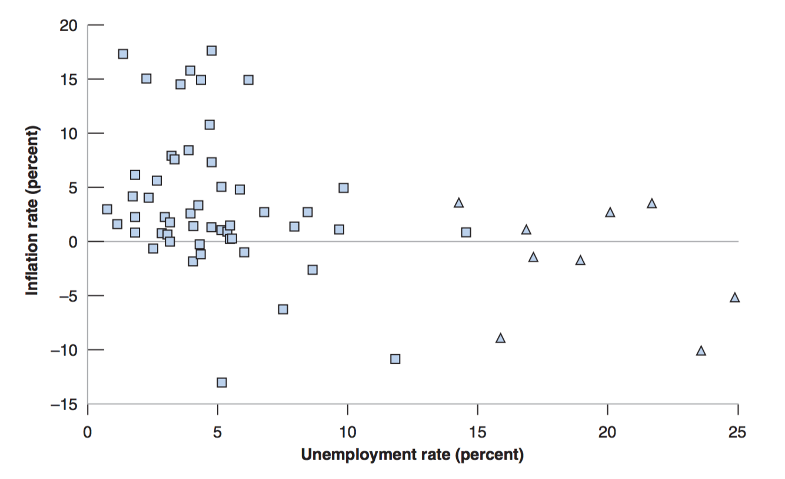
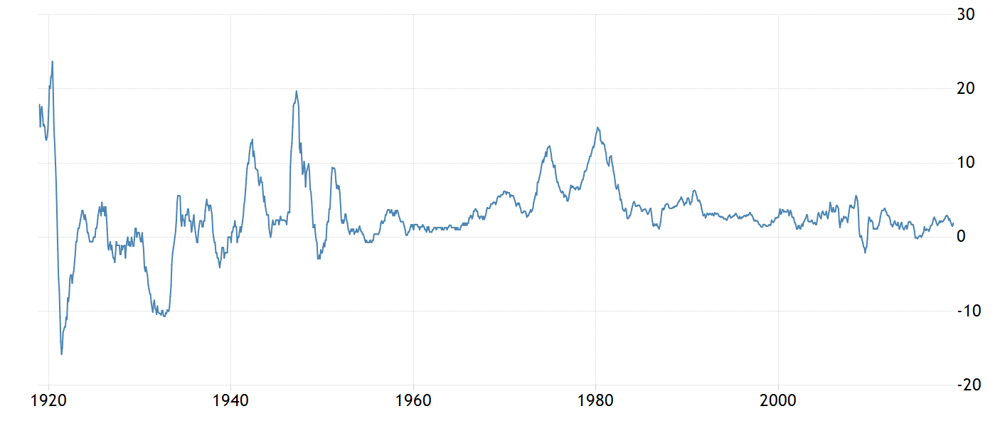
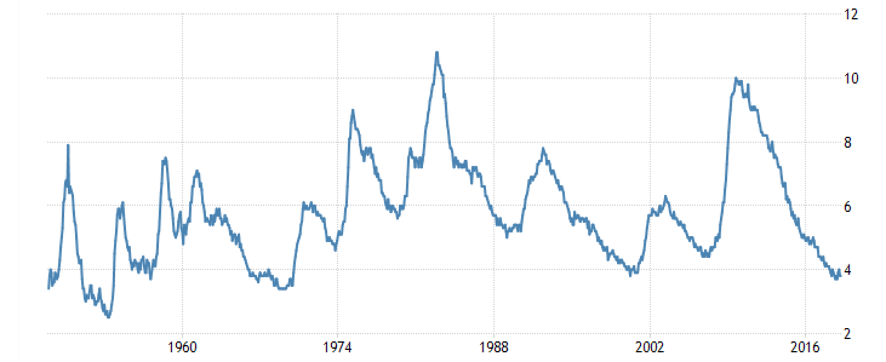

class: inverse, center, middle

```{R, setup, include = F}
options(htmltools.dir.version = FALSE)
library(pacman)
p_load(
  broom, here, tidyverse,
  latex2exp, ggplot2, ggthemes, viridis, extrafont, gridExtra,
  kableExtra,
  dplyr, magrittr, knitr, parallel
)
# Define pink color
red_pink <- "#e64173"
turquoise <- "#20B2AA"
grey_light <- "grey70"
grey_mid <- "grey50"
grey_dark <- "grey20"
# Dark slate grey: #314f4f
# Knitr options
opts_chunk$set(
  comment = "#>",
  fig.align = "center",
  fig.height = 7,
  fig.width = 10.5,
  warning = F,
  message = F
)
opts_chunk$set(dev = "svg")
options(device = function(file, width, height) {
  svg(tempfile(), width = width, height = height)
})
# A blank theme for ggplot
theme_empty <- theme_bw() + theme(
  line = element_blank(),
  rect = element_blank(),
  strip.text = element_blank(),
  axis.text = element_blank(),
  plot.title = element_blank(),
  axis.title = element_blank(),
  plot.margin = structure(c(0, 0, -0.5, -1), unit = "lines", valid.unit = 3L, class = "unit"),
  legend.position = "none"
)
theme_simple <- theme_bw() + theme(
  line = element_blank(),
  panel.grid = element_blank(),
  rect = element_blank(),
  strip.text = element_blank(),
  axis.text.x = element_text(size = 18, family = "STIXGeneral"),
  axis.text.y = element_blank(),
  axis.ticks = element_blank(),
  plot.title = element_blank(),
  axis.title = element_blank(),
  # plot.margin = structure(c(0, 0, -1, -1), unit = "lines", valid.unit = 3L, class = "unit"),
  legend.position = "none"
)
theme_axes_math <- theme_void() + theme(
  text = element_text(family = "MathJax_Math"),
  axis.title = element_text(size = 22),
  axis.title.x = element_text(hjust = .95, margin = margin(0.15, 0, 0, 0, unit = "lines")),
  axis.title.y = element_text(vjust = .95, margin = margin(0, 0.15, 0, 0, unit = "lines")),
  axis.line = element_line(
    color = "grey70",
    size = 0.25,
    arrow = arrow(angle = 30, length = unit(0.15, "inches")
  )),
  plot.margin = structure(c(1, 0, 1, 0), unit = "lines", valid.unit = 3L, class = "unit"),
  legend.position = "none"
)
theme_axes_serif <- theme_void() + theme(
  text = element_text(family = "MathJax_Main"),
  axis.title = element_text(size = 22),
  axis.title.x = element_text(hjust = .95, margin = margin(0.15, 0, 0, 0, unit = "lines")),
  axis.title.y = element_text(vjust = .95, margin = margin(0, 0.15, 0, 0, unit = "lines")),
  axis.line = element_line(
    color = "grey70",
    size = 0.25,
    arrow = arrow(angle = 30, length = unit(0.15, "inches")
  )),
  plot.margin = structure(c(1, 0, 1, 0), unit = "lines", valid.unit = 3L, class = "unit"),
  legend.position = "none"
)
theme_axes <- theme_void() + theme(
  text = element_text(family = "Fira Sans Book"),
  axis.title = element_text(size = 18),
  axis.title.x = element_text(hjust = .95, margin = margin(0.15, 0, 0, 0, unit = "lines")),
  axis.title.y = element_text(vjust = .95, margin = margin(0, 0.15, 0, 0, unit = "lines")),
  axis.line = element_line(
    color = grey_light,
    size = 0.25,
    arrow = arrow(angle = 30, length = unit(0.15, "inches")
  )),
  plot.margin = structure(c(1, 0, 1, 0), unit = "lines", valid.unit = 3L, class = "unit"),
  legend.position = "none"
)
```

# Book Chapter 8

---

class: inverse, middle, center

# Overview

---

# Overview

## Monetary Goals

The Federal Reserve works to __promote a strong U.S. economy__. 

Congress has directed __the Fed__ to conduct the nation's monetary policy to support .hi[three specific goals]:


1. Maximum sustainable employment. (__output - Y__)

2. __Stable prices. (price - P)__

3. Moderate long-term interest rates. (__implied by 2.__)

__Note the second goal relates to our focus of this lecture.__
---

# Overview

## Brief History

- In 1958, __A.W. Phillips__ plotted the historical relationship between the __inflation rate__ and the __unemployment rate__ in the .hi.purple[United Kingdom] between 1861 and 1957.

- He found strong evidence of a __negative relationship between inflation and unemployment__. 

- That is, when .hi[inflation is high, unemployment is low]. And when inflation is low, unemployment is high.

- In 1960, __Paul Samuelson__ and __Robert Solow__ found evidence of the same relationship using .hi.purple[U.S. data].

---

# Overview 

## The Phillips Curve

- The __negative relationship__ between the inflation rate and unemployment.

- __In the 1970s__, however, this __relationship broke down__. Both high inflation and high unemployment (stagflation). 


- Phillips curve still is the .hi[primary framework] for understanding and .hi.purple[forecasting inflation] used in central banks.

---

class: inverse, middle, center

# Inflation

---

# Inflation

## Functions of Money

Before we start talking about price and changes in price (inflation), let's talk about money.

There are three functions of money:

- The medium of exchange.

- Store of value. 

- Unit of account.

---

# Inflation

## Functions of Money

Economists like to argue that money belongs in the same class as the wheel and the inclined plane among .hi[ancient inventions of great social utility]. 

Price stability allows that invention to work with minimal friction.


---

# Inflation

## Why Stable Price

__The Dual Role of Price Stability__

- Price stability plays a dual role in modern central banking: It is both 

- __An end (goal) of monetary policy__

- __A means of monetary policy__

---

# Inflation

## Price Stability - Goal

- Fundamentally, price stability preserves the .hi[integrity and purchasing power] of the nation's money. 

  - People can hold money __without having to worry that inflation will eat away at the real value of their money balances__.
  
---

# Inflation

## Price Stability - Goal

- Equally important, stable prices allow people to .hi[rely on the dollar as a measure of value] when __making long-term contracts, engaging in long-term planning, or borrowing or lending__ for long periods.
  
  - Price stability permits  __tax laws, accounting rules__ to be expressed in dollar terms without being subject to distortions arising from fluctuations in the value of money.

---

# Inflation 

## Price Stability - Means

When price stability likely to

- __Enhance Long-term Economic growth__ (related to goal 1)

- __Matain stable Long-term interest rates__ (related to goal 2)

---

# Inflation 

## Price Stability - Means

Price stability helps maintain .hi[long-term economic growth] by...

- __reducing concern__ about unpredictable fluctuations in the purchasing power of money. 

- __improving economic activities__

- __making sure markets operate efficiently__.

---

# Inflation

## Price Stability - Means

Price stability helps maintain .hi[long-term economic growth] because

- The dollar provides a reasonably __secure gauge__ of __real economic values__ .hi[only when inflation is low and stable]. 

- High and variable inflation degrades the quality of the signals coming from the price system

- Producers and consumers find it difficult to distinguish __price changes arising from changes in product supplies and demands__ from __changes arising from general inflation__.

---

# Inflation

## Price Stability - Means

Price stability helps maintain .hi[long-term interest rate].

To understand this, we need to understand .hi[Fisher Equation]

Let $i$ be the nominal interest rate, $r$ be the real interest rate, and $\pi$ be the inflation rate.

The Fisher Equation is:

$$i = r + \pi$$
Conclusion:

Stable $\pi$ is necessary for stable $i$.

---
class: inverse, middle, center

# Phillips Curve

---

# Phillips Curve

## Empirical Discovery

During the period __1900–1960__ in the United States, 

- .hi[A low unemployment rate] was associated with .hi[a high inflation rate]

- .hi[A high unemployment rate] was associated with .hi[a low inflation rate.]

<center>
 
</center>

---

# Phillips Curve

## Empirical Discovery

Why is the Phillips Curve an important discovery?

- It states that there is a trade-off between the unemployment rate and the inflation rate.

- The Fed wants __a low sustainable unemployment rate__.

- The Fed wants __a low sustainable inflation rate__.

- The Phillips Curve gives the Fed __a guidance on how to reach a balance between these two goals__. 

---

# Phillips Curve

## Theory

In Macroeconomics, we __can't run controlled experiments__; we rely on models to explain what we observe in the data. 

The theory supporting the Phillips Curve is coming from the .hi[Labor Market Equilibrium]. Assuming technology A = 1, we have labor supply (WS) and labor demand (PS):

\begin{align}
\text{WS} : \color{#e64173}{W} & = P^e F(u, z)\\
\text{PS} : P & = (1 + m) \color{#e64173}{W}
\end{align}

The Labor Market Equilibrium states:

$$P = (1 + m) P^e F(u, z)$$
---

# Phillips Curve

## Theory

__The Labor Market Equilibrium states__:

$$P = P^e (1 + m) \color{#e64173}{F(u, z)}$$

Recall that $F(u, z)$ is a decreasing function in $u$ and an increasing function in z. 

__To make life easier, we assume__

$$\color{#e64173}{F(u, z)} = 1 - \alpha u + z$$
where $\alpha > 0$. 


$$P = P^e (1 + m)  (1 - \alpha u + z)$$
---

# Phillips Curve

## Theory

We need to go from __price to inflation__. Recall inflation: __The growth rate in prices over time.__

$$\pi_{t} = \frac{P_t - P_{t-1}}{P_{t-1}}$$

$$\pi_{t} = \frac{P_t}{P_{t-1}} - 1$$
$$1 + \pi_{t} = \frac{P_t}{P_{t-1}}$$
We can perform the __same analysis__ for expected inflation $\pi^e_t$ at time t:

$$1 + \pi^e_{t} = \frac{P^e_t}{P_{t-1}}$$


---

# Phillips Curve

## Theory

__The Labor Market Equilibrium__

$$P = P^e (1 + m)  (1 - \alpha u + z)$$
$$P_t = P_t^e (1 + m)  (1 - \alpha u_t + z)$$
$$\frac{P_t}{P_{t-1}} = \frac{P_t^e}{P_{t-1}} (1 + m)  (1 - \alpha u_t + z)$$
$$1 + \pi_t = (1 + \pi^e_{t}) (1 + m)  (1 - \alpha u_t + z)$$
$$1 + \pi_t = 1 + \pi^e_{t} + m - \alpha u_t + z$$
$$\pi_t = \pi^e_{t} + (m + z) - \alpha u_t$$
__I won't make you do this derivation in the exams. __

---

# Phillips Curve

## Theory

__Now we have our Labor Market Equilibrium written in terms of inflations.__

$$\pi = \pi^e + (m + z) - \alpha u$$

- Increase in expected inflation --> Increase in actual inflation

- Increase in z --> increase in actual inflation

- Increase in m --> Increase in actual inflation

- Increase in unemployment --> decrease in inflation (Phillips Curve)

---

# Phillips Curve

## Theory

__Incease in expected inflation --> increase in actual inflation__

- .hi[Expected Inflation increases]...

- The expected price is higher in the next period...

- Workers ask for a higher wage (__WS Relation__)...

- More costly for firms to produce goods because labor is more expensive...

- Firms set .hi[higher price] in the next period (__PS Relation__)... 

---

# Phillips Curve

## Theory

- __Increase in z --> increase in actual inflation__

- .hi[Increase in z]...

- Workers ask for a higher wage (__WS Relation__) in the next period...

- More costly for firms to produce goods because labor is more expensive...

- Firms set .hi[higher price] in the next period (__PS Relation__)... 

---

# Phillips Curve

## Theory

- __Increase in m --> increase in actual inflation__

- .hi[Increase in m]...

- Firms will set a .hi[higher price] because firms have a __higher mark-up__ in the next period. 

Examples for __m__:

1. __Monopoly Power__.

2. __Higher Input Price__.

---

# Phillips Curve

## Theory

- __ Increase in the unemployment rate --> decrease in inflation (Phillips Curve)__

- .hi[Higher unemployment rate]

- Workers ask for a lower wage (__WS Relation__)

- It is less costly for firms to produce goods because labor is cheaper...

- Firms will set a .hi[lower price] in the next period.

---

# Phillips Curve

## Theory

Recall the Phillips Curve is

$$\pi = \pi^e + (m + z) - \alpha u$$
We need to use __time indexes__ so that we can refer to variables like inflation, or expected inflation, or unemployment, .hi[in a specific year]. 

$$\pi_t = \pi^e_t + (m + z) - \alpha u_t$$

__The data__ doesn't tell us anything about the __inflation expectation__ $\pi^e_t$.

__The theory__ tells us how __inflation expectation__ $\pi^e_t$ influences the actual inflation rate. 

---
class: inverse, middle, center

# Expectation Formation

---

# Expectation Formation

Recall the Phillips Curve is

$$\pi = \pi^e + (m + z) - \alpha u$$
We need to use __time indexes__ so that we can refer to variables like inflation, or expected inflation, or unemployment, .hi[in a specific year]. 

$$\pi_t = \pi^e_t + (m + z) - \alpha u_t$$

To connect the __theory to data__, we need to infer how expectations are formed. 

- __Expectation formation is difficult to study. __

- __It's brain activity. __

---

# Expectation Formation

## Models

Eventually, we want to find the best mathematical model to describe expectation formation. Here is how we should proceed:

- Consider __a large selection of expectation selection models__

- Combine __each one of the expectation formation model__ with the .hi[theory]

$$\pi_t = \pi^e_t + (m + z) - \alpha u_t$$
- Back out how the model-theory combo __implies $\pi_t$__

- Check if the implied $\pi_t$ __matches the data__ or .hi[makes sense] (rational). 

---

# Expectation Formation

## Static Expectations

$$π_t^e=0$$

- I observe the current price level

- I assume that future prices will be the same as they are today.

---

# Expectation Formation

## Adaptive Expectations

$$π_t^e= f(\pi_{t-1})$$
- Next year's inflation depends on this year's inflation. 

- I expect inflation to be similar to what it was last period.

---

# Expectation Formation

## Rational Expectations (Not Required)

$π_t^e$ is the __true, statistical expectation__ of $π_t$. 

- I know the entire distribution of possible inflation rates

- I know the probabilities of each of these rates occurring

- I can calculate the true expected inflation rate.

__Modern Macroeconomic Modeling almost entirely relies on Rational Expectations!__

---

# Phillips Curve

## Inflation History

<center>
 
</center>

__Note__: __Before 1960__ (when Phillips Curve was first discovered), inflation was positive in some years and negative in others, on average it was around zero. 


---

# Phillips Curve

## Inflation History

<center>
 
</center>

__Note__: __During the 70s__ hit twice in the 1970s by __a substantial Increase in the price of oil__. Inflation, in general, maintained at a higher level.

---

# Phillips Curve

## Inflation History

<center>
 
</center>

__Note__: __During the 70s__ hit twice in the 1970s by __a substantial Increase in the price of oil__. Inflation, in general, maintained at a higher level.

---

# Phillips Curve

## Inflation History

<center>
 
</center>

__Note__: __Since 1990__ inflation, in general, has been __roughly stable at a lower level__. (Except for the year when great recession happened.)

---

# Phillips Curve

## Inflation History

How do you think __people formed their expectations for inflation before the 60s__?

- __Before 1960__ (when Phillips Curve was first discovered), inflation was positive in some years and negative in others, on average it was around zero. 

- It is reasonable for people to expect that __inflation will be equal to zero over the next year__ as well.


---

# Phillips Curve

## Unemployment History

<center>
 
</center>

__Note__: __During the 70s__ hit twice in the 1970s by __a substantial Increase in the price of oil__. The unemployment rate increased.

---

# Phillips Curve

## Unemployment History

<center>
 
</center>

__Note__: __In general__, we can see that there is a __bussiness cycle__ in terms of the unemployment rate. 


---
# Phillips Curve

## Unemployment History

<center>
 
</center>

__Note__: __In general__, we can see that there is a __bussiness cycle__ in terms of the unemployment rate. 

---
exclude: true

```{R, generate pdfs, include = F}
system("decktape remark 13_phillips_curve_part1.html 13_phillips_curve_part1.pdf --chrome-arg=--allow-file-access-from-files")
```


