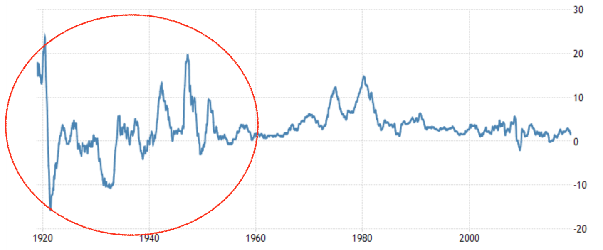
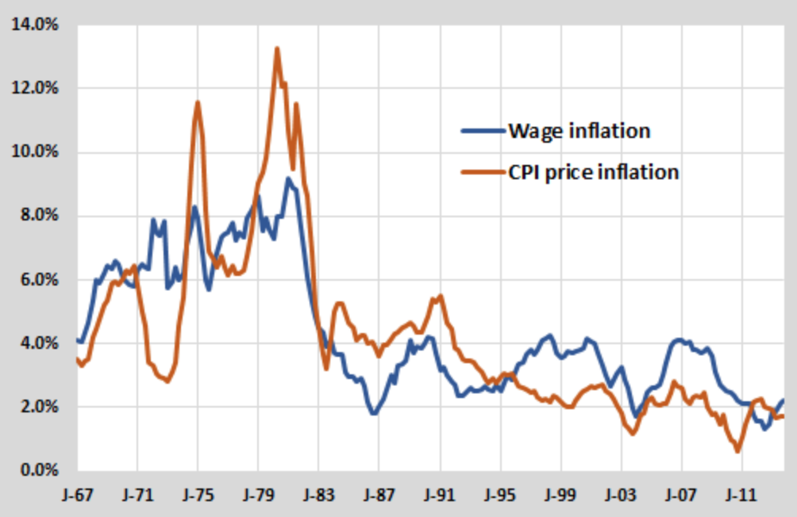
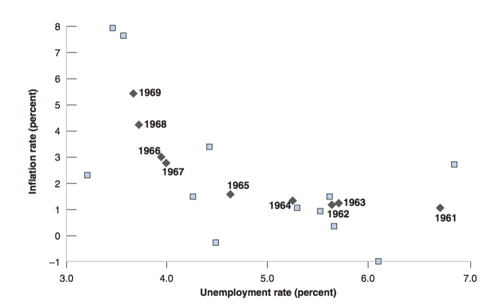
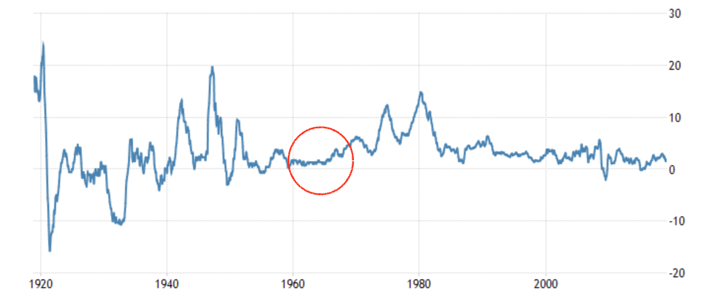
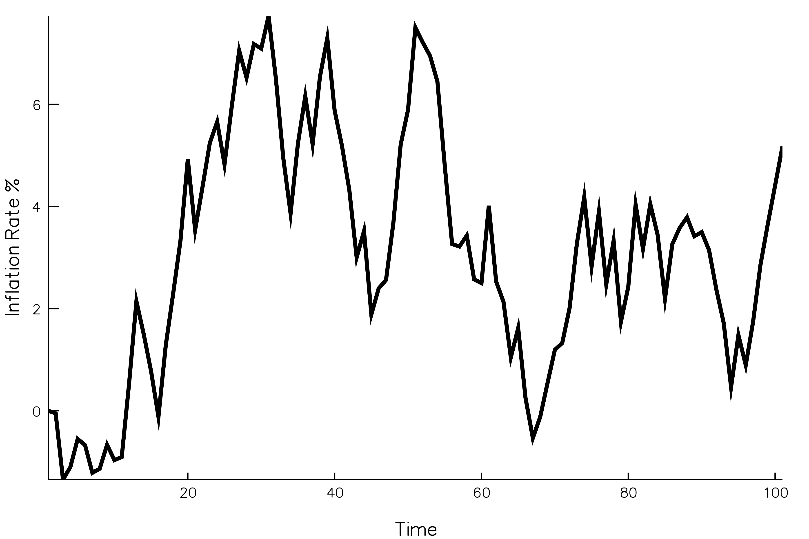
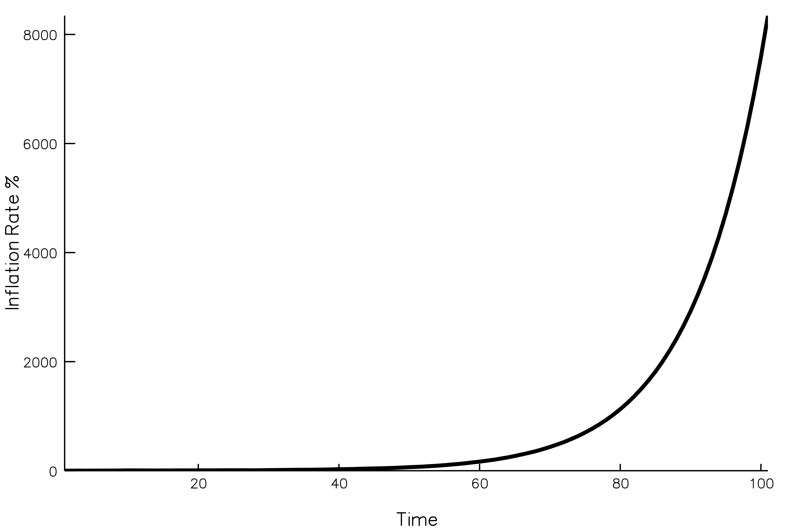
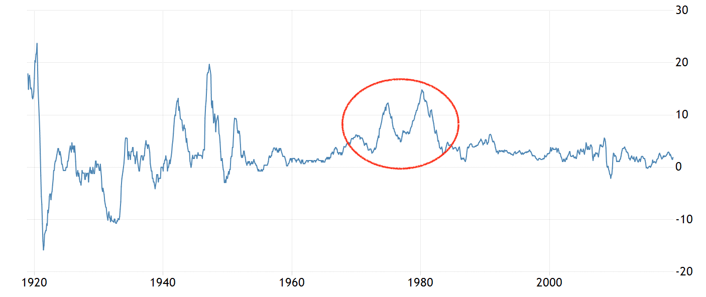
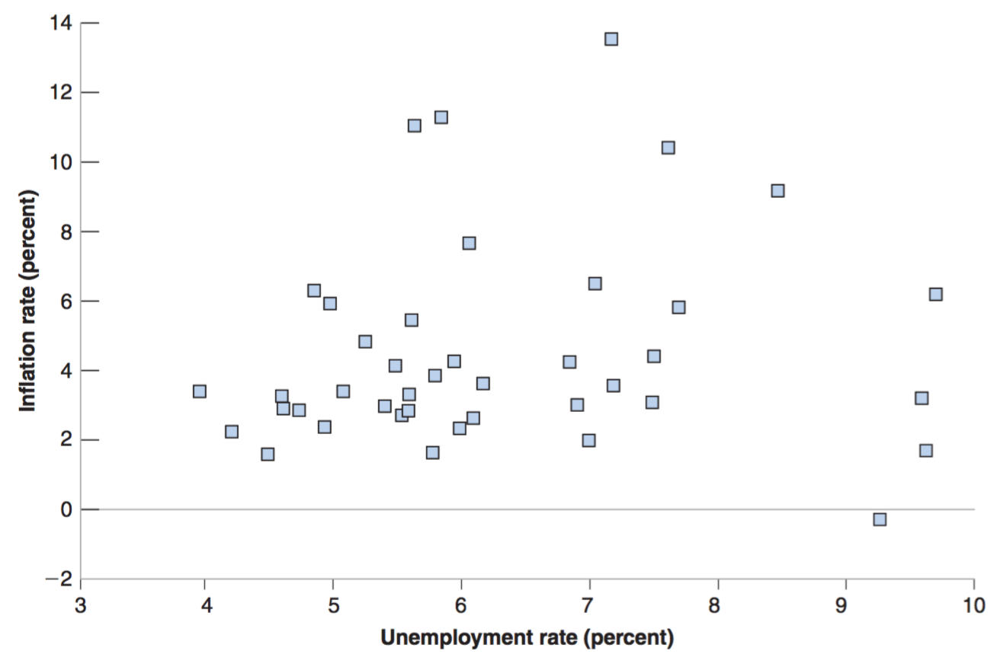
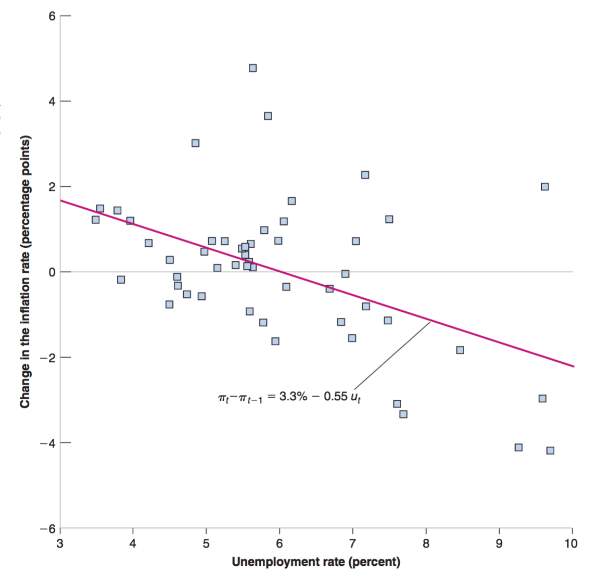
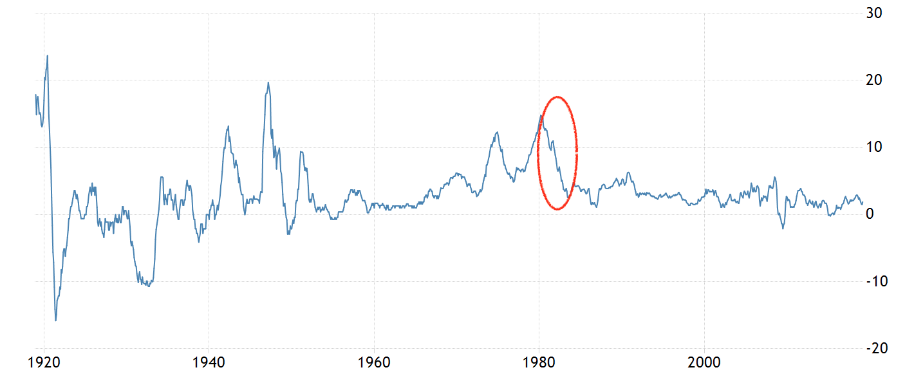

class: inverse, center, middle

```{R, setup, include = F}
options(htmltools.dir.version = FALSE)
library(pacman)
p_load(
  broom, here, tidyverse,
  latex2exp, ggplot2, ggthemes, viridis, extrafont, gridExtra,
  kableExtra,
  dplyr, magrittr, knitr, parallel
)
# Define pink color
red_pink <- "#e64173"
turquoise <- "#20B2AA"
grey_light <- "grey70"
grey_mid <- "grey50"
grey_dark <- "grey20"
# Dark slate grey: #314f4f
# Knitr options
opts_chunk$set(
  comment = "#>",
  fig.align = "center",
  fig.height = 7,
  fig.width = 10.5,
  warning = F,
  message = F
)
opts_chunk$set(dev = "svg")
options(device = function(file, width, height) {
  svg(tempfile(), width = width, height = height)
})
# A blank theme for ggplot
theme_empty <- theme_bw() + theme(
  line = element_blank(),
  rect = element_blank(),
  strip.text = element_blank(),
  axis.text = element_blank(),
  plot.title = element_blank(),
  axis.title = element_blank(),
  plot.margin = structure(c(0, 0, -0.5, -1), unit = "lines", valid.unit = 3L, class = "unit"),
  legend.position = "none"
)
theme_simple <- theme_bw() + theme(
  line = element_blank(),
  panel.grid = element_blank(),
  rect = element_blank(),
  strip.text = element_blank(),
  axis.text.x = element_text(size = 18, family = "STIXGeneral"),
  axis.text.y = element_blank(),
  axis.ticks = element_blank(),
  plot.title = element_blank(),
  axis.title = element_blank(),
  # plot.margin = structure(c(0, 0, -1, -1), unit = "lines", valid.unit = 3L, class = "unit"),
  legend.position = "none"
)
theme_axes_math <- theme_void() + theme(
  text = element_text(family = "MathJax_Math"),
  axis.title = element_text(size = 22),
  axis.title.x = element_text(hjust = .95, margin = margin(0.15, 0, 0, 0, unit = "lines")),
  axis.title.y = element_text(vjust = .95, margin = margin(0, 0.15, 0, 0, unit = "lines")),
  axis.line = element_line(
    color = "grey70",
    size = 0.25,
    arrow = arrow(angle = 30, length = unit(0.15, "inches")
  )),
  plot.margin = structure(c(1, 0, 1, 0), unit = "lines", valid.unit = 3L, class = "unit"),
  legend.position = "none"
)
theme_axes_serif <- theme_void() + theme(
  text = element_text(family = "MathJax_Main"),
  axis.title = element_text(size = 22),
  axis.title.x = element_text(hjust = .95, margin = margin(0.15, 0, 0, 0, unit = "lines")),
  axis.title.y = element_text(vjust = .95, margin = margin(0, 0.15, 0, 0, unit = "lines")),
  axis.line = element_line(
    color = "grey70",
    size = 0.25,
    arrow = arrow(angle = 30, length = unit(0.15, "inches")
  )),
  plot.margin = structure(c(1, 0, 1, 0), unit = "lines", valid.unit = 3L, class = "unit"),
  legend.position = "none"
)
theme_axes <- theme_void() + theme(
  text = element_text(family = "Fira Sans Book"),
  axis.title = element_text(size = 18),
  axis.title.x = element_text(hjust = .95, margin = margin(0.15, 0, 0, 0, unit = "lines")),
  axis.title.y = element_text(vjust = .95, margin = margin(0, 0.15, 0, 0, unit = "lines")),
  axis.line = element_line(
    color = grey_light,
    size = 0.25,
    arrow = arrow(angle = 30, length = unit(0.15, "inches")
  )),
  plot.margin = structure(c(1, 0, 1, 0), unit = "lines", valid.unit = 3L, class = "unit"),
  legend.position = "none"
)
```

# Book Chapter 8

---

class: inverse, middle, center

# Review

---

# Review

## Equation

In the last lecture, we derived __the Phillips Relation__ from __the Labor Market Equilibrium__. 

$$\pi_t = \pi^e_t + (m + z) - \alpha u_t$$
--

This Lecutre, we will use this Phillips Relation to explain the behavior of .hi[inflation rate] and .hi[unemployment rate] in the U.S. data. Specifically, we will discuss

- __the 60s and before__

- __the 70s and after__

---

# Review

## Expectation Formation

The Phillips Relation contains a term for inflation expectation. It is up to the modelers (us) to figure out how the expectation is formed. We mentioned that there are three types of expectation formations.

- __Static Expectations__

- __Adaptive Expectations__

- Rational Expectations (Not Required)

---

class: inverse, middle, center

# the 60s and before

---

# the 60s and before

## Inflation

<center>
 
</center>

- __Before 1960__ inflation was positive in some years and negative in others, on average it was around zero. 

- It is reasonable for people to __expect the inflation to be at the average level 0 next year__. 

---

# the 60s and before

## Inflation Expectation

Mathematically

$$\pi^e_t = 0$$
--
This can also be interpreted as:

People simply take __the expected price level__ to be __last year’s price level__ $P^e_t = P_{t-1}$.

$$\pi^e_t = \frac{P^e_t - P_{t-1}}{P_{t-1}} = \frac{0}{P_{t-1}} = 0$$

---

# the 60s and before

## Early Incarnation

Combining $\pi^e_t=0$ with the __Phillips Relation__,

$$\pi_t = \pi^e_t + (m + z) - \alpha u_t$$
we get 

$$\color{#e64173}{\pi_t = (m + z) - \alpha u_t}$$
This equation above is called .hi[the Early Incarnation of Phillips Curve]. It is also called __wage-price spiral__. 

---

# the 60s and before

## Wage-price Spiral

1. Low unemployment leads to __a higher nominal wage__.

2. In response to the higher nominal wage, __firms increase their prices__. The price level
increases.

3. In response to the higher price level, __workers ask for a higher nominal wage__ the
next time the wage is set.

4. The higher nominal wage leads __firms to further increase their prices__. .hi[Goes back to 2.]

---

# the 60s and before

## Wage-price Spiral
From the data, __Wage Inflation and CPI Price Inflation__ are roughly aligned. 
<center>
 
</center>

---

# the 60s and before

## Theory Matches Data

The __steady decline in the U.S. unemployment rate__ throughout the 1960s was associated with __a steady increase in the inflation rate__.

<center>
 
</center>

---

# the 60s and before

## Static Expectation Revisited

Let's revisit our assumption about how expectation is formed:

$$\pi^e_t=0$$

It says people expect the inflation rate to be zero. However, in the 60s, __the inflation rate was maintained above zero__. 

<center>
 
</center>

---

# the 60s and before

## Static Expectation Revisited

__Q__: .hi[Would the static expectation formation still be a good assumption?]

__A__: .hi[No!]

__What are the alternatives?__

1. $\pi^e_t = c$ and $c > 0$

2. $\pi^e_t = \theta \pi_{t-1}$

---

# the 60s and before

## Alternative I

$$\pi^e_t = c, \text{where } c > 0$$
Combined with the __Phillips Relation__,

$$\pi_t = \pi^e_t + (m + z) - \alpha u_t$$
We would get 

$$\color{#e64173}{\pi_t} = (c + m + z) - \alpha \color{#e64173}{u_t}$$
The __wage-price spiral__ would still exist. 

---

# the 60s and before

## Alternative II

$$\pi^e_t = \theta \pi_{t-1}$$
Combined with the __Phillips Relation__,

$$\pi_t = \theta \pi_{t-1} + (m + z) - \alpha u_t$$
We would get 

$$\color{#e64173}{\pi_t - \pi_{t-1}} = (\theta - 1) \pi_{t-1} + (m + z) - \alpha \color{#e64173}{u_t}$$
We get a new negative relation between __the change in inflation rate__ and __unemployment rate__. 

---

# the 60s and before

## Alternative II - Three Cases

We can study the second alternative in three different cases:

$$\color{#e64173}{\pi_t - \pi_{t-1}} = (\theta - 1) \pi_{t-1} + (m + z) - \alpha \color{#e64173}{u_t}$$


where 

- $0<\theta<1$

- $\theta = 1$

- $\theta > 1$

The model-predicted inflation rates are drastically different depending on which case we are looking at. 
---

# the 60s and before

## Alternative II Case 1: $0<\theta <1$

Simulation with $0<\theta <1$ for $$\pi_t = \theta \pi_{t-1} + (m + z) - \alpha u_t$$ 

<center>
 
</center>

---

# the 60s and before

## Alternative II Case 2: $\theta = 1$

.hi[This seems to be the case for the United States after the 60s!!]

Simulation with $\theta = 1$ for $$\pi_t = \theta \pi_{t-1} + (m + z) - \alpha u_t$$ 

<center>
 
</center>


---

# the 60s and before

## Alternative II Case 3: $\theta > 1$

Simulation with $\theta > 1$ for $$\pi_t = \theta \pi_{t-1} + (m + z) - \alpha u_t$$ 

<center>
 
</center>

---
class: inverse, middle, center

# the 70s and after

---

# the 70s and after

## Inflation

<center>
 
</center>

- Hit twice in the 1970s by __a large increase in the price of oil__. 

- __Higher nonlabor costs__ forced firms to increase their prices relative to the wages they were paying. __Or mark-up m increased__.

---

# the 70s and after

## Inflation Expectation

Note that in the 60s, the inflation rate was maintained above zero. The __static expectation__ 

$$\pi^e_t = 0$$ 

can't hold any more. People would be making __persistent mistakes__ using this expectation formaiton in the 60s. It is reasonable to think they changed the way they form expectations after the 60s. 


---

# the 70s and after

## Inflation Expectation

From the previous discussion, there are two possible alternatives:

1. $\pi^e_t = c, \text{where } c >0$

2. $\pi^e_t = \pi_{t-1}$

Both would work in terms of matching the positive persistent inflation observed in the data. But which one makes more sense? 

---

# the 70s and after

## Inflation - Unemployment

There is __no correlation between the inflation rate and unemployment rate__ from 1970 to 2010. 

<center>
 
</center>

---

# the 70s and after

## Alternative I

Alternative I $\pi^e_t = c$ would __still predicit that there is correlation between the inflation rate and unemployment rate__ from 1970 to 2010: 

Combine $\pi^e_t = c$ with the Phillips Relation $$\pi_t = \pi^e_t + (m + z) - \alpha u_t$$, we would get 

$$\pi_t = (c + m + z) - \alpha u_t$$
Note that $\pi_t$ and $u_t$ would still be negatively correlated. Alternative I $\pi^e_t = c$ doesn't match the data.

---

# the 70s and after

## Change in Inflation - Unemployment

There is correlation between .hi[the change in inflation rate] and unemployment rate from 1970 to 2010. 

<center>
 
</center>

---

# the 70s and after

## Alternative II

Alternative II (case 2) $\pi^e_t = \pi_{t-1}$ would match this correlation between .hi[the change in inflation rate] and unemployment rate from 1970 to 2010. 

Combine $\pi^e_t = \pi_{t-1}$ with the Phillips Relation $$\pi_t = \pi^e_t + (m + z) - \alpha u_t$$, we would get 

$$\pi_t - \pi_{t-1} = (m + z) - \alpha u_t$$
Note that __change in inflation__, $\pi_t - \pi_{t-1}$ and $u_t$ would be negatively correlated. Alternative II $\pi^e_t = \pi_{t-1}$ matches the data.

---

# the 70s and after

## Accelerationist Phillips Curve

Using a regression line to estimate the model implied by Alternative II, we get

$$\pi_t - \pi_{t-1} = 3.3\% - 0.55 u_t$$
This Relation is also called .hi[Accelerationist Phillips Curve]

---

# the 70s and after

## Accelerationist Phillips Curve

One of the reasons why we want to figure out the Phillips Curve is because we can use it to predict inflation rate. Suppose the Accelerationist Phillips Curve holds in an economy:

$$\pi_t - \pi_{t-1} = 3.3\% - 0.55 u_t$$
Let $\pi_{2017} = 2%$, and unemployment rate for 2017 and 2018 are $u_{2018} = 4\%$ and $u_{2019} = 6\%$. What is the inflation rate in 2019 $\pi_{2019}$? 


---

# the 70s and after

## Contractionary Policies

__Contractionary policies__ notably occurred in the early 1980s when the then-Federal Reserve chairman Paul Volcker finally __ended the soaring inflation of the 1970s__.

- Higher Tax and Lower Government Spending

- Less money supply (higher interest rate)

These two policies can be analyzed in the framework of ADAS model. The result is .hi[lower output, higher unemployment rate, negative change in the inflation rate] (cool down the economy). 

---

# the 70s and after

## Contractionary Policies

These two policies can be analyzed in the framework of ADAS model. The result is .lower output, higher unemployment rate, .hi[negative change in the inflation rate] (cool down the economy). 

<center>
 
</center>

---

class: inverse, middle, center

# Natural Rate of Unemployment

---
# Natural Rate of Unemployment

## Derive the Natural Rate of Unemployment

Recall that the natural rate of unemployment is the __Equilibrium Unemployment Rate from the Labor Market Model__. 

The Labor Market Equilibrium can be written as 

\begin{align}
\text{WS} : \color{#e64173}{W} & = P^e F(u, z)\\
\text{PS} : P & = (1 + m) \color{#e64173}{W} \\
F(u, z) & = 1 - \alpha u + z
\end{align}

Or 

$$P  = (1 + m) P^e (1 - \alpha u + z) $$
---
# Natural Rate of Unemployment

## Derive the Natural Rate of Unemployment

Let $P^e = P$, we have

$$1 = (1 + m) (1 - \alpha u_n + z) \approx 1 + m - \alpha u_n + z$$
We get
$$\color{#e64173}{u_n = \frac{m + z}{\alpha}}$$

---

# Natural Rate of Unemployment

## Rewrite the Phillips Relation

It is useful to rewrite the Phillips Relation in terms of the natural rate of unemployment. 

\begin{align}
\pi_t & = \pi^e_t + (m + z) - \alpha u_t \\
\pi_t & = \pi^e_t + \alpha \color{#e64173}{\frac{(m + z)}{\alpha}} - \alpha u_t\\
\pi_t & = \pi^e_t + \alpha \color{#e64173}{u_n} - \alpha u_t\\
\pi_t & = \pi^e_t - \alpha(u_t - \color{#e64173}{u_n})\\
\pi_t - \pi^e_t & = - \alpha(u_t - \color{#e64173}{u_n})
\end{align}

---

# Natural Rate of Unemployment

## Rewrite the Phillips Relation

Static Expectation with $\pi^e_t = 0$:

$$\pi_t  = - \alpha(u_t - u_n)$$
Adaptive Expectation with $\pi^e_t = \pi_{t-1}$:

$$\pi_t - \pi_{t-1}  = - \alpha(u_t - u_n)$$

---

# Natural Rate of Unemployment

## Change Since the 80s

The natural rate of unemployment 

$$\color{#e64173}{u_n = \frac{m + z}{\alpha}}$$

__It appeared that the natural rate was around 5%, so roughly 2% lower than it had been in the 1980s. __

---

# Natural Rate of Unemployment

## Questions

Suppose the natural rate of unemployment is 5%. This year the unemployment rate is 6%. The last year the inflation rate is 2%. $F(u, z) = 1 - \alpha u + z$ where $\alpha = -0.5$. 

__Q1__: If the expectation formation is $\pi^e_t = 0$, what is this year's inflation rate? 

__Q2__: If the expectation formation is $\pi^e_t = \pi_{t-1}$, what is this year's inflation rate? 

---

# Natural Rate of Unemployment

## Questions

__Q1__: If the expectation formation is $\pi^e_t = 0$, what is this year's inflation rate? 

__A1__: If the expectation formation is $\pi^e_t = 0$, the Phillips Relation can be written in terms of the natural rate of unemployment. 

$$\pi_t  = - \alpha(u_t - u_n) = -0.5 (6\% - 5\%) = -0.5\%$$

---

# Natural Rate of Unemployment

## Questions

__Q2__: If the expectation formation is $\pi^e_t = \pi_{t-1}$, what is this year's inflation rate? 

__A1__: If the expectation formation is $\pi^e_t = \pi_{t-1}$, the Phillips Relation can be written in terms of the natural rate of unemployment. 

$$\pi_t - \pi_{t-1}  = - \alpha(u_t - u_n) = -0.5 (6\% - 5\%) = -0.5\%$$
and 

$$\pi_{t-1} = 2\%$$
then
$$\pi_{t} = 2\% - 0.5\%  = 1.5\%$$
---

# Natural Rate of Unemployment

## The Great Depression

Let's use the Static Expectation Formation for Great Depression (1930s), the Phillips Curve can be written as

$$\pi_t  = - \alpha(u_t - u_n)$$
__Question__: During the great depression, we see a very high $u_t$, but also we see a large deflation $\pi_t < 0$. How do we explain this?

---
exclude: true

```{R, generate pdfs, include = F}
system("decktape remark 14_phillips_curve_part2.html 14_phillips_curve_part2.pdf --chrome-arg=--allow-file-access-from-files")
```


