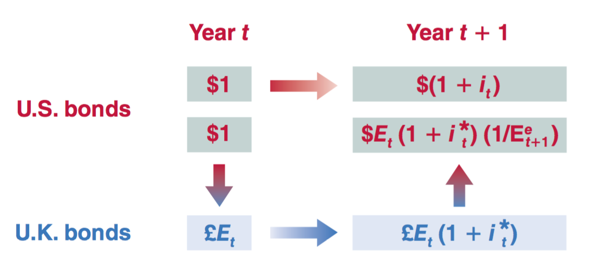
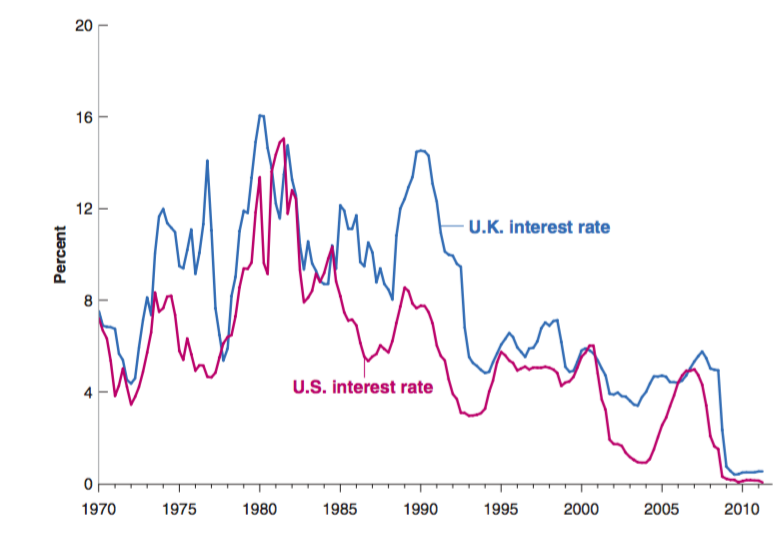
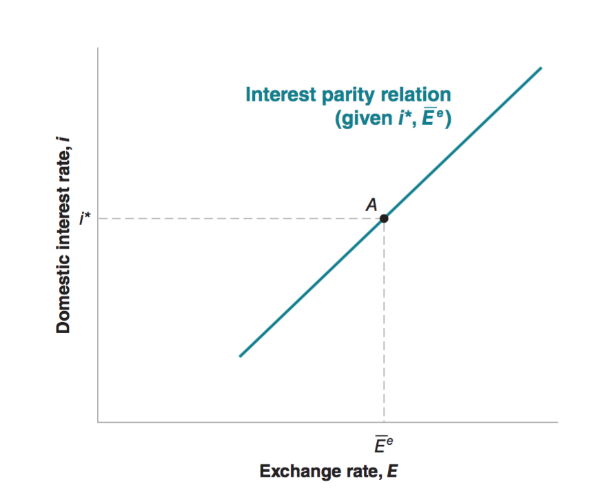

class: inverse, center, middle

```{R, setup, include = F}
options(htmltools.dir.version = FALSE)
library(pacman)
p_load(
  broom, here, tidyverse,
  latex2exp, ggplot2, ggthemes, viridis, extrafont, gridExtra,
  kableExtra,
  dplyr, magrittr, knitr, parallel
)
# Define pink color
red_pink <- "#e64173"
turquoise <- "#20B2AA"
grey_light <- "grey70"
grey_mid <- "grey50"
grey_dark <- "grey20"
# Dark slate grey: #314f4f
# Knitr options
opts_chunk$set(
  comment = "#>",
  fig.align = "center",
  fig.height = 7,
  fig.width = 10.5,
  warning = F,
  message = F
)
opts_chunk$set(dev = "svg")
options(device = function(file, width, height) {
  svg(tempfile(), width = width, height = height)
})
# A blank theme for ggplot
theme_empty <- theme_bw() + theme(
  line = element_blank(),
  rect = element_blank(),
  strip.text = element_blank(),
  axis.text = element_blank(),
  plot.title = element_blank(),
  axis.title = element_blank(),
  plot.margin = structure(c(0, 0, -0.5, -1), unit = "lines", valid.unit = 3L, class = "unit"),
  legend.position = "none"
)
theme_simple <- theme_bw() + theme(
  line = element_blank(),
  panel.grid = element_blank(),
  rect = element_blank(),
  strip.text = element_blank(),
  axis.text.x = element_text(size = 18, family = "STIXGeneral"),
  axis.text.y = element_blank(),
  axis.ticks = element_blank(),
  plot.title = element_blank(),
  axis.title = element_blank(),
  # plot.margin = structure(c(0, 0, -1, -1), unit = "lines", valid.unit = 3L, class = "unit"),
  legend.position = "none"
)
theme_axes_math <- theme_void() + theme(
  text = element_text(family = "MathJax_Math"),
  axis.title = element_text(size = 22),
  axis.title.x = element_text(hjust = .95, margin = margin(0.15, 0, 0, 0, unit = "lines")),
  axis.title.y = element_text(vjust = .95, margin = margin(0, 0.15, 0, 0, unit = "lines")),
  axis.line = element_line(
    color = "grey70",
    size = 0.25,
    arrow = arrow(angle = 30, length = unit(0.15, "inches")
  )),
  plot.margin = structure(c(1, 0, 1, 0), unit = "lines", valid.unit = 3L, class = "unit"),
  legend.position = "none"
)
theme_axes_serif <- theme_void() + theme(
  text = element_text(family = "MathJax_Main"),
  axis.title = element_text(size = 22),
  axis.title.x = element_text(hjust = .95, margin = margin(0.15, 0, 0, 0, unit = "lines")),
  axis.title.y = element_text(vjust = .95, margin = margin(0, 0.15, 0, 0, unit = "lines")),
  axis.line = element_line(
    color = "grey70",
    size = 0.25,
    arrow = arrow(angle = 30, length = unit(0.15, "inches")
  )),
  plot.margin = structure(c(1, 0, 1, 0), unit = "lines", valid.unit = 3L, class = "unit"),
  legend.position = "none"
)
theme_axes <- theme_void() + theme(
  text = element_text(family = "Fira Sans Book"),
  axis.title = element_text(size = 18),
  axis.title.x = element_text(hjust = .95, margin = margin(0.15, 0, 0, 0, unit = "lines")),
  axis.title.y = element_text(vjust = .95, margin = margin(0, 0.15, 0, 0, unit = "lines")),
  axis.line = element_line(
    color = grey_light,
    size = 0.25,
    arrow = arrow(angle = 30, length = unit(0.15, "inches")
  )),
  plot.margin = structure(c(1, 0, 1, 0), unit = "lines", valid.unit = 3L, class = "unit"),
  legend.position = "none"
)
```

# Book Chapter 18 & 20

---

class: inverse, middle, center

# Overview

---

# Overview

## Openness in financial markets

- Choices between .hi[domestic assets] and .hi[foreign assets].

- Capital controls __lower the openness in financial market__

  - Restrictions on the foreign assets their domestic residents could hold 
  
  - Restrictions on the domestic assets foreigners could hold.
  
---

# Overview

## Openness in financial markets

Openness in financial markets also means there is a __foreign exchange market__ where people trade foreign currencies (also called foreign exchange). 

People sell and buy foreign currencies because of 

- __buying or selling foreign assets__. 

- __trade__. (Less than 1%.)

---

# Overview

## Openness in financial markets

In 2010, for example, the recorded __daily volume__ of .hi[foreign exchange transactions] in the world was $4 trillion, of which 85%—about $3.4 trillion—involved U.S. dollars on one side of the transaction.

- __More than 99%__ of the foreign exchange transactions are associated with __purchases and sales of financial assets__. 

- __Less than 1%__ of the foreign exchange transactions are associated with __trade__.

---

# Overview

## Openness in financial markets

For a country as a whole, openness in financial markets has another important implication:  It allows the country to run trade surpluses and trade deficits. 

- Recall __NX = -NCI__

- Hence __NX < 0__ implies __NCI > 0__

- This means the economy is __borrowing money from the rest of the world__ to pay for the difference between what it buys and what it sells.  


---


class: inverse, middle, center

# Openness in Financial Markets

---

# Openness in Financial Markets

## Domestic Asset or Foreign Asset? 

Let's consider which bond to buy: one-year __US bond__ or one-year __UK bond__.

Let $i_t$ be the one-year US bond's interest rate.

Let $i^*_t$ be the one-year UK bond's interest rate.

In year t, you are faced with two options. Which one would you choose?

.hi[Option 1]: buy 1 dollar worth US bond

.hi[Option 2]: buy 1 dollar worth of UK bond

---

# Openness in Financial Markets

## US Bonds

.hi[Option 1]: buy 1 dollar worth US bond

After 1 year, you will have $(1 + i_t)$ dollars. 

---
# Openness in Financial Markets

## UK Bonds

.hi[Option 2]: buy 1 dollar worth of UK bond

You can't buy UK bonds with American dollars. You need to first exchange this 1 dollar to British pounds.

For 1 dollar, you can get $E_t$ pounds. Recall that $E_t$ is the nominal exchange rate in year t. 

After 1 year, you will have $E_t (1 + i^*_t)$ pounds.

If you .hi[expect] the exchange rate next year (t+1) will be $E_{t+1}^e$, then you expect to exchange $E_t (1 + i^*_t)$ pounds to $\frac{E_t (1 + i^*_t)}{E_{t+1}^e}$ dollars. 

---
# Openness in Financial Markets

## Domestic Asset or Foreign Asset? 

Two Options - Diagram

<center>
 
</center>

---

# Openness in Financial Markets

## Domestic Asset or Foreign Asset? 

.hi[In reality], financial investors __hold both US bonds and UK bonds__.

This implies that the investors expect the returns on UK bonds equal to the returns on US bonds. This is called the .hi[interest parity condition]. (Arbitrage Assumption)

$$(1 + i_t) = \frac{E_t (1 + i^*_t)}{E_{t+1}^e}$$

---
# Openness in Financial Markets

## Domestic Asset or Foreign Asset? 

.hi[interest parity condition]

$$(1 + i_t) = \frac{E_t (1 + i^*_t)}{E_{t+1}^e}$$

Note this parity ignores

- Transaction costs

- Risk

For the rich countries of the world, the arbitrage assumption is a good approximation of reality.

---
# Openness in Financial Markets

## Interest Rates and Exchange Rates

Note we can simplify the .hi[interest parity condition]

\begin{align}
(1 + i_t) & = \frac{E_t (1 + i^*_t)}{E_{t+1}^e}\\
(1 + i_t) & = \frac{(1 + i^*_t)}{1 + (E_{t+1}^e - E_t) / E_t}\\
i_t & = i^*_t - (E_{t+1}^e - E_t) / E_t
\end{align}

---

# Openness in Financial Markets

## Interest Rates and Exchange Rates

__Question__: If the interest rate in U.S. is lower than the interest rate in UK, does that mean the foreign exchange market signals that the exchange rate for dollars is increasing or decreasing?

__Answer__: $(E_{t+1}^e - E_t) / E_t = i^*_t - i_t > 0$ hence 
$(E_{t+1}^e - E_t) > 0$ hence $E_{t+1}^e > E_t$ which means the market expects the exchange rate for dollars to go up 

---

# Openness in Financial Markets

## Interest Rates 

U.S. and U.K. nominal interest rates have largely moved to- gether over the last 40 years. But US interest rate is consistently lower than the UK interest rate. 

<center>
 
</center>

---

# Openness in Financial Markets

## How Many Markets?

In an open economy, there are .hi[two financial markets]. People make choices between

- __(domestic) money and (domestic) bonds__

  - Domestic Money Market

- __domestic bonds and foreign bonds__

  - International Bonds Market
  
__We want them both to be at equilibrium!__

---

# Openness in Financial Markets

## How Many Markets?

In an open economy, there are .hi[two financial markets]. 

Right now we are building a economics model that covers __both markets__, and there are __two variables of interest__!

- Interest Rate

- Exchange Rate

__The model we are building can describe the behaviors of both variables in equilibrium. __


---

class: inverse, middle, center

# Equilibria 

---

# Equilibrium 

## Equilibrium I - Domestic Money Market

To determine the interest rate, we need that the __supply of money be equal to the demand for money__. 

Recall $M$ is money supply, $P$ is GDP deflator, $Y$ is output, $L(i)$ is the liquidity function which is decreasing in $i$. 

$$\frac{M}{P} = Y L(i)$$
This relation pretty much holds in an open economy: the demand for domestic money is still __mostly a demand by domestic residents__. 

---

# Equilibrium 

## Equilibrium II - International Bonds Market

The equilibrium in the international bonds market is charaterized by the .hi[interest parity condition] which is nonarbitrary assumption. 

$$(1 + i_t) = (1 + i_t^*) \frac{E_t}{E^e_{t+1}}$$
Reorganize this equation and mask the time index, we get the equilibrium condition

$$E = \frac{1 + i}{1 + i^*} \bar E^e$$
where we shall take the expected future exchange rate as given (exogeneous) and denote it as
$E^e$. 

---

# Equilibrium 

## Equilibrium II - International Bonds Market

$$E = \frac{1 + i}{1 + i^*} \bar E^e$$

- __An increase in the domestic interest rate__ leads to __an increase in the exchange rate__.

- __An decrease in the foreign interest rate__ leads to __an increase in the exchange rate__.

- __An increase in the expected future exchange rate__ leads to __an increase in the current exchange rate__.

---

# Equilibrium 

## Equilibrium II - International Bonds Market

__An increase in the domestic interest rate__, or __an decrease in the foreign interest rate__, or __an increase in the expected future exchange rate__

- Dollars become more attractive

- People sell foreign currencies to buy dollars

- Dollars appreciate (increase in the exchange rate)

---

# Equilibrium 

## Equilibrium II - International Bonds Market

- Consider financial investors—investors, for short—choosing between U.S. bonds and Japanese bonds.

- Suppose that the one-year interest rate on U.S. bonds is 2%, and the one-year interest rate on Japanese bonds is also 2%.

- Suppose that the current exchange rate is 100 (one dollar is worth 100 yens), and the expected exchange rate a year from now is also 100.

- Under these assumptions, both U.S. and Japanese bonds have the same expected return in dollars, and the interest parity condition holds.

---

# Equilibrium 

## Equilibrium II - International Bonds Market

- Suppose now that investors now expect the exchange rate to be 10% higher a year from now, so Ee is now equal to 110. 

- At an unchanged current exchange rate, U.S. bonds are now much more attractive than Japanese bonds.

- At the initial exchange rate of 100, investors want to shift out of Japanese bonds into U.S. bonds. 

- To do so, they must first sell Japanese bonds for yens, then sell yens for dollars, and then use the dollars to buy U.S. bonds. As investors sell yens and buy dollars, the dollar appreciates.

---

# Equilibrium 

## Equilibrium II - International Bonds Market

- __An increase in the domestic interest rate__ leads to __an increase in the exchange rate__.

$$E = \frac{1 + i}{1 + i^*} \bar E^e$$
<center>
 
</center>

---

# Equilibrium 

## Two Markets Combined

Now we can analyze how equilibirum interest rate and equilibrium exchange rate by combining both markets equilibrium equations. 

\begin{align}
\frac{M}{P} & = Y L(i)\\
E & = \frac{1 + i}{1 + i^*} \bar E^e
\end{align}

.hi[Exogeneous variables]: $M$, $P$, $Y$, $i^*$, $E^e$

.hi[Endogeneous variables]: $E$ and $i$

We can use the financial markets model to explain how $E$ and $i$ change in response to changes in $M$, $P$, $Y$, $i^*$, or $E^e$


---

# Equilibrium 

## Higher $M$ - Math

If money supply $M$ is higher

- equilibrium interest rate $i$ goes down. 

- equilibrium exchange rate $E$ goes down. 

\begin{align}
\frac{M}{P} & = Y L(i)\\
E & = \frac{1 + i}{1 + i^*} \bar E^e
\end{align}

---

# Equilibrium 

## Higher $M$ - Intuition

- Higher money supply $M$ leads to higher domestic bonds demand, which leads to a decrease in domestic interest rate (bonds price increases). 

- A lower domestic interest rate makes the domestic bonds less attractive which leads to a decrease in demand for domestic currency. 

- Hence the exchange rate decreases. 

---

# Equilibrium 

## Higher $P$ - Math

If GDP deflator $P$ is higher

- equilibrium interest rate $i$ goes up 

- equilibrium exchange rate $E$ goes up 

\begin{align}
\frac{M}{P} & = Y L(i)\\
E & = \frac{1 + i}{1 + i^*} \bar E^e
\end{align}

---

# Equilibrium 

## Higher $P$ - Intuition

- Higher GDP deflator $P$ leads to a lower domestic money supply.

- A lower domestic money supply leads to a lower demand for bonds, which leads to an increase in domestic interest rate (bonds price decreases). 

- A higher domestic interest rate makes the domestic bonds more attractive which leads to a higher demand for domestic currency. 

- Hence the exchange rate increases. 

---
# Equilibrium 

## Higher $Y$ - Math

If output $Y$ is higher

- equilibrium interest rate $i$ goes up 

- equilibrium exchange rate $E$ goes up 

\begin{align}
\frac{M}{P} & = Y L(i)\\
E & = \frac{1 + i}{1 + i^*} \bar E^e
\end{align}

---

# Equilibrium 

## Higher $Y$ - Intuition

- Higher output $Y$ leads to a higher domestic money demand.

- A higher domestic money demand leads to a higher supply for bonds, which leads to an increase in domestic interest rate (bonds price decreases). 

- A higher domestic interest rate makes the domestic bonds more attractive which leads to a higher demand for domestic currency. 

- Hence the exchange rate increases. 

---

# Equilibrium 

## Higher $i^*$ - Math

If foreign interest rate $i^*$ is higher

- equilibrium interest rate $i$ doesn't change

- equilibrium exchange rate $E$ goes down 

\begin{align}
\frac{M}{P} & = Y L(i)\\
E & = \frac{1 + i}{1 + i^*} \bar E^e
\end{align}

---

# Equilibrium 

## Higher $i^*$ - Intuition

- Changes in the foreign interest rate do not affect the domestic bonds market. The interest rate $i$ does not change.

- Higher foreign interest rate $i^*$ makes foreign bonds more attractive, which leads to a higher supply of domestic currency.

- Hence exchange rate decrease. 

---

# Equilibrium 

## Higher $\bar E^e$ - Math

If expected future exchange rate $\bar E^e$ is higher

- equilibrium interest rate $i$ doesn't change

- equilibrium exchange rate $E$ goes up 

\begin{align}
\frac{M}{P} & = Y L(i)\\
E & = \frac{1 + i}{1 + i^*} \bar E^e
\end{align}

---

# Equilibrium 

## Higher $\bar E^e$ - Intuition

- Changes in the future expectation of exchange rate do not affect the domestic bonds market. The interest rate $i$ does not change.

- Higher expected future exchange rate $\bar E^e$ makes domestic currency more attractive, which leads to a higher demand of domestic currency.

- Hence exchange rate increases. 

---

# Equilibrium 

## Numerical Example

Let $L(i) = \frac{1}{a + bi}$. We have the financial markets equilibrium for the open economy as follows

\begin{align}
\frac{M}{P} & = Y \frac{1}{a + bi}\\
E & = \frac{1 + i}{1 + i^*} \bar E^e
\end{align}

The first equation implies 

$i = \frac{PY - aM}{bM}$

Plug this to the second equation we get

$E = \frac{PY - aM + bM}{bM(1 + i^*)}\bar E^e$


---
exclude: true

```{R, generate pdfs, include = F}
system("decktape remark 16_openness_moneymarket.html 16_openness_moneymarket.pdf --chrome-arg=--allow-file-access-from-files")
```
