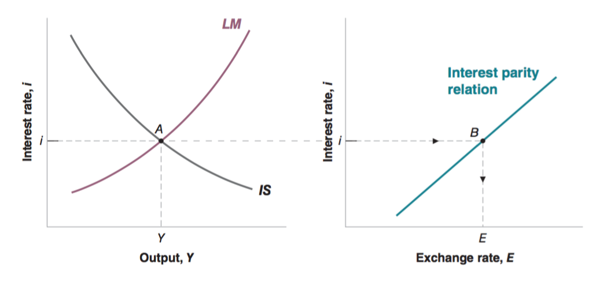
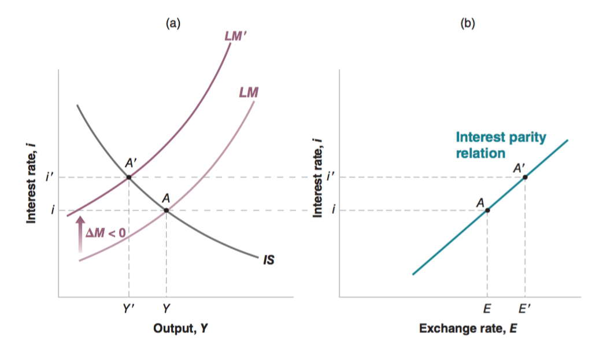
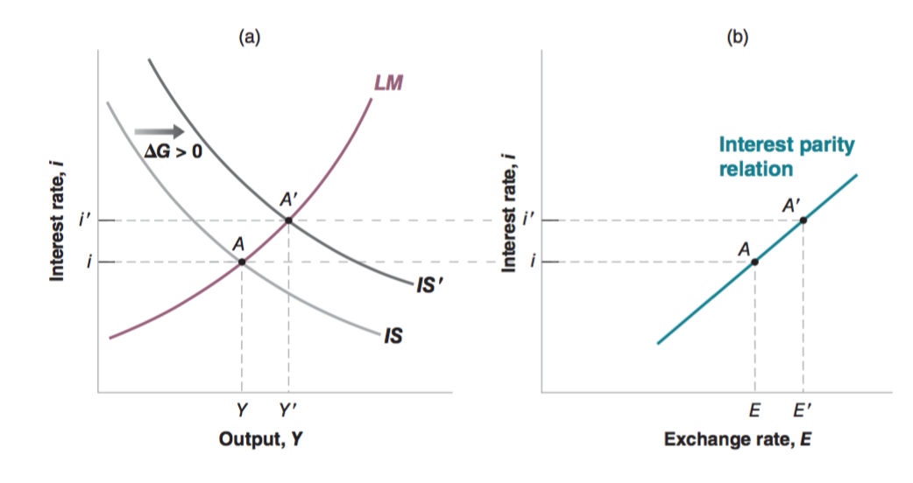
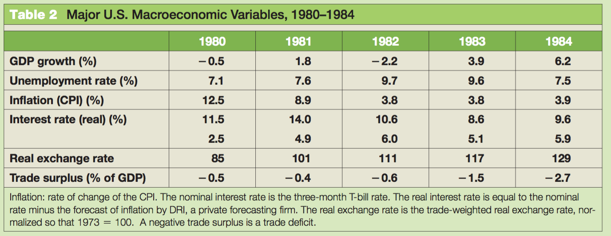
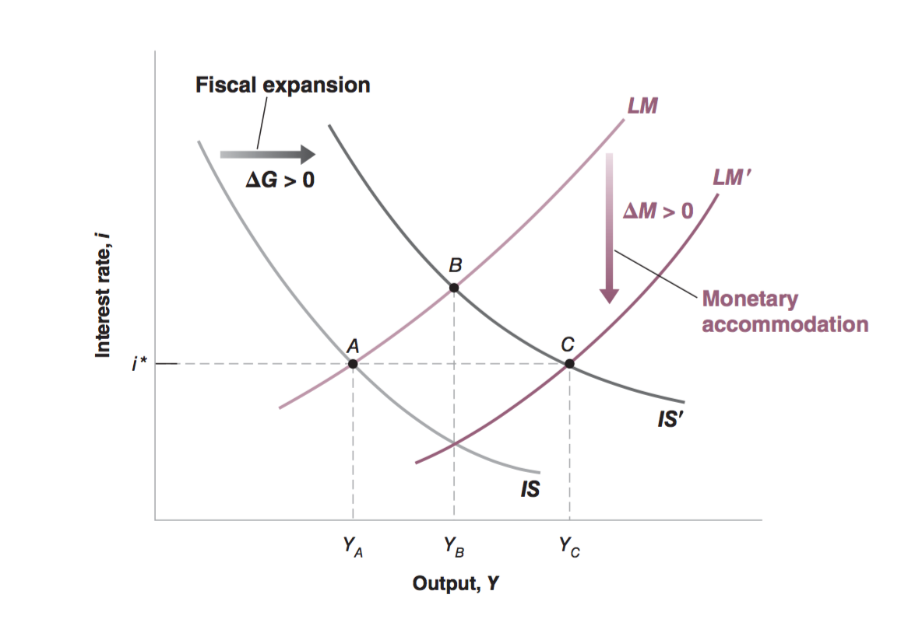

class: inverse, center, middle

```{R, setup, include = F}
options(htmltools.dir.version = FALSE)
library(pacman)
p_load(
  broom, here, tidyverse,
  latex2exp, ggplot2, ggthemes, viridis, extrafont, gridExtra,
  kableExtra,
  dplyr, magrittr, knitr, parallel
)
# Define pink color
red_pink <- "#e64173"
turquoise <- "#20B2AA"
grey_light <- "grey70"
grey_mid <- "grey50"
grey_dark <- "grey20"
# Dark slate grey: #314f4f
# Knitr options
opts_chunk$set(
  comment = "#>",
  fig.align = "center",
  fig.height = 7,
  fig.width = 10.5,
  warning = F,
  message = F
)
opts_chunk$set(dev = "svg")
options(device = function(file, width, height) {
  svg(tempfile(), width = width, height = height)
})
# A blank theme for ggplot
theme_empty <- theme_bw() + theme(
  line = element_blank(),
  rect = element_blank(),
  strip.text = element_blank(),
  axis.text = element_blank(),
  plot.title = element_blank(),
  axis.title = element_blank(),
  plot.margin = structure(c(0, 0, -0.5, -1), unit = "lines", valid.unit = 3L, class = "unit"),
  legend.position = "none"
)
theme_simple <- theme_bw() + theme(
  line = element_blank(),
  panel.grid = element_blank(),
  rect = element_blank(),
  strip.text = element_blank(),
  axis.text.x = element_text(size = 18, family = "STIXGeneral"),
  axis.text.y = element_blank(),
  axis.ticks = element_blank(),
  plot.title = element_blank(),
  axis.title = element_blank(),
  # plot.margin = structure(c(0, 0, -1, -1), unit = "lines", valid.unit = 3L, class = "unit"),
  legend.position = "none"
)
theme_axes_math <- theme_void() + theme(
  text = element_text(family = "MathJax_Math"),
  axis.title = element_text(size = 22),
  axis.title.x = element_text(hjust = .95, margin = margin(0.15, 0, 0, 0, unit = "lines")),
  axis.title.y = element_text(vjust = .95, margin = margin(0, 0.15, 0, 0, unit = "lines")),
  axis.line = element_line(
    color = "grey70",
    size = 0.25,
    arrow = arrow(angle = 30, length = unit(0.15, "inches")
  )),
  plot.margin = structure(c(1, 0, 1, 0), unit = "lines", valid.unit = 3L, class = "unit"),
  legend.position = "none"
)
theme_axes_serif <- theme_void() + theme(
  text = element_text(family = "MathJax_Main"),
  axis.title = element_text(size = 22),
  axis.title.x = element_text(hjust = .95, margin = margin(0.15, 0, 0, 0, unit = "lines")),
  axis.title.y = element_text(vjust = .95, margin = margin(0, 0.15, 0, 0, unit = "lines")),
  axis.line = element_line(
    color = "grey70",
    size = 0.25,
    arrow = arrow(angle = 30, length = unit(0.15, "inches")
  )),
  plot.margin = structure(c(1, 0, 1, 0), unit = "lines", valid.unit = 3L, class = "unit"),
  legend.position = "none"
)
theme_axes <- theme_void() + theme(
  text = element_text(family = "Fira Sans Book"),
  axis.title = element_text(size = 18),
  axis.title.x = element_text(hjust = .95, margin = margin(0.15, 0, 0, 0, unit = "lines")),
  axis.title.y = element_text(vjust = .95, margin = margin(0, 0.15, 0, 0, unit = "lines")),
  axis.line = element_line(
    color = grey_light,
    size = 0.25,
    arrow = arrow(angle = 30, length = unit(0.15, "inches")
  )),
  plot.margin = structure(c(1, 0, 1, 0), unit = "lines", valid.unit = 3L, class = "unit"),
  legend.position = "none"
)
```

# Book Chapter 20

---

class: inverse, middle, center

# Overview

---
# Overview

## Open IS-LM

In the open goods market, the variable of interest is output __Y__.

In the open financial markets, the variables of interest are interest rate __i__ and exchange rate __E__. 

Now we want a model that describe all of these variables at the same time:

__Open IS-LM__

---

# Overview

## Openness in Goods Market

Recall the Open Goods Market Model

$$Y = C(Y - T) + I(Y, i) + G - IM(Y, \epsilon)/\epsilon + X(Y^*, \epsilon)/\epsilon$$
It will be convenient to regroup the last two terms under "net exports", defined as exports minus the value of imports: 

$$NX(Y, Y^*, \epsilon) = X(Y^*) - IM(Y, \epsilon)/\epsilon$$
It is easy to see that 

- __NX is decreasing in Y__

- __NX is increasing in $Y^*$ __

---

# Overview

## Marshall-Lerner Condition

Right now, we don't really know how NX changes in response to the real exchange rate $\epsilon$. 

$$NX(Y, Y^*, \epsilon) = X(Y^*) - IM(Y, \epsilon)/\epsilon$$

The condition under which a real depreciation leads to an increase in net exports is known as the .pink[Marshall-Lerner condition]. This condition is __empirically true__. We will assume this condition for the rest of the class!

---

# Overview

## Net Export Function

In conclusion, we can write

$$NX(\underbrace{Y, Y^*, \epsilon}_{(-, +, -)}) = X(Y^*) - IM(Y, \epsilon)/\epsilon$$
Using this definition of net exports, we can rewrite the equilibrium condition as 

$$Y = C(\underbrace{Y - T}_{+}) + I(\underbrace{Y, i}_{+, -}) + G + NX(\underbrace{Y, Y^*, \epsilon}_{-,+,-})$$
---

# Overview

## Notational Convenience 

Since domestic price and foreign price are just index numbers, we can set 

$$P / P^* = 1$$
Then we have real exchange rate equal to nominal exchange rate

$$\epsilon = E$$
Hence, we have Open Goods Market Equilibrium:

$$Y = C(\underbrace{Y - T}_{+}) + I(\underbrace{Y, i}_{+, -}) + G + NX(\underbrace{Y, Y^*, E}_{-,+,-})$$

---

# Overview

## Open Financial Markets

The Open Financial Markets give us __two equations__:

$$\frac{M}{P} = Y L(i)$$
$$E = \frac{1 + i}{1 + i^*} \bar E^e$$
---

class: inverse, middle, center

# IS Relation
---

# IS Relation

## Derive IS Relation

Combine:


$$Y = C(Y - T) + I(Y, i) + G + NX(Y, Y^*, E)$$
$$E = \frac{1 + i}{1 + i^*} \bar E^e$$
We get the IS Relation for the Open Econonmy:

$$Y = C(Y - T) + I(Y, i) + G + NX(Y, Y^*, \frac{1 + i}{1 + i^*} \bar E^e)$$

---
# IS Relation

## Two Effects:

$$Y = C(Y - T) + I(Y, i) + G + NX(Y, Y^*, \frac{1 + i}{1 + i^*} \bar E^e)$$
An increase in the interest rate now has two effects:

- First Effect: Through Investment (and Consumption)

- Second Effect: Through Net Export

---
# IS Relation

## First (Direct) Effect - Investment

- The first effect, which was already present in __a closed economy__, is the direct effect on investment: __A higher interest rate leads to a decrease in investment__, a decrease in the demand for domestic goods, and a decrease in output.


---
# IS Relation

## Second (Indirect) Effect - Net Export

- The second effect, is the effect through the exchange rate: An increase in the domestic interest rate leads to an increase in the exchange rate—an appreciation. The appreciation, which makes domestic goods more expensive relative to foreign goods, leads to __a decrease in net exports__, and therefore to a decrease in the demand for domestic goods and a decrease in output.

---
# IS Relation

## Downward Sloping

Both effects work in the same direction: __An increase in the interest rate decreases demand__ .pink[directly]-through investment, and .pink[ indirectly]—through the adverse effect of the appreciation on demand。

Hence IS Curve in an open market is still a .pink[downward-sloping curve].

---

class: inverse, middle, center

# LM Relation

---

# LM Relation

## Upward Sloping

In an open market the LM relation is exactly the same as the closed economy, given by the following equation:

$$\frac{M}{P} = Y L(i)$$
We have shown that this equation implies LM curve is an .pink[upward-sloping curve.]

---

class: inverse, middle, center

# Open IS-LM

---

# Open IS-LM

## Graphically 

Draw the Interest Parity Relation right next to the IS-LM Model.

Combine these two graphs, we can find __equilibrium interest rate__, __equilibrium output__ and __equilibrium exchange rate__. All three variables of interest.

<center>
 
</center>

---

# Open IS-LM

## Mundell-Fleming Model

This version of the IS–LM model for the open economy was first put together in the 1960s by the two economists we mentioned at the outset of the chapter, __Robert Mundell__, at Columbia University, and __Marcus Fleming__, at the International Monetary

This model is still very much in use today!


---

class: inverse, middle, center

# Policy Analysis

---

# Policy Analysis 

## Contractionary Monetary Policy - Early 80s

The __early 1980s in the United States__ were dominated by __sharp changes__ both .pink[in monetary policy and in fiscal policy].

By the late 1970s, the Chairman of the Fed, Paul Volcker, concluded __U.S. inflation was too high__ and had to be reduced. __Starting in late 1979, Volker embarked on a path of sharp monetary contraction__, realizing this might lead to a recession in the short–run, but would lead to lower inflation in the medium run.

---

# Policy Analysis

## Contractionary Monetary Policy

Analyze an contractionary monetary policy .pink[graphically].

<center>
 
</center>

---

# Policy Analysis

## Contractionary Monetary Policy

Analyze an expansionary fiscal policy .pink[In words].  

- A monetary contraction leads to __an increase in the interest rate__, 

- Domestic bonds become more attractive and trigger an __appreciation__. 

- The higher interest rate and the appreciation both __decrease demand and output__. 

---

# Policy Analysis

## Contractionary Monetary Policy

How does NX changes in response to an contractionary monetary policy?

$$NX(\underbrace{Y, Y^*, E}_{-,+,-})$$

__Note that Y decreases and E increases As a result, NX is undetermined. __


---

# Policy Analysis

## Contractionary Monetary Policy

In conclusion, with a contractionary monetary policy

- __Y decreases.__

- __i increases.__

- __E increases. __

- __NX undetermined. __

---

# Policy Analysis 

## Expansionary Fiscal Policy - Early 80s

The __early 1980s in the United States__ were dominated by __sharp changes__ both .pink[in monetary policy and in fiscal policy].

The change in fiscal policy was triggered by the election of Ronald Reagan in 1980. Reagan was elected on the promise of __more conservative policies__, namely a __scaling down of taxation and the government’s role in economic activity__. This commitment was the inspiration for the .pink[Economic Recovery Act of August 1981]. Personal income taxes were cut by a total of 23%, in three installments from 1981 to 1983. Corporate taxes were also reduced. 

__These tax cuts were not, however, accompanied by corresponding decreases in government spending__, and the result was a steady increase in budget deficits, which reached a peak in 1983 at 5.6% of GDP.

---

# Policy Analysis

## Expansionary Fiscal Policy

Analyze an expansionary fiscal policy .pink[graphically].

<center>
 
</center>

---

# Policy Analysis

## Expansionary Fiscal Policy

Analyze an expansionary fiscal policy .pink[In words].  

- Government spending increases

- then demand increases

- then __output increases__

- As output increases, so does the demand for money.

- __Interest rate increases__

- Domestic bonds more attractive, leads to an __appreciation__. 

- (The higher interest rate and the appreciation both offset some of the effect of government spending on demand and output.)

---

# Policy Analysis

## Expansionary Fiscal Policy

How does NX changes in response to an expansionary fiscal policy. 

$$NX(\underbrace{Y, Y^*, E}_{-,+,-})$$

Note that both Y and E increase. As a result, NX decreases. 

It works through the effect of the expansionary fiscal policy on output and on the exchange rate, and, in turn, on the trade deficit.

---

# Policy Analysis

## Expansionary Fiscal Policy

In conclusion, with a expansionary fiscal policy

- __Y increases.__

- __i increases.__

- __E increases. __

- __NX decreases. __

---

# Policy Analysis 

## History

- From 1980 to 1982, the evolution of the economy was dominated by the effects of the monetary contraction. 

- From 1982 on, the evolution of the economy was domi- nated by the effects of the fiscal expansion. 

<center>
 
</center>

---

class: inverse, middle, center

# Fixed Exchange Rates

---

# Fixed Exchange Rates

## Alternative Monetary Policy

We have assumed so far that the central bank __chose the money supply__ and __let the exchange rate adjust__ in whatever manner was implied by equilibrium in the foreign–exchange market.

In many countries, .pink[this assumption does not reflect reality]: Central banks act under implicit or explicit exchange–
rate targets and use monetary policy to achieve those targets. The targets are sometimes implicit, sometimes explicit

---

# Fixed Exchange Rates

## Variables of Interest

How do we think about fixed exchange rate regime from a modeler's perspective?

Flexible Exchange Rate Regime:

- __Variables of Interest: Y, i, E__

- __Exogeneous Variable: M__

Fixed Exchange Rate Regime: 

- __Variables of Interest: Y, i,__ .pink[M]

- __Exogeneous Variable:__ .pink[E]


---

# Fixed Exchange Rates

## Interest Parity Condition Revisited

Flexible or fixed, the exchange rate and the nominal interest rate must satisfy the interest parity condition:

$$(1 + i) = (1 + i^*) \frac{E}{\bar E^e}$$
If the central bank pegs the exchange rate at $\bar E$, then the expected exchange rate is also $\bar E^e = \bar E$ (why?). The interest parity condition can be further simplified to

$$(1 + i) = (1 + i^*)$$

Or

$$i = i^*$$
---

# Fixed Exchange Rates

## Money Market Equilibrium Revisited 

This condition has one further important implication. 

__Return to the equilibrium condition that the supply of money and demand for money be equal__. Now that $i = i^∗$, this condition becomes:

$$\frac{M}{P} = Y L(i^*)$$
When Y goes up, M also goes up to keep interest rate equal to the foreign interest rate $i^*$. This is called __monetary accomandation__.

---

# Fixed Exchange Rates

## Monetary Policy

Let’s summarize: 

__Under fixed exchange rates, the central bank gives up monetary policy as a policy instrument__. A fixed exchange rate implies a domestic interest rate equal to the foreign rate. And the money supply must adjust so as to maintain the interest rate.

---

# Fixed Exchange Rates

## Fiscal Expansion

If monetary policy can no longer be used under fixed exchange rates, what
about fiscal policy? Suppose an increase in domestic output increases the demand for money. 

<center>
 
</center>

---

# Fixed Exchange Rates

## Why Fixed Exchange Rate?

A country loses a powerful tool for correcting the economic conditions - monetary policy. Why would some countries adopt fixed exchange rate? In general, flexible exchange rates are preferable. There are, however, two exceptions

- Common Currency Areas


- Trust Crisis For Monetary Policy


---

# Fixed Exchange Rates

## Common Currency Areas

- __The countries have to experience similar shocks__. We just saw the rationale for this: If they experience similar shocks, then they would have chosen roughly the same monetary policy anyway.
  
- If the countries experience different shocks, they must have __high factor mobility__. Mobility rather than macroeconomic policy can allow countries to adjust to shocks.

---

# Fixed Exchange Rates

## Trust Crisis For Monetary Policy

- When there is a financial crisis and the government runs a large debt, sometimes policymakers will finance its budget deficit through money creation, resulting in high money growth and high inflation.

- This causes the financial market not to trust the central bank. When this is true, a country may want to limit its ability to use monetary policy.

---

# Fixed Exchange Rates

## Zimbabwe - Dollarization

Zimbabwe ran a dollarization test to see if the adoption of a foreign currency could stave off high inflation and stabilize its economy. In 2008, the acting finance minister announced that Zimbabwe would run an 18-month experiment in which the U.S. dollar would be accepted as legal tender for a select number of merchandisers and retailers. After the experiment, the finance minister announced that the country would adopt the U.S. dollar completely, suspending use of the Zimbabwe dollar.

Dollarization in Zimbabwe immediately worked to reduce inflation. This reduced the instability of the country's overall economy, allowing it to increase its citizens' buying power and realize increased economic growth. Additionally, long-term economic planning became easier for the country, since the stable dollar attracted some foreign investment.

---

# Fixed Exchange Rates

## Zimbabwe - Dollarization

However, dollarization wasn't an entirely smooth ride for the country, and there were drawbacks. All monetary policy would be created and implemented by the United States, some thousands of miles away from Zimbabwe. Decisions made by the Federal Reserve do not take into account the best interests of Zimbabwe when creating and enacting policy, and the country had to hope that any decisions, such as open market operations, would benefit the country.

Further, Zimbabwe became disadvantaged when trading with local partners, such as with Zambia or South Africa. Zimbabwe could not make its goods and services cheaper in the world market by devaluing its currency, which would attract more foreign investments from these countries.


---
exclude: true

```{R, generate pdfs, include = F}
system("decktape remark 17_openness_ISLM.html 17_openness_ISLM.pdf --chrome-arg=--allow-file-access-from-files")
```


