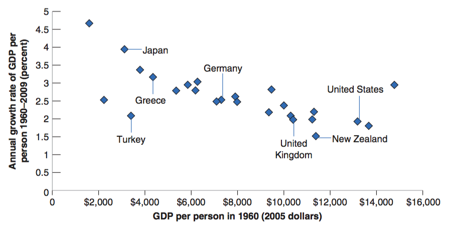

class: inverse, center, middle

```{R, setup, include = F}
options(htmltools.dir.version = FALSE)
library(pacman)
p_load(
  broom, here, tidyverse,
  latex2exp, ggplot2, ggthemes, viridis, extrafont, gridExtra,
  kableExtra,
  dplyr, magrittr, knitr, parallel
)
# Define pink color
red_pink <- "#e64173"
turquoise <- "#20B2AA"
grey_light <- "grey70"
grey_mid <- "grey50"
grey_dark <- "grey20"
# Dark slate grey: #314f4f
# Knitr options
opts_chunk$set(
  comment = "#>",
  fig.align = "center",
  fig.height = 7,
  fig.width = 10.5,
  warning = F,
  message = F
)
opts_chunk$set(dev = "svg")
options(device = function(file, width, height) {
  svg(tempfile(), width = width, height = height)
})
# A blank theme for ggplot
theme_empty <- theme_bw() + theme(
  line = element_blank(),
  rect = element_blank(),
  strip.text = element_blank(),
  axis.text = element_blank(),
  plot.title = element_blank(),
  axis.title = element_blank(),
  plot.margin = structure(c(0, 0, -0.5, -1), unit = "lines", valid.unit = 3L, class = "unit"),
  legend.position = "none"
)
theme_simple <- theme_bw() + theme(
  line = element_blank(),
  panel.grid = element_blank(),
  rect = element_blank(),
  strip.text = element_blank(),
  axis.text.x = element_text(size = 18, family = "STIXGeneral"),
  axis.text.y = element_blank(),
  axis.ticks = element_blank(),
  plot.title = element_blank(),
  axis.title = element_blank(),
  # plot.margin = structure(c(0, 0, -1, -1), unit = "lines", valid.unit = 3L, class = "unit"),
  legend.position = "none"
)
theme_axes_math <- theme_void() + theme(
  text = element_text(family = "MathJax_Math"),
  axis.title = element_text(size = 22),
  axis.title.x = element_text(hjust = .95, margin = margin(0.15, 0, 0, 0, unit = "lines")),
  axis.title.y = element_text(vjust = .95, margin = margin(0, 0.15, 0, 0, unit = "lines")),
  axis.line = element_line(
    color = "grey70",
    size = 0.25,
    arrow = arrow(angle = 30, length = unit(0.15, "inches")
  )),
  plot.margin = structure(c(1, 0, 1, 0), unit = "lines", valid.unit = 3L, class = "unit"),
  legend.position = "none"
)
theme_axes_serif <- theme_void() + theme(
  text = element_text(family = "MathJax_Main"),
  axis.title = element_text(size = 22),
  axis.title.x = element_text(hjust = .95, margin = margin(0.15, 0, 0, 0, unit = "lines")),
  axis.title.y = element_text(vjust = .95, margin = margin(0, 0.15, 0, 0, unit = "lines")),
  axis.line = element_line(
    color = "grey70",
    size = 0.25,
    arrow = arrow(angle = 30, length = unit(0.15, "inches")
  )),
  plot.margin = structure(c(1, 0, 1, 0), unit = "lines", valid.unit = 3L, class = "unit"),
  legend.position = "none"
)
theme_axes <- theme_void() + theme(
  text = element_text(family = "Fira Sans Book"),
  axis.title = element_text(size = 18),
  axis.title.x = element_text(hjust = .95, margin = margin(0.15, 0, 0, 0, unit = "lines")),
  axis.title.y = element_text(vjust = .95, margin = margin(0, 0.15, 0, 0, unit = "lines")),
  axis.line = element_line(
    color = grey_light,
    size = 0.25,
    arrow = arrow(angle = 30, length = unit(0.15, "inches")
  )),
  plot.margin = structure(c(1, 0, 1, 0), unit = "lines", valid.unit = 3L, class = "unit"),
  legend.position = "none"
)
```

# Book Chapter 10

---

class: inverse, middle, center

# Overview

---
# Overview

## Fluctuations v.s. Growth

- Our perceptions of the economy: __fluctuations__ in economic activity.

- If we step back to get a look at activity over longer periods, fluctuations fade and __growth dominates the picture__. 

--

Recall: 

- .pink[Short-Run and Medium-Run: Fluctuations]

- .pink[Long-Run: Growth]

---

# Overview

## U.S. GDP

Panel (a) shows the enormous increase in U.S. output since 1890, by a factor of 43. 

<center>
 
</center>

[Link: More GDP times series](https://fred.stlouisfed.org/series/GDP)

---

# Overview

## Measuring the Standard of Living

- The reason we care about growth is that we care about the standard of living.

- The variable we want to focus on, and compare either over time or across countries, is __output per person__, rather than output itself.


---

# Overview

## Output Per Person Growth

Panel (b) shows that the increase in output is not simply due to the large increase in U.S. population from 63 million to more than 300 million over this period. Output per person has risen by a factor of 9.

<center>
 
</center>

---

# Overview

## Does Money Buy Happiness?

Does money lead to happiness? Or, put more accurately, does higher income per person lead to more happiness? __The answer is a qualified yes.__

<center>
 
</center>

---

class: inverse, middle, center

# Growth Facts

---

# Growth Facts

## Living Standard since 1950

Output per person has increased by a factor of 3.1 since 1950 in the United States, by a factor of 4.3 in France, and by a factor of 10.2 in Japan.

Design of policies that stimulate growth leads to a very large effect on the standard of living.


<center>
 
</center>

---

# Growth Facts

## The Convergence of Output per Person

Levels of output per person have converged (become closer) over time: The numbers for output per person are much more similar in 2009 than they were in 1950.

<center>
 
</center>

---

# Growth Facts

## The Convergence of Output per Person

This convergence of levels of output per person across countries extends to the set of OECD countries. 

<center>
 
</center>

---

# Growth Facts

## The Convergence of Output per Person

This convergence of levels of output per person across states within the United States. 

<center>
 
</center>

---

# Growth Facts

## Looking across Two Millennia

- From the end of the Roman Empire to roughly year 1500, there was essentially no growth of output per person in Europe:

- Most workers were employed in agriculture in which there was little technological progress. 

- This period of stagnation of output per person is often called the Malthusian (named after an economist in the late 1800s): any increase in output, he argued, would lead to a decrease in mortality, leading to an increase in population until output per person was back to its initial level.
---

# Growth Facts

## Looking across Two Millennia

- Eventually, Europe was able to escape this trap. From about 1500 to 1700, growth of output per person turned positive, but it was still small—only around 0.1% per year.

- It then increased to just 0.2% per year from 1700 to 1820. 

- Starting with the Industrial Revolution, growth rates increased, but from 1820 to 1950 the growth rate of output per person in the United States was still only 1.5% per year. 

- On the scale of human history, therefore, sustained growth of output per person—especially the high growth rates we have seen since 1950—is definitely a __recent phenomenon__.

---

# Growth Facts

## Across Countries

There is clear evidence of convergence in OECD and Asia. 

There is __no__ evidence of convergence in Africa. 

<center>
 
</center>

---

# Growth Facts

## Sources of Growth

- A higher rate of technological progress 

   - developed economies

- A higher level of capital per worker

   - emerging economies 

- __Better Institutions__

  - Institutions comprise for example contracts and contract enforcement, protection of property rights, the rule of law, government bureaucracies, financial markets.
  
---

# Growth Theory

## Instituition v.s. Growth

Economists have always been interested in answering this question: does institution lead to high growth or high growth lead to institution? 

__Acemoglu, Johnson and Robinson found that good institutions leads to high GDP growth. __  

[Link: a fascinating paper](https://economics.mit.edu/files/4123)


---
exclude: true

```{R, generate pdfs, include = F}
system("decktape remark 18_growth.html 18_growth.pdf --chrome-arg=--allow-file-access-from-files")
```  
  


