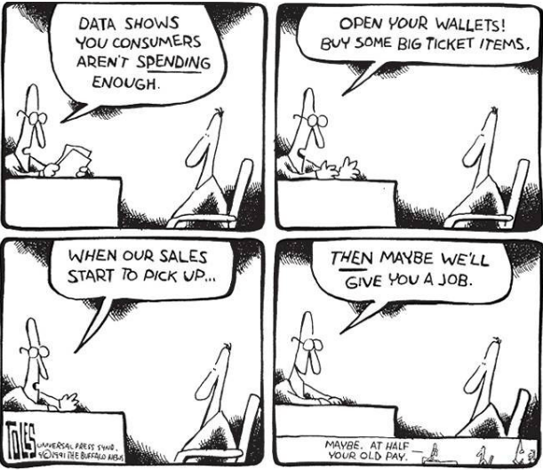
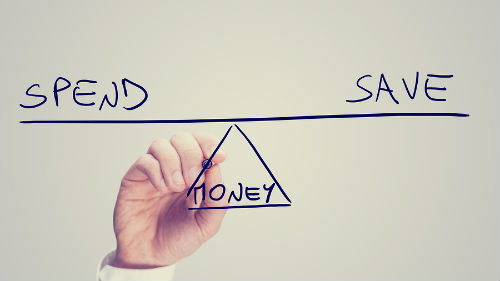
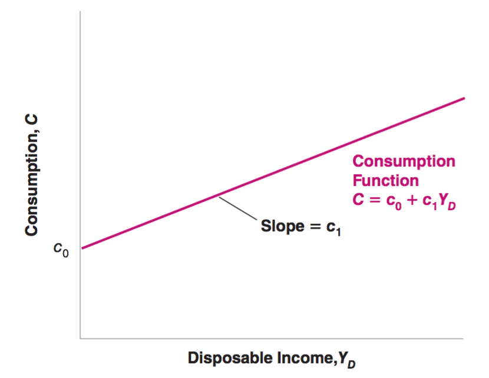
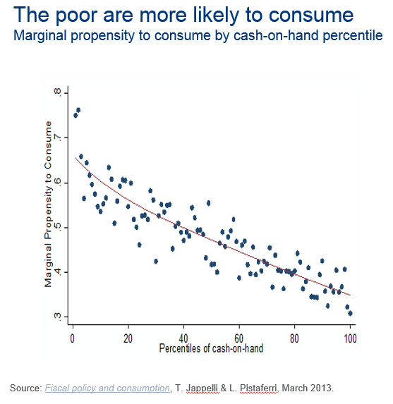
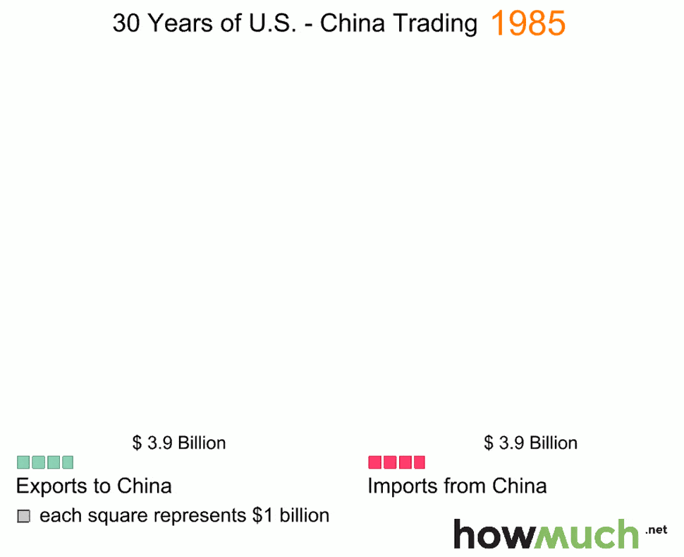
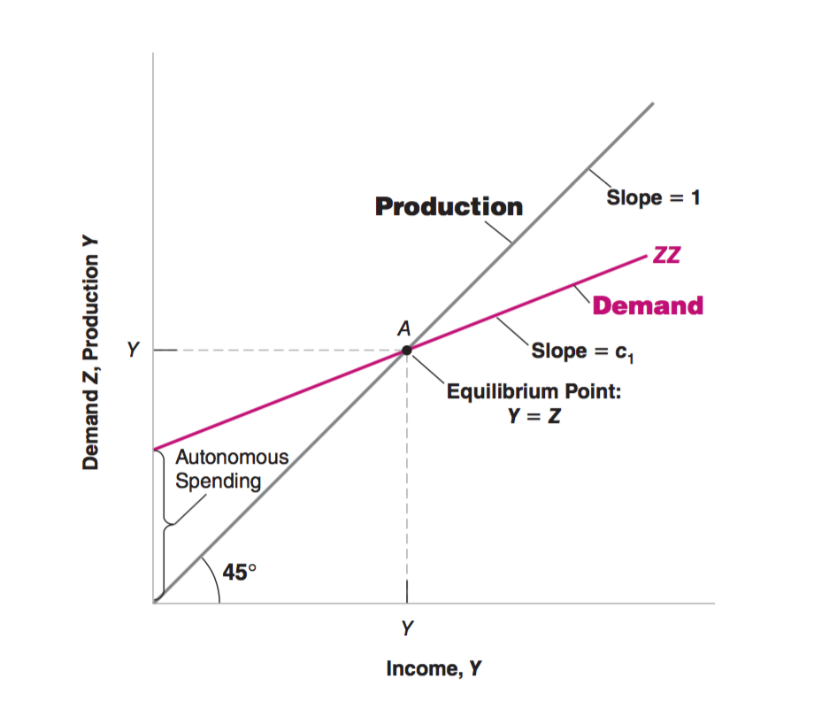
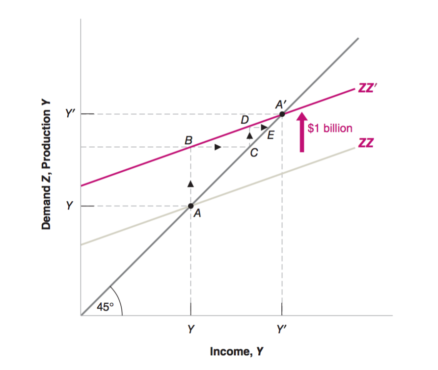
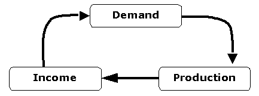

class: inverse, center, middle

```{R, setup, include = F}
options(htmltools.dir.version = FALSE)
library(pacman)
p_load(
  broom, here, tidyverse,
  latex2exp, ggplot2, ggthemes, viridis, extrafont, gridExtra,
  kableExtra,
  dplyr, magrittr, knitr, parallel
)
# Define pink color
red_pink <- "#e64173"
turquoise <- "#20B2AA"
grey_light <- "grey70"
grey_mid <- "grey50"
grey_dark <- "grey20"
# Dark slate grey: #314f4f
# Knitr options
opts_chunk$set(
  comment = "#>",
  fig.align = "center",
  fig.height = 7,
  fig.width = 10.5,
  warning = F,
  message = F
)
opts_chunk$set(dev = "svg")
options(device = function(file, width, height) {
  svg(tempfile(), width = width, height = height)
})
# A blank theme for ggplot
theme_empty <- theme_bw() + theme(
  line = element_blank(),
  rect = element_blank(),
  strip.text = element_blank(),
  axis.text = element_blank(),
  plot.title = element_blank(),
  axis.title = element_blank(),
  plot.margin = structure(c(0, 0, -0.5, -1), unit = "lines", valid.unit = 3L, class = "unit"),
  legend.position = "none"
)
theme_simple <- theme_bw() + theme(
  line = element_blank(),
  panel.grid = element_blank(),
  rect = element_blank(),
  strip.text = element_blank(),
  axis.text.x = element_text(size = 18, family = "STIXGeneral"),
  axis.text.y = element_blank(),
  axis.ticks = element_blank(),
  plot.title = element_blank(),
  axis.title = element_blank(),
  # plot.margin = structure(c(0, 0, -1, -1), unit = "lines", valid.unit = 3L, class = "unit"),
  legend.position = "none"
)
theme_axes_math <- theme_void() + theme(
  text = element_text(family = "MathJax_Math"),
  axis.title = element_text(size = 22),
  axis.title.x = element_text(hjust = .95, margin = margin(0.15, 0, 0, 0, unit = "lines")),
  axis.title.y = element_text(vjust = .95, margin = margin(0, 0.15, 0, 0, unit = "lines")),
  axis.line = element_line(
    color = "grey70",
    size = 0.25,
    arrow = arrow(angle = 30, length = unit(0.15, "inches")
  )),
  plot.margin = structure(c(1, 0, 1, 0), unit = "lines", valid.unit = 3L, class = "unit"),
  legend.position = "none"
)
theme_axes_serif <- theme_void() + theme(
  text = element_text(family = "MathJax_Main"),
  axis.title = element_text(size = 22),
  axis.title.x = element_text(hjust = .95, margin = margin(0.15, 0, 0, 0, unit = "lines")),
  axis.title.y = element_text(vjust = .95, margin = margin(0, 0.15, 0, 0, unit = "lines")),
  axis.line = element_line(
    color = "grey70",
    size = 0.25,
    arrow = arrow(angle = 30, length = unit(0.15, "inches")
  )),
  plot.margin = structure(c(1, 0, 1, 0), unit = "lines", valid.unit = 3L, class = "unit"),
  legend.position = "none"
)
theme_axes <- theme_void() + theme(
  text = element_text(family = "Fira Sans Book"),
  axis.title = element_text(size = 18),
  axis.title.x = element_text(hjust = .95, margin = margin(0.15, 0, 0, 0, unit = "lines")),
  axis.title.y = element_text(vjust = .95, margin = margin(0, 0.15, 0, 0, unit = "lines")),
  axis.line = element_line(
    color = grey_light,
    size = 0.25,
    arrow = arrow(angle = 30, length = unit(0.15, "inches")
  )),
  plot.margin = structure(c(1, 0, 1, 0), unit = "lines", valid.unit = 3L, class = "unit"),
  legend.position = "none"
)
```

# Book Chapter 3

---
class: inverse, center, middle

# Overview

---

# Overview

## Questions

By studying the goods market, we can answer the following questions. 

What happens to the .hi[GDP] in the .hi.purple[short run]

- if households .pink[save more]?

- if the firms make .pink[less investiment]?

- if the government .pink[cuts government spending]?

- if the government .pink[transfers some wealth from the rich to the poor]?

- if the government starts a .pink[trade war] with a major trading partner?

---

# Overview

## Questions

Before we can answer these questions, we need to

- know what the __short-run__ means in economics

- the __demand side__ behavior in the short run

- the __supply side__ behavior in the short run

- the __equilibrium__ in the short run

---

# Overview

## Short-run v.s. Medium-run v.s. Long-run

- .hi.purple[Fluctuation] in GDP:

  - .hi[Short-run]: Time horizon over which the price level is fixed.
  Typically anything less than one or two years (Ch. 3-5). __Demand Driven Economy__.
  
  - .hi[Medium-run]: Time Horizon over which the price level does vary. Typically thought of as 5-10 years (Ch. 6-9). __Supply Driven Economy__.
  
- .hi.purple[Growth] in GDP

  - .hi[Long-run]: Time Horizon over which there is a constant change in aggregate output. Typically thought of like 20+ years (Ch. 10-13). __Institution Driven__ Economy.

---

# Overview

## Production, Income, and Demand 

When economists think about economic fluctuations in the short-run, they focus on the interactions among .hi.purple[production], .hi.purple[income], and .hi.purple[demand]:

- Increase in the .hi[demand] for goods leads to increase in .hi[production]

- Increase in .hi[production] leads to increase in .hi[income]

- Increase in .hi[income] leads to increase in the .hi[demand] for goods


---

# Overview

## Production, Income, and Demand 

<center>
 
</center>

---


# Overview

## Mathematical Models

.hi[Model]: A method of simulating real-life situations with mathematical equations to forecast future behavior.

.hi[Q]: How can we possibly represent all of the human behavior (the goal of economics) with equations?

.hi[A]: We can't - so we make simplifying and mostly innocuous assumptions!

---

# Overview

## Mathematical Models

A few .hi[difficulties] in describing the reality with a model of a few equations and the corresponding .hi[assumptions] we make for the rest of the lecture (and the course)

- Reality 1: So many different commodities

- Assumption 1: Use Dollar as the unit to sum up different goods

- Reality 2: There are so many households and firms

- Assumption 2: Use the average household and firm as the representatives

- More assumptions along the way...
---

class: inverse, center, middle
# Demand

---

# Demand

## The Demand for Goods 

- .hi[Comsumption (C)] by the households

- .hi[Investment (I)] by the firms

- .hi[Government Spending (G)] by the government

- .hi[Net Export (X - IM)] from a broad.

---

# Demand 

## The Demand for Goods 

<center>
 
</center>

---
# Demand - Consumption

- Consumption decisions are made by ordinary people (households)

- Why do we want to consume? 

- Why don't we want to consume?

- It is a trade off between .pink[present happiness] and .pink[future happiness]. 

<center>
 
</center>

---

# Demand - Consumption

## Consumption

- .hi[Largest component] of GDP (70% in 2010)

- The goods and services purchased by consumers. Ranging from food to airplane tickets, to new cars, and services

- In general, consumption is a function of .hi[disposable income], which is the income after taxes. We can denote the function as $C = f^C(Y_D)$ where $Y_D = Y - T$. Here $Y$ is income and $T$ is tax. 

- Here $f^C(\cdot)$ is the consumption function and $Y_D$ is the disposable income. $f^C$ is an increasing function in $Y_D$


---

# Demand - Consumption

## Consumption

- It is reasonable to assume a linear functional form for $f^C(Y_D) = c_0 + c_1 Y_D$, where $c_0$ and $c_1$ are the parameters that have .hi.purple[specific economic meanings]. 

- Parameter $c_0$ denotes the amount of goods .hi[an average household] consumes when they have no disposable income. 

- Parameter $c_1$ denotes the marginal propensity to consume (.pink[MPC]). For each dollar .hi[an average household] makes, they consume $c_1$ out of the one dollar.  
---

# Demand - Consumption

## Consumption

- .hi[Q]: What boundaries should we place on $c_0$ and $c_1$

  - $c_0$ is positive
  
  - $c_1$ is between 0 and 1
  
- .hi[Q]: Why are these restrictions made?

  - If $c_0$ < 0, we would have negative consumption when $Y_D = 0$, which is impossible.
  
  - It is reasonable to assume, on average, households save some and spend some of their income.

---

# Demand - Consumption

## Linear Consumption Function

<center>
 
</center>

---

# Demand - Consumption

## Average MPC v.s. Individual MPC

- Note that the consumption function characterizes .hi[an average household] in the economy. 

- In reality, each individual probably has a different .hi[personal] consumption function. Think about yourself for a second. 

- In general, a richer household has a lower MPC parameter of $c_1$. .hi[Why?]

---

# Demand - Consumption

## MPC Varies Across Individuals

<center>
 
</center>

---

# Demand - Consumption

## Linear Consumption Function

- We are interested in National Income $Y$, which is .hi[the variable of interest].

- Consumption itself is a function of the variable of interest

$$C = f^C(Y_D) = c_0 + c_1 (Y - T)$$
- In this case, we call consumption $C$ an .hi[endogeneouns variable]. A model has the power to explain the behaviors of the endogeneous variables.

---

# Demand - Investment

## Investment

- Account for 12% of the GDP in 2010

  - Nonresidential investment: purchases by firms of new plants or new machines.
  
  - Residential investment: purchases by people of new houses or apartments.

---

# Demand - Investment

## Investment

- To .hi[simplify] the model, we treat investment $I$ as a constant number, and write $I = \bar I$. Is this a realistic assumption? If it is not realistic, why should we still use this model? 


- We will relax this assumption when we discuss the financial market in the future

- Since $I$ is a constant number that does not depend on the variable of interest $Y$, we call $I$ an .hi[exogenous variable]. A model does not have the power to explain the exogenous variables. 

---

# Demand - Government Spending

## Government Spending

- The purchases of goods and services by the federal, state, and local governments.

- This measure does not include direct government transfers like social security, food stamps, Medicaid, etc.

---

# Demand - Government Spending

## Government Spending

- Together with taxes $T$, government spending $G$ describes .hi[fiscal policy]

- Just as we did for investment, we will take $T$ and $G$ as exogeneous, because

  - $T$ and $G$ do not have the same regularity as consumers or firms. 
  
  - We don't want the model to decide $T$ and $G$; we want to answer questions like "*If the government were to choose these values for G and T, this is what would happen*"
  
---
  
# Demand - Net Export

## Net Export  (X-IM)

- Also known as the trade balance, this is the difference between goods American companies sell consumers in other countries and goods purchased by American citizens from firms located in other countries.

- Q: Do you think America typically has a trade surplus (X>IM) or a trade deficit (X<IM)?

---

# Demand - Net Export

## Net Export  (X-IM)

<center>
 
</center>

---

# Demand - Net Export

## Net Export  (X-IM) 

 - Net Export is mainly influenced by the economic condition of the world, interest rates, and exchange rates. 
 
 - Our model has no power to explain the fluctuations in Net Export. (Not our focus)

 - Again, we treat Nex Export as .hi[exogeneous]
 
 - Let X be the export and IM be the import, we have
 
 $$NX = X - IM$$
 
 


---

# Demand - Aggregate Demand

## Aggregate Demand

Adding up all of the demand components, we get the .hi[aggregate demand] denoted as $Z$

$$Z = C + I + G + NX$$
Substitute in $C$, we get 

$$Z = c_0 + c_1(Y - T) + I + G + NX$$


---

class: inverse, center, middle
# Supply

---

# Supply 

## Short-Run Supply

In the .hi[short-run]

- __Supply__ is the passive side of the economy. We assume that firms will supply any amount of consumption goods for a given price level P.

$$Y = Z$$

- __Demand__ is the driving side of the economy. 

- "Production and sales of automobiles were higher last month due to a surge in consumer confidence, which drove consumers to showrooms in record numbers." 


---

class: inverse, center, middle
# Short-Run Equilibrium

---

# Short-Run Equilibrium 

## Equilibrium

.hi[Demand]: 

- Demand Component: $Z := C + \bar I + G + NX$

- Linear Consumption Function: $C = c_0 + c_1 Y_D$

- Disposable Income Definition: $Y_D = Y - T$

.hi[Supply]: 

- Short-Run Supply: $Y = Z$

---

# Short-Run Equilibrium 

## Equilibrium

.hi[Demand]: 

- Demand Component: $Z := C + \bar I + G + NX$

- Linear Consumption Function: $C = c_0 + c_1 Y_D$

- Disposable Income Definition: $Y_D = Y - T$

.hi[Combining these three equations]:

- Short-Run Demand $Z = c_0 + c_1 (Y - T) + \bar I + G + NX$

---

# Short-Run Equilibrium 

## Equilibrium Analysis - Model

.hi[Equilibrium]

- Combine these four equations and solve for $Y$, we get the following .hi[equilibrium relation]
$$Y = \frac{c_0}{1 - c_1} - \frac{c_1}{1 - c_1} T + \frac{1}{1 - c_1} (\bar I + G + NX)$$
Now we can answer the questions raised at the beginning of the class

---

# Short-Run Equilibrium 

## Equilibrium Analysis - Model
$$Y = \frac{1}{1 - c_1} (c_0 + \bar I + G + NX) - \frac{c_1}{1 - c_1} T$$
What if households save less? i.e. .hi[higher] $c_0$

- $c_0$ increases by $1$ unit, $Y$ increases by $\frac{1}{1 - c_1}$ units. 

What if firms make more investment? i.e. .hi[higher] $\bar I$

- $\bar I$ increases by $1$ unit, $Y$ increases by $\frac{1}{1 - c_1}$ units. 


---

# Short-Run Equilibrium 

## Equilibrium Analysis - Model
$$Y = \frac{1}{1 - c_1} (c_0 + \bar I + G + NX) - \frac{c_1}{1 - c_1} T$$
What if the government increases the spending? i.e. .hi[higher] $G$

- $G$ increases by $1$ unit, $Y$ increases by $\frac{1}{1 - c_1}$ units. 

What if there is more Net Export? i.e. .hi[higher] $NX$

- $NX$ increases by $1$ unit, $Y$ increases by $\frac{1}{1 - c_1}$ units. 

- This *magic number* $\frac{1}{1 - c_1}$ is what we call __multiplier__

---

# Short-Run Equilibrium 

## Equilibrium Analysis - Model
$$Y = \frac{1}{1 - c_1} (c_0 + \bar I + G + NX) - \frac{c_1}{1 - c_1} T$$
The only element that does not work with the multiplier is .hi[income tax]

The *tax multiplier* is $-\frac{c_1}{1 - c_1}$, which means if tax .pink[goes up] by 1 dollar, GDP will .pink[decrease] by $-\frac{c_1}{1 - c_1}$ dollars. 

*If the government has accumulated a lot of debt, they eventually need to raise the tax, and the increased tax is not used on government spending but on paying off the debt. This is why running a persistent deficit is dangerous. *

---

# Short-Run Equilibrium 

## Equilibrium Analysis - Model
$$Y = \frac{1}{1 - c_1} (c_0 + \bar I + G + NX) - \frac{c_1}{1 - c_1} T$$
What happens to GDP if the government takes 1 dollar tax and spends this 1 dollar?

Hint: two things are going on: 

- T goes up by 1 dollar

- G goes up by 1 dollar 

---

# Short-Run Equilibrium 

## Equilibrium Analysis - Graphics

<center>
 
</center>

---

# Short-Run Equilibrium 

## Equilibrium Analysis - Graphics

<center>
 
</center>

---

# Short-Run Equilibrium 

## Equilibrium Analysis - Words

Production depends on demand, which depends on income, which is itself equal
to production. An increase in demand, such as an increase in government spending, leads to an increase in production and a corresponding increase in income. This increase in income leads to a further increase in demand, which leads to a further increase in production, and so on. 

<center>
 
</center>

---

# Short-Run Equilibrium 

## Why $c_0$ Changes

- Why would consumers increase or decrease consumption if their disposable income has not changed? 

- Or, in terms of the linear consumption function, why might $c_0$ increase or decrease leading in turn to an increase or decrease in demand, output, and so on?

- Why do you think?


---

# Short-Run Equilibrium 

## Why $c_0$ Changes

- Many economists use the word ".hi[animal spirit]" to explain the changes in $c_0$. 

- For example, when people saw the bankruptcy of Lehman in 2008, they started to worry that the economy would be going down and hence cut their consumption, even though at that particular moment their income hadn't gone down yet. 

- This change in .hi[animal spirit] is a .hi[self-fulfilling prophecy] - think about what happens to GDP after $c_0$ goes down...


---
exclude = true

```{R, generate pdfs, include = F}
system("decktape remark 02_goodsmarket_part1.html 02_goodsmarket_part1.pdf --chrome-arg=--allow-file-access-from-files")
```


