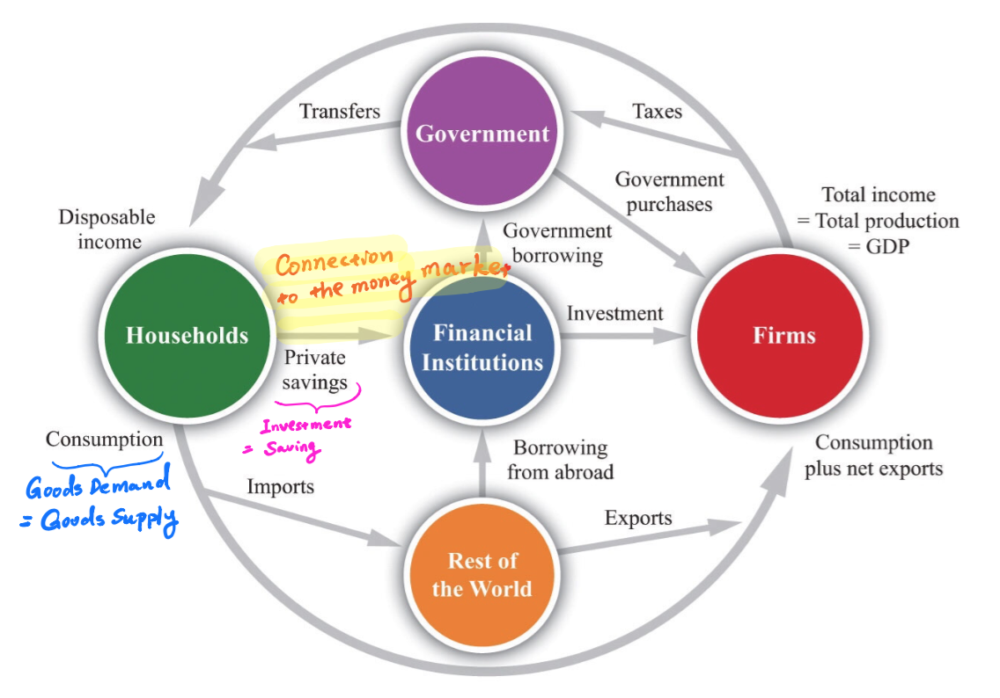

class: inverse, center, middle

```{R, setup, include = F}
options(htmltools.dir.version = FALSE)
library(pacman)
p_load(
  broom, here, tidyverse,
  latex2exp, ggplot2, ggthemes, viridis, extrafont, gridExtra,
  kableExtra,
  dplyr, magrittr, knitr, parallel
)
# Define pink color
red_pink <- "#e64173"
turquoise <- "#20B2AA"
grey_light <- "grey70"
grey_mid <- "grey50"
grey_dark <- "grey20"
# Dark slate grey: #314f4f
# Knitr options
opts_chunk$set(
  comment = "#>",
  fig.align = "center",
  fig.height = 7,
  fig.width = 10.5,
  warning = F,
  message = F
)
opts_chunk$set(dev = "svg")
options(device = function(file, width, height) {
  svg(tempfile(), width = width, height = height)
})
# A blank theme for ggplot
theme_empty <- theme_bw() + theme(
  line = element_blank(),
  rect = element_blank(),
  strip.text = element_blank(),
  axis.text = element_blank(),
  plot.title = element_blank(),
  axis.title = element_blank(),
  plot.margin = structure(c(0, 0, -0.5, -1), unit = "lines", valid.unit = 3L, class = "unit"),
  legend.position = "none"
)
theme_simple <- theme_bw() + theme(
  line = element_blank(),
  panel.grid = element_blank(),
  rect = element_blank(),
  strip.text = element_blank(),
  axis.text.x = element_text(size = 18, family = "STIXGeneral"),
  axis.text.y = element_blank(),
  axis.ticks = element_blank(),
  plot.title = element_blank(),
  axis.title = element_blank(),
  # plot.margin = structure(c(0, 0, -1, -1), unit = "lines", valid.unit = 3L, class = "unit"),
  legend.position = "none"
)
theme_axes_math <- theme_void() + theme(
  text = element_text(family = "MathJax_Math"),
  axis.title = element_text(size = 22),
  axis.title.x = element_text(hjust = .95, margin = margin(0.15, 0, 0, 0, unit = "lines")),
  axis.title.y = element_text(vjust = .95, margin = margin(0, 0.15, 0, 0, unit = "lines")),
  axis.line = element_line(
    color = "grey70",
    size = 0.25,
    arrow = arrow(angle = 30, length = unit(0.15, "inches")
  )),
  plot.margin = structure(c(1, 0, 1, 0), unit = "lines", valid.unit = 3L, class = "unit"),
  legend.position = "none"
)
theme_axes_serif <- theme_void() + theme(
  text = element_text(family = "MathJax_Main"),
  axis.title = element_text(size = 22),
  axis.title.x = element_text(hjust = .95, margin = margin(0.15, 0, 0, 0, unit = "lines")),
  axis.title.y = element_text(vjust = .95, margin = margin(0, 0.15, 0, 0, unit = "lines")),
  axis.line = element_line(
    color = "grey70",
    size = 0.25,
    arrow = arrow(angle = 30, length = unit(0.15, "inches")
  )),
  plot.margin = structure(c(1, 0, 1, 0), unit = "lines", valid.unit = 3L, class = "unit"),
  legend.position = "none"
)
theme_axes <- theme_void() + theme(
  text = element_text(family = "Fira Sans Book"),
  axis.title = element_text(size = 18),
  axis.title.x = element_text(hjust = .95, margin = margin(0.15, 0, 0, 0, unit = "lines")),
  axis.title.y = element_text(vjust = .95, margin = margin(0, 0.15, 0, 0, unit = "lines")),
  axis.line = element_line(
    color = grey_light,
    size = 0.25,
    arrow = arrow(angle = 30, length = unit(0.15, "inches")
  )),
  plot.margin = structure(c(1, 0, 1, 0), unit = "lines", valid.unit = 3L, class = "unit"),
  legend.position = "none"
)
```

# Review

---

# Review

In the last lecture, we studied the goods market in the short-run

- .hi[Demand] 

  - Linear Consumption Function
  
  - Disposable Income

- .hi[Supply]

- .hi[Equilibrium]
  
  - Multipliers for $c_0$, $\bar I$, $G$, $NX$
  
  - Multiplier for $T$ 
  
- Use .hi[graphs] and .hi[words] to describe the behavior of the goods market. 

---

class: inverse, center, middle

# Overview

---

# Overview

## Goals of this lecture

- Derive the .hi[Investment-Equal-Saving (IS) relation] from the goods market equilibrium

- Discuss the .hi[Fiscal Policy]  

- Analyze more .hi[real-life] examples and applications using the .hi[short-run goods market model]. 

---

class: inverse, center, middle

# IS Relation

---

# IS Relation 

## Why?

.hi[Investment Equal Savings] is just another way to describe the goods market. Since our object of interest is still the same, the equilibrium should be the same as well. 


In the end, we should get the same equilibrium equation:
$$Y = \frac{1}{1 - c_1} (c_0 + \bar I + G + NX) - \frac{c_1}{1 - c_1} T$$

The only difference is: instead of using .hi[Goods Demand = Goods Supply], we use .hi[Investment = Savings]. 


---

# IS Relation 

## Why?

We already has a way to model the goods market equilibrium 

- .pink[Demand for Goods = Supply for Goods]

However, our ultimate goal is to describe the whole economy which also contains the .hi[money market]. 

To establish the connection, we need to find .hi[another perspective] to look at the goods market. 

This alternative perspective is the .hi[Investment-Equal-Saving (IS) relation] 

---

# IS Relation 

## Why?

<center>
 
</center>

---

class: inverse, center, middle

# Savings

---

# Savings

## Savings

Just like when we consider the components of consumption, we first consider the .hi[components of saving]. 

- Consumers: $S_C$

- Government: $S_G$ 

- Foreigners: $S_F$

Think about the question, who saves in the eocnomy? The answer is .hi[whoever consumes saves]


---

# Savings

## Savings - Consumers

The consumers has the disposable income $Y_D$ and spends $C$, their saving would be 
$S_C = Y_D - C$, recall $Y_D = Y - T$. Hence we have the following .hi[consumer saving equation]
$$S_C = Y - T - C$$
Also, note the consumption is endogenous in the model because C depends on $Y$, i.e. the __linear consumption funciton__ $C = c_0 + c_1(Y - T)$, and thus we can further write
$$S_C = Y - T - (c_0 + c_1 (Y - T))$$
---
# Savings

## Savings - Government

The government has the tax income $T$ and spends $G$. Hence we have the following .hi[government saving equation]

$$S_G = T - G$$

Note that in macroeconomics government saving is also called __government surplus__

---

# Savings

## Savings - Foreigners

Foreigners also save, and some of their savings end up coming into our economy, and that is the part we are interested in when we study an economy. The part of foreign saving that flows into our economy is called .hi[capital inflow (CI)]

Just like export and import, when there is capital inflow there is also .hi[capital outflow (CO)], which is domestic saving that goes abroad. 

The true saving from broad that flows into the economy is the difference between inflow and outflow, and thus we have the following condition:
$$S_F = NCI$$
Here NCI is the .hi[net capital inflow] and $NCI = CI - CO$

---

# Savings

## Aggregate Savings

The aggregate saving available in the economy can be computed as follows 

\begin{align}
S & = \color{#e64173}{S_C} + \color{#20B2AA}{S_G} + \color{#6A5ACD}{S_F}\\
  & = \color{#e64173}{Y - T - (c_0 + c_1 (Y - T))} + \color{#20B2AA}{T - G} + \color{#6A5ACD}{NCI}\\
  & = Y - (c_0 + c_1 (Y - T)) - G + NCI
\end{align}

---

class: inverse, center, middle

# Investment 

---

# Investment

## Investment

The aggregate investment is straightforward, and you have seen this already

--

$$I = \bar I$$

That is to say, investment is .hi[exogeneous] to the model we are considering. 

---

class: inverse, center, middle

# Equilibrium

---

# Equilibrium 

## Solve for the equilibrium

The equilibrium is defined by .hi[equating savings to investment]
\begin{align}
I & = S \\
\bar I & = Y - (c_0 + c_1 (Y - T)) - G + NCI
\end{align}
Solving for Y, we get the following equation that characterizes the goods marker equilibrium
$$Y = \frac{1}{1-c_1}(c_0 + \bar I + G - NCI) - \frac{c_1}{1 - c_1}T$$
Does this look familiar? It does!

---

# Equilibrium 

## Comparing Two Methods

Using .hi[Goods Demand = Goods Supply], we get (from the last lecture)
$$Y = \frac{1}{1-c_1}(c_0 + \bar I + G \color{#20B2AA}{+ NX}) - \frac{c_1}{1 - c_1}T$$
Using .hi[Investment = Savings], we get
$$Y = \frac{1}{1-c_1}(c_0 + \bar I + G \color{#20B2AA}{- NCI}) - \frac{c_1}{1 - c_1}T$$
Theoretically, these two equations should be the same. How would we make these two equations identical? 

--
$$\color{#20B2AA}{NX} = \color{#20B2AA}{-NCI}$$

---

# Equilibrium 

## Comparing Two Methods

What does this equation mean? 
$$\color{#20B2AA}{NX} = \color{#20B2AA}{-NCI}$$
The amount of the .hi[net export] one economy is equal to the amount of .hi[net capital outflow]

__The Lucas paradox__: the observation that capital does not flow from developed countries to developing countries despite the fact that developing countries have lower levels of capital per worker.

---

class: inverse, center, middle

# Application - Computation

---

# Application - Computation
Consider an economy that has the following setup: 
\begin{align}
c_0 & = 100 & c_1 & = 0.6 & \bar I & = 150 \\
G & = 140 & NX & = 10 & T & = 100
\end{align}

a) What is the net capital inflow (NCI)?

b) What is equilibrium output?

c) What is disposable income

d) What is consumption 

e) If $c_0$ decreases to 50, what is the change in equilibrium output? 

f) What is demand when $c_0 = 100$? Does it equal output? 

---

class: inverse, center, middle

# Application - Responsive Tax

---

# Application - Responsive Tax

## Responsive Tax

Consider a close economy with reponsive .pink[(fiscal) tax policy] where tax T is a function of output Y. 
\begin{align}
Z & = C + I + G\\
C & = c_0 + c_1 Y_D\\
T & = t_0 + t_1 Y 
\end{align}
a) Solve for the equilibrium output interms of the exogeneous variables. 

b) What is the multiplier for $c_0$

c) Is the multiplier for $c_0$ higher or lower when $t_1$ is 0 or when $t_1$ is positive? 

---
# Application - Responsive Tax

## Responsive Tax

Consider a closed economy (NX = 0) with reponsive .pink[(fiscal) tax policy] where tax T is a function of output Y. 
\begin{align}
Z & = C + I + G\\
C & = c_0 + c_1 Y_D\\
T & = t_0 + t_1 Y 
\end{align}
d) What is your intuition for your answer to c)

e) Suppose $c_0$ increase by $300. What is the change in equilibrium Y when 

1) $t_1 = 0.2$ and $c_1 = 0.5$

2) $t_1 = 0$ and $c_1 = 0.5$

---

class: inverse, center, middle

# Application - Crowding Out

---

# Application - Crowding Out

## Crowding Out

Consider a closed economy (NX = 0) where government spending crowds out investment. 
\begin{align}
Z & = C + I + G\\
C & = c_0 + c_1 Y_d\\
I & = i_0 - i_1 G 
\end{align}
a) Solve for the equilibrium output interms of the exogeneous variables. 

b) What is the multiplier for c_0

c) What is the multiplier for G

d) If $i_1$ increases (crowding out effect is more intense), how does the multiplier for $c_0$ changes? how does the multiplier for G change.  

---

# Application - Crowding Out

## Crowding Out

Consider a closed economy (NX = 0) where government spending crowds out investment. 
\begin{align}
Z & = C + I + G\\
C & = c_0 + c_1 Y_d\\
I & = i_0 - i_1 G 
\end{align}
e) Suppose $G$ increase by $300. What is the change in equilibrium Y when 

1) $i_1 = 0.2$ and $c_1 = 0.5$

2) $i_1 = 0$ and $c_1 = 0.5$

---
exclude = true

```{R, generate pdfs, include = F}
system("decktape remark 03_goodsmarket_part2.html 03_goodsmarket_part2.pdf --chrome-arg=--allow-file-access-from-files")
```


<!--chapter:end:03_goodsmarket_part2.Rmd-->

