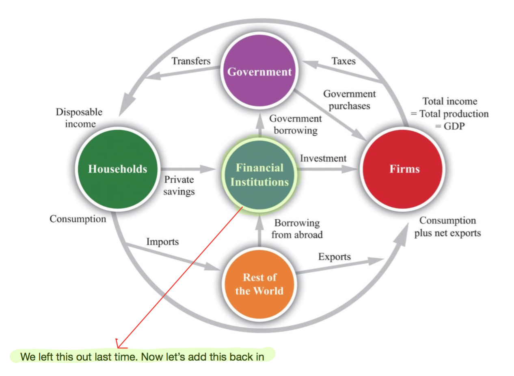
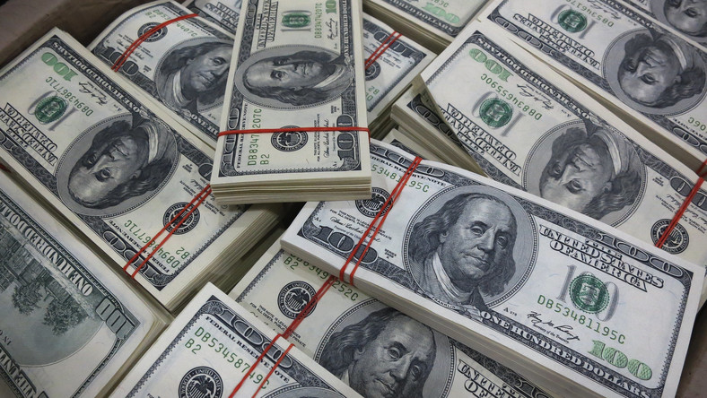
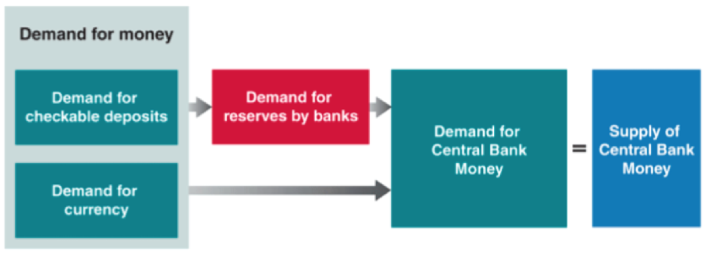
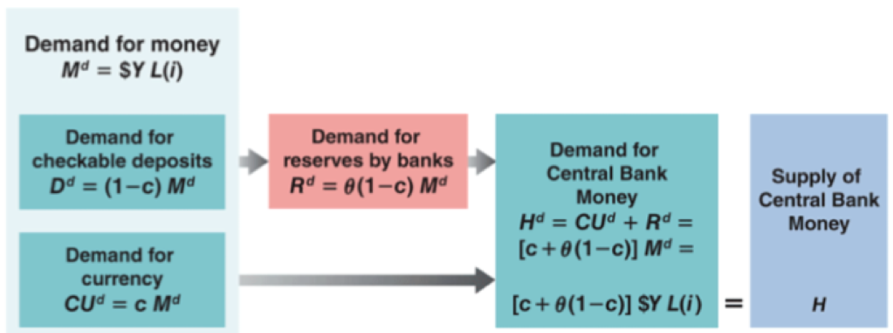
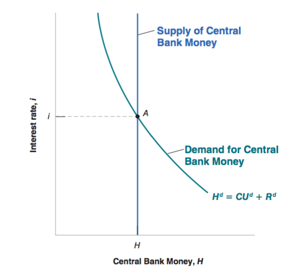
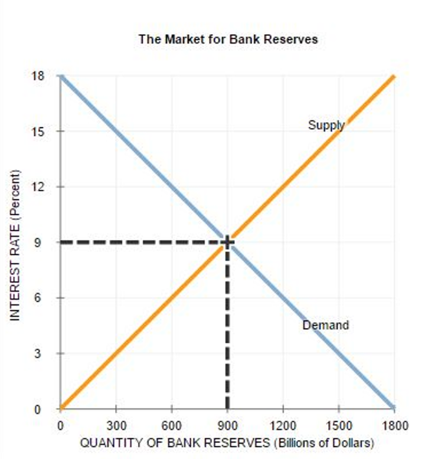
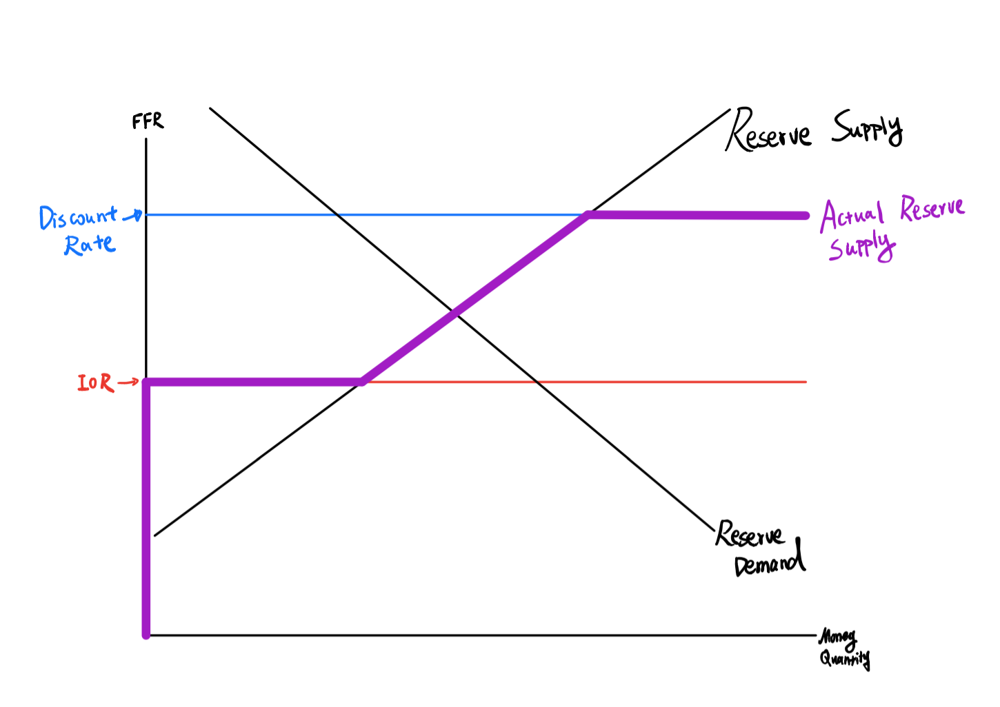
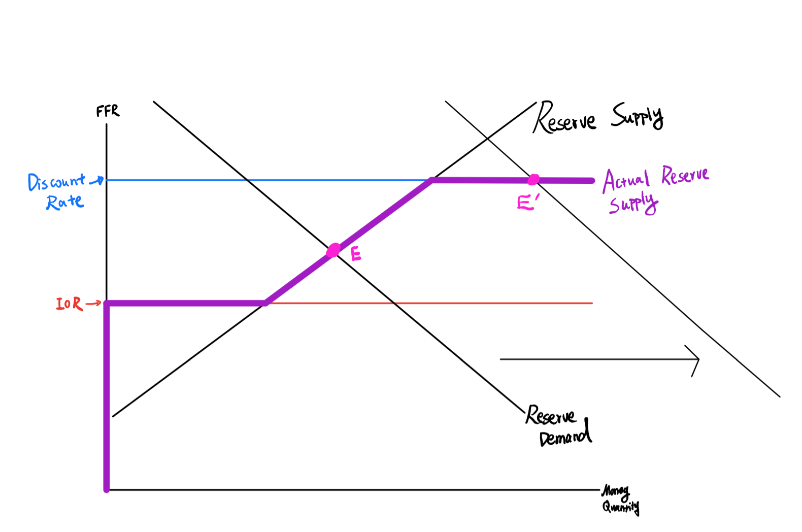

class: inverse, center, middle

```{R, setup, include = F}
options(htmltools.dir.version = FALSE)
library(pacman)
p_load(
  broom, here, tidyverse,
  latex2exp, ggplot2, ggthemes, viridis, extrafont, gridExtra,
  kableExtra,
  dplyr, magrittr, knitr, parallel
)
# Define pink color
red_pink <- "#e64173"
turquoise <- "#20B2AA"
grey_light <- "grey70"
grey_mid <- "grey50"
grey_dark <- "grey20"
# Dark slate grey: #314f4f
# Knitr options
opts_chunk$set(
  comment = "#>",
  fig.align = "center",
  fig.height = 7,
  fig.width = 10.5,
  warning = F,
  message = F
)
opts_chunk$set(dev = "svg")
options(device = function(file, width, height) {
  svg(tempfile(), width = width, height = height)
})
# A blank theme for ggplot
theme_empty <- theme_bw() + theme(
  line = element_blank(),
  rect = element_blank(),
  strip.text = element_blank(),
  axis.text = element_blank(),
  plot.title = element_blank(),
  axis.title = element_blank(),
  plot.margin = structure(c(0, 0, -0.5, -1), unit = "lines", valid.unit = 3L, class = "unit"),
  legend.position = "none"
)
theme_simple <- theme_bw() + theme(
  line = element_blank(),
  panel.grid = element_blank(),
  rect = element_blank(),
  strip.text = element_blank(),
  axis.text.x = element_text(size = 18, family = "STIXGeneral"),
  axis.text.y = element_blank(),
  axis.ticks = element_blank(),
  plot.title = element_blank(),
  axis.title = element_blank(),
  # plot.margin = structure(c(0, 0, -1, -1), unit = "lines", valid.unit = 3L, class = "unit"),
  legend.position = "none"
)
theme_axes_math <- theme_void() + theme(
  text = element_text(family = "MathJax_Math"),
  axis.title = element_text(size = 22),
  axis.title.x = element_text(hjust = .95, margin = margin(0.15, 0, 0, 0, unit = "lines")),
  axis.title.y = element_text(vjust = .95, margin = margin(0, 0.15, 0, 0, unit = "lines")),
  axis.line = element_line(
    color = "grey70",
    size = 0.25,
    arrow = arrow(angle = 30, length = unit(0.15, "inches")
  )),
  plot.margin = structure(c(1, 0, 1, 0), unit = "lines", valid.unit = 3L, class = "unit"),
  legend.position = "none"
)
theme_axes_serif <- theme_void() + theme(
  text = element_text(family = "MathJax_Main"),
  axis.title = element_text(size = 22),
  axis.title.x = element_text(hjust = .95, margin = margin(0.15, 0, 0, 0, unit = "lines")),
  axis.title.y = element_text(vjust = .95, margin = margin(0, 0.15, 0, 0, unit = "lines")),
  axis.line = element_line(
    color = "grey70",
    size = 0.25,
    arrow = arrow(angle = 30, length = unit(0.15, "inches")
  )),
  plot.margin = structure(c(1, 0, 1, 0), unit = "lines", valid.unit = 3L, class = "unit"),
  legend.position = "none"
)
theme_axes <- theme_void() + theme(
  text = element_text(family = "Fira Sans Book"),
  axis.title = element_text(size = 18),
  axis.title.x = element_text(hjust = .95, margin = margin(0.15, 0, 0, 0, unit = "lines")),
  axis.title.y = element_text(vjust = .95, margin = margin(0, 0.15, 0, 0, unit = "lines")),
  axis.line = element_line(
    color = grey_light,
    size = 0.25,
    arrow = arrow(angle = 30, length = unit(0.15, "inches")
  )),
  plot.margin = structure(c(1, 0, 1, 0), unit = "lines", valid.unit = 3L, class = "unit"),
  legend.position = "none"
)
```

# Book Chapter 4

---
class: inverse, middle, center

# Overview

---

# Overview

## Overview

<center>
 
</center>

---

# Overview

## Overview

In the last lecture, we derived the .hi[LM equation], which describes the interest rate at the equilibrium of the money market. 

\begin{align}
M & = $Y * L(i)
\end{align}

However, we made a simplifying assumption - there are __no commercial banks__, which means there is currency but no checkable deposits. 

Also, we talked about the central bank has the power to decide the __money supply__, but we still don't know the mechanism of injecting money into the economy. 

---

# Overview

## Overview

In this lecture, we will go over.

- Adding __Commercial Banks__ in our Money Market Model

- Monetary Policy: __Open Market Operations__

- Monetary Policy: __Reserve Requirement__

- Among Commercial Banks: __Reserve Market__

- Monetary Policy: __Discount Rate__

- Monetary Policy: __Interest On Reserves__

---

class: inverse, center, middle

# Commercial Banks

---

# Commercial Banks

<center>
 
</center>

---

# Commercial Banks

## What Banks Do?

Commercial Banks are the most important __financial intermediaries__ in an economy. A few things to note:

- Commercial Banks __sell__ future money (bonds) of __different liquidity with different interest rate__ to .purple[households]. .hi[Commercial Banks themselves are not the source of the now money]. 

  - Allen has $6000 left in the bank with __0%__ annual interest rate with high liquidity. He is backpacking in Southeast Asia for a year and plans to spend $500 every month.  
  
---

# Commercial Banks

## What Banks Do?

Commercial Banks are the most important __financial intermediaries__ in an economy. A few things to note:

- Commercial Banks __sell__ future money (bonds) of __different liquidity with different interest rate__ to .purple[households]. .hi[Commercial Banks themselves are not the source of the now money]. 

  - Mary has $1 million saved in the bank with __3%__ annual interest rate with low liquidity. According to the contract, she can't use the $1 million for the next 12 months but will receive $1.03 million afterward. 
  
---

# Commercial Banks

## What Banks Do?

Commercial Banks are the most important __financial intermediaries__ in an economy. A few things to note:

- Commercial Banks __buy__ future money (bonds) of __different liquidity with different interest rate__ from .purple[households] and .purple[firms], and .hi[this helps increase consumption and investment in the economy]. 

--

  - Alex needs to buy a __road bike__ for $5000 (__C__), but he doesn't have enough money right now. He took a loan from a local commercial bank to finance his purchase. The loan requires him to pay the bank $500 every month for the next 12 months. 
  
---

# Commercial Banks

## What Banks Do?

Commercial Banks are the most important __financial intermediaries__ in an economy. A few things to note:

- Commercial Banks __buy__ future money (bonds) of __different liquidity with different interest rate__ from .purple[households] and .purple[firms], and .hi[this helps increase consumption and investment in the economy].
  
  - Maria has an excellent business idea, and she wants to borrow some money from the bank to realize the idea. After checking her financial status, the local bank decides to give her $1 million to buy __equipments__ (__I__) to start, and she needs to pay the bank $1.1 million in a year. 
  
---

# Commercial Banks

## Why Banks?

Why do we need these commercial banks as intermediaries? 

Why can't Alex borrow money directly from Allen? 

  - The bank gets to pocket $1000 from this transaction. 
  
--

Why can't Maria borrow money directly from Mary? 

  - The bank gets to pocket $0.07 million from this transaction. (A lot of money!)


---

# Commercial Banks

## Why Banks? 

Why can't Alex borrow money directly from Allen? - The bank gets to pocket $1000 from this transaction. 

--

 - It takes time for them to find each other. 
 
--
  
 - Alex would have to build a few ATM's for Allen, depending on where Allen wants to go in Southeast Asia.
 
--
 
 - Allen needs to do a background check on Alex if he can pay back the money. 
 
--
 
 - Allen needs to pay a lawyer lots of money (more than $1000) to write a very detailed contract.

---

# Commercial Banks

## Why Banks?

Why can't Maria borrow money directly from Mary? - The bank gets to pocket $0.07 million from this transaction. (A lot of money!)

--

  - It takes time for them to find each other. 
  
--

  - Mary has to make sure Maria won't escape with the $1 million!
  
--
  
  - Maria probably needs to borrow against her house, which requires some expensive legal service. 
  
---

# Commercial Banks

## Why Banks?

If there were no commercial banks, Alex wouldn't be able to buy the road bike (at least sooner), and Maria wouldn't be able to realize her business idea. GDP suffers! We will get back to this in a few weeks.   

__Which banks got bailed out in 2008?__

"Lehman Brothers went bankrupt. *Merrill Lynch, AIG, Freddie Mac, Fannie Mae, HBOS, Royal Bank of Scotland, Bradford & Bingley, Fortis, Hypo and Alliance & Leicester* all came within a whisker of doing so and __had to be rescued__"

---

# Commercial Banks

## Reserves

- Each commercial bank wants to lend out as much money (buy future money) as possible

- But each bank also wants to (and also is required to) keep some __cash in their vault__ (.hi[reserves]) to avoid bank run (a Self-fulfilling Prophecy). This is for both precautionary and for regulatory reasons.

<center>
 
</center>

---

# Commercial Banks

## Reserves

How much __reserves__ does a bank need to keep in their vault? 

- Reserves are used for people to __withdraw cash__. 

- People withdraw cash from their __checkable deposits__. 

- If a bank has larger checkable deposits, it needs to prepare more reserves. 

\begin{align}
R^d = \theta D^d
\end{align}

$R^d$ __is the reserves demand from banks__. 

$\theta$ __is the reserve ratio__. 

$D^d$ __is the dollar amount of checkable deposits demand from households__. 


---

# Commercial Banks

## Checkable Deposits

Here is the question, how much checkable deposits are demanded by households $D^d$? 

Recall that .hi[checkable deposits] is just a form of money, and the other form is .hi[currency]. 

--

Also, recall the money demand is $M^D$ - let's assume people hold:

$c$ proportion of their money in currency

$1 - c$ proportion of their money in checkable deposits. 

- The demand for checkable deposits is $D^d = (1 - c) M^d$

- The demand for currency is $CU^d = c M^d$

---

class: inverse, center, middle

# (Central Bank) Money Market 

---

# (Central Bank) Money Market 

## Demand for Central Bank Money

Central Bank Money can be used as 

- currency held by __households__ 

- reserves held by __commercial banks__ in their vaults

<center>
 
</center>

Demand for Central Bank Money: 

$$H^d = CU^d + R^d$$
---

# (Central Bank) Money Market 

## Demand for Central Bank Money

\begin{align}
H^d & = \color{#e64173}{CU^d} + \color{#20B2AA}{R^d}\\
    & = \color{#e64173}{c M^d} + \color{#20B2AA}{\theta D^d}\\
    & = \color{#e64173}{c M^d} + \color{#20B2AA}{\theta (1 - c) M^d}\\
    & = [c + \theta (1 - c)] \color{#6A5ACD}{M^d}\\
    & = [c + \theta (1 - c)] \color{#6A5ACD}{$Y L(i)}\\
\end{align}


---

# (Central Bank) Money Market

## Supply for Central Bank Money

Supply for __Central Bank Money__ is achieved by .hi[Open Market Operations (OMO)] by __the Federal Open Market Committee (FOMC)__. 

- FOMC decides how much __government securities__ they want to sell to or buy in the open market. These government securities are very safe assets. 

--

- When FOMC buys government securities, they inject central bank money into the economy (__Expansionary OMO__). 
--

- When FOMC sells government securities, they take central bank money out of the economy (__Contractionary OMO__).

---

# (Central Bank) Money Market

## Supply for Central Bank Money

Through __OMO__, the Fed can control the .hi[supply of Central Bank Money] $H^S$ in the economy.

- Again, since the model doesn't explain the level of $H^S$, we say it is exogeneous. 

$$H^S = H$$

- __OMO__ is one of the most important tools for the Federal Reserve Bank.  

---

# (Central Bank) Money Market

## Equilibrium

Demand for Central Bank Money = Supply for Central Bank Money

$$H^D = H^S$$

<center>
 
</center>


---

# (Central Bank) Money Market

## Equilibrium

Demand for Central Bank Money = Supply for Central Bank Money

$$H^D = H^S$$

<center>
 
</center>

---

# (Central Bank) Money Market

## Equilibrium

Demand for Central Bank Money = Supply for Central Bank Money
\begin{align}
\color{#e64173}{H^D} & = \color{#20B2AA}{H^S} \\
\color{#e64173}{[c + \theta (1 - c)] $Y L(i)} & = \color{#20B2AA}{H}
\end{align}
Note that $H^D$ is still a decreasing function in $i$, we have the following Equilibrium Graph. $H^S$ is independent from the interest rate $i$. 
<center>
 
</center>

---

# (Central Bank) Money Market

## Connection to the Money Market

Now the Equilibrium for the Central Bank Money Market is as follows.

\begin{align}
[c + \theta (1 - c)] \color{#e64173}{$Y L(i)} & = H
\end{align}

--

Recall the Money Demand is 

\begin{align}
M^D & = \color{#e64173}{$Y L(i)}
\end{align}

--

We have

\begin{align}
[c + \theta (1 - c)] M^D & = H
\end{align}

--

Or

\begin{align}
M^D & = \frac{1}{[c + \theta (1 - c)]}H
\end{align}

---

# (Central Bank) Money Market

## Connection to the Money Market

\begin{align}
\overbrace{M^D}^{\text{Money Demand}} & = \overbrace{\frac{1}{[c + \theta (1 - c)]}H}^{\text{Money Supply}}
\end{align}

In the equilibrium, the money supply is 

$$M^S = \underbrace{\frac{1}{[c + \theta (1 - c)]}}_{\text{Money Multiplier}}H$$
According to this equation, when the central bank increases central bank money (H) by 1 dollar, the actual money supply goes up by $\frac{1}{[c + \theta (1 - c)]}$ dollars. Note that the .hi[money mulitipler] is larger than 1. 

---

# (Central Bank) Money Market

## Monetary Multiplier

To understand monetary multiplier, let's make a simplifying assumption: 

- __households only want to hold checkable deposits and no cash__. 

- That is to say c = 0, and multiplier is $\frac{1}{\theta}$. 

---

# (Central Bank) Money Market

## Monetary Multiplier

- The FOMC buys __1 dollar__ worth of bond in the open market from __Seller 1__.

--

- .hi[Seller 1] doesn't hold cash, so they deposit this $\color{#e64173}{1}$ dollar at .hi.purple[Bank A]. 

- .hi.purple[Bank A] now has $\color{#e64173}{1}$ dollar checkable deposits, so it is required to hold $\theta * \color{#e64173}{1}$ dollars as reserves in the vault and uses the rest of $(1 - \theta) * \color{#e64173}{1}$ dollars to buy bonds from .hi[Seller 2]

--

- .hi[Seller 2] doesn't hold cash, so they deposit this $\color{#e64173}{(1- \theta)}$ dollar at .hi.purple[Bank B].

- .hi.purple[Bank B] now has $\color{#e64173}{(1- \theta)}$ dollar checkable deposits, so it is required to hold $\theta * \color{#e64173}{(1- \theta)}$ dollars as reserves in the vault and uses the rest of $(1 - \theta) * \color{#e64173}{(1- \theta)}$ dollars to buy bonds from .hi[Seller 3]

---

# (Central Bank) Money Market

## Monetary Multiplier

--

- .hi[Seller 3] doesn't hold cash, so they deposit this $\color{#e64173}{(1 - \theta)^2}$ dollar at .hi.purple[Bank C].

- .hi.purple[Bank C] now has $\color{#e64173}{(1 - \theta)^2}$ dollar checkable deposits, so it is required to hold $\theta * \color{#e64173}{(1 - \theta)^2}$ dollars as reserves in the vault and uses the rest of $(1 - \theta) * \color{#e64173}{(1 - \theta)^2}$ dollars to buy bonds from .hi[Seller 4]. 

--

- .hi[Seller 4] doesn't hold cash, so they deposit this $\color{#e64173}{(1- \theta)^3}$ dollar at .hi.purple[Bank D].

- $\cdots$

---

# (Central Bank) Money Market

## Monetary Multiplier

- .hi[Seller 1] holds $\color{#e64173}{1}$ dollar checkable deposits

--

- .hi[Seller 2] holds $\color{#e64173}{(1 - \theta)}$ checkable deposits

--

- .hi[Seller 3] holds $\color{#e64173}{(1 - \theta)^2}$ checkable deposits

--

- .hi[Seller 4] holds $\color{#e64173}{(1 - \theta)^3}$ checkable deposits

--

- $\cdots$


The total money supply (which only contains checkable deposits in this world because $c=0$) is as follows:

$$1 + (1 - \theta) + (1 - \theta)^2 + (1 - \theta)^3 + ... = \frac{1}{1 - (1 - \theta)} = \frac{1}{\theta}$$
---

---

# (Central Bank) Money Market

## Monetary Multiplier

- .hi.purple[Central Bank] bought $\color{#e64173}{1}$ dollar worth of bonds

--

- .hi.purple[Bank A] bought $\color{#e64173}{(1 - \theta)}$ dollar worth of bonds

--

- .hi.purple[Bank B] bought $\color{#e64173}{(1 - \theta)^2}$ dollar worth of bonds

--

- .hi.purple[Bank C] bought $\color{#e64173}{(1 - \theta)^3}$ dollar worth of bonds

--

- $\cdots$

--

Ultimate increase in the money supply is a result of __successive rounds of purchases of bonds__:

- First, the Fed, in its open market operation. 

- and then, the following rounds by commercial banks. (Money Creation)

---

class: inverse, center, middle 

# Federal Funds Market

---

# Federal Funds Market

## Federal Funds Market


Neither __Money Market__ nor __Central Bank Money Market__ physically exists in the United States. These markets are constructed to facilitate the .hi[equilibrium theory] and conduct .hi[equilibrium analysis]. 

--

Although our former analysis still holds, we still should consider the market that actually exists, which is the __Federal Funds Market__.

---

# Federal Funds Market

## Federal Funds Market

Each commercial bank is required to hold a minimum __reserves__, $\theta * D^d$, in their vault. 

--

In the morning, all commercial banks get prepare in their vault:

- __Required reserves__

- __Some extra reserves__ for households to withdraw. 

---

# Federal Funds Market

## Federal Funds Market

However, each bank __can't predict__ exactly how much extra reserves they need for that day.

Some banks have __extra reserves__, and some banks have __insufficient reserves__.

--

All the commercial banks "get together" in a place called .hi[Federal Funds Market]. 

--

Banks with extra reserves __sell the excess reserves__ to the market. 

--

Banks with insufficient reserves __buy reserves__ from the market. 

--

The equilibrium interest rate is called .hi[Federal Funds Rate (FFR)] 

---

# Federal Funds Market

## Equilibrium

The .hi[Federal Funds Market Equilibrium] can be derived from the __Central Bank Money Market Equilibrium__. First recall
\begin{align}
\underbrace{H}_{\text{Central Bank Money Supply}} & = \underbrace{CU^d + R^d}_{\text{Central Bank Money Demand}}\\
\underbrace{H - CU^d}_{\text{Reserves Supply}} & = \underbrace{R^d}_{\text{Reserves Demand}}\\
\underbrace{H - c $Y L(i)}_{\text{Reserves Supply}} & = \underbrace{\theta (1 - c) $Y L(i)}_{\text{Reserves Demand}}\\
\end{align}

--

- Recall $L(i)$ is decreasing in $i$

--

- Left-hand Side: Reserve Supply is increasing in $i$

--

- Right-hand Side: Reserve Demand is decreasing in $i$

---

# Federal Funds Market

## Equilibrium - Example

<center>
 
</center>

--

What happens to __Federal Funds Rate (FFR)__ if the __FOMC__ conducts an __expansionary open market operation__? 

---

# Federal Funds Market

## Discount Rate

The Fed also supplies reserves in the federal funds market.

Commercial Banks can always buy reserves from the Fed through the "__discount window__"

The __discount rate__ refers to the interest rate charged to the commercial banks. 

---

# Federal Funds Market

## Discount Rate

Question: when the market rate is __higher than the discount rate__, who will be the only supply for reserves in the federal funds market? 

Answer: __The Fed__

The Discount Rate is the __upper bound for the FFR__ in the federal funds market, and the Fed has control over the upper bound. 

---

# Federal Funds Market

## Interest Rate on Reserves (IOR)

The Fed pays interests to the reserves commercial banks hold in their vault. This rate is called __Interest Rate on Reserves (IOR)__. 

This sounds a little odd, but doing this gives the Fed the power to set __the lower bound for FFR__. 

Question: when the market rate is __lower than IOR__, will there be any supplies for reserves?

Answer: No

---

# Federal Funds Market

## Upper and Lower Bound

<center>
 
</center>

---

# Federal Funds Market

## Upper and Lower Bound

<center>
 
</center>


---

# Federal Funds Market

## Upper and Lower Bound

<center>
 
</center>


---

exclude = true

```{R, generate pdfs, include = F}
system("decktape remark 05_moneymarket_part2.html 05_moneymarket_part2.pdf --chrome-arg=--allow-file-access-from-files")
```
