class: inverse, center, middle

```{R, setup, include = F}
options(htmltools.dir.version = FALSE)
library(pacman)
p_load(
  broom, here, tidyverse,
  latex2exp, ggplot2, ggthemes, viridis, extrafont, gridExtra,
  kableExtra,
  dplyr, magrittr, knitr, parallel
)
# Define pink color
red_pink <- "#e64173"
turquoise <- "#20B2AA"
grey_light <- "grey70"
grey_mid <- "grey50"
grey_dark <- "grey20"
# Dark slate grey: #314f4f
# Knitr options
opts_chunk$set(
  comment = "#>",
  fig.align = "center",
  fig.height = 7,
  fig.width = 10.5,
  warning = F,
  message = F
)
opts_chunk$set(dev = "svg")
options(device = function(file, width, height) {
  svg(tempfile(), width = width, height = height)
})
# A blank theme for ggplot
theme_empty <- theme_bw() + theme(
  line = element_blank(),
  rect = element_blank(),
  strip.text = element_blank(),
  axis.text = element_blank(),
  plot.title = element_blank(),
  axis.title = element_blank(),
  plot.margin = structure(c(0, 0, -0.5, -1), unit = "lines", valid.unit = 3L, class = "unit"),
  legend.position = "none"
)
theme_simple <- theme_bw() + theme(
  line = element_blank(),
  panel.grid = element_blank(),
  rect = element_blank(),
  strip.text = element_blank(),
  axis.text.x = element_text(size = 18, family = "STIXGeneral"),
  axis.text.y = element_blank(),
  axis.ticks = element_blank(),
  plot.title = element_blank(),
  axis.title = element_blank(),
  # plot.margin = structure(c(0, 0, -1, -1), unit = "lines", valid.unit = 3L, class = "unit"),
  legend.position = "none"
)
theme_axes_math <- theme_void() + theme(
  text = element_text(family = "MathJax_Math"),
  axis.title = element_text(size = 22),
  axis.title.x = element_text(hjust = .95, margin = margin(0.15, 0, 0, 0, unit = "lines")),
  axis.title.y = element_text(vjust = .95, margin = margin(0, 0.15, 0, 0, unit = "lines")),
  axis.line = element_line(
    color = "grey70",
    size = 0.25,
    arrow = arrow(angle = 30, length = unit(0.15, "inches")
  )),
  plot.margin = structure(c(1, 0, 1, 0), unit = "lines", valid.unit = 3L, class = "unit"),
  legend.position = "none"
)
theme_axes_serif <- theme_void() + theme(
  text = element_text(family = "MathJax_Main"),
  axis.title = element_text(size = 22),
  axis.title.x = element_text(hjust = .95, margin = margin(0.15, 0, 0, 0, unit = "lines")),
  axis.title.y = element_text(vjust = .95, margin = margin(0, 0.15, 0, 0, unit = "lines")),
  axis.line = element_line(
    color = "grey70",
    size = 0.25,
    arrow = arrow(angle = 30, length = unit(0.15, "inches")
  )),
  plot.margin = structure(c(1, 0, 1, 0), unit = "lines", valid.unit = 3L, class = "unit"),
  legend.position = "none"
)
theme_axes <- theme_void() + theme(
  text = element_text(family = "Fira Sans Book"),
  axis.title = element_text(size = 18),
  axis.title.x = element_text(hjust = .95, margin = margin(0.15, 0, 0, 0, unit = "lines")),
  axis.title.y = element_text(vjust = .95, margin = margin(0, 0.15, 0, 0, unit = "lines")),
  axis.line = element_line(
    color = grey_light,
    size = 0.25,
    arrow = arrow(angle = 30, length = unit(0.15, "inches")
  )),
  plot.margin = structure(c(1, 0, 1, 0), unit = "lines", valid.unit = 3L, class = "unit"),
  legend.position = "none"
)
```

# Book Chapter 5

---
class: inverse, middle, center

# Overview

---

# Overview

## Overview

In the last four lectures, we studied the __goods market__ and the __money market__:

- Goods Market Equilibrium: 

  - Output (Y) is endogeneous. 
  
  - Interest Rate (i) is exogeneous. 
  
--

- Money Market:

  - Output (Y) is exogeneous.
  
  - Interest Rate (i) is endogeneous

---

# Overview

<center>
 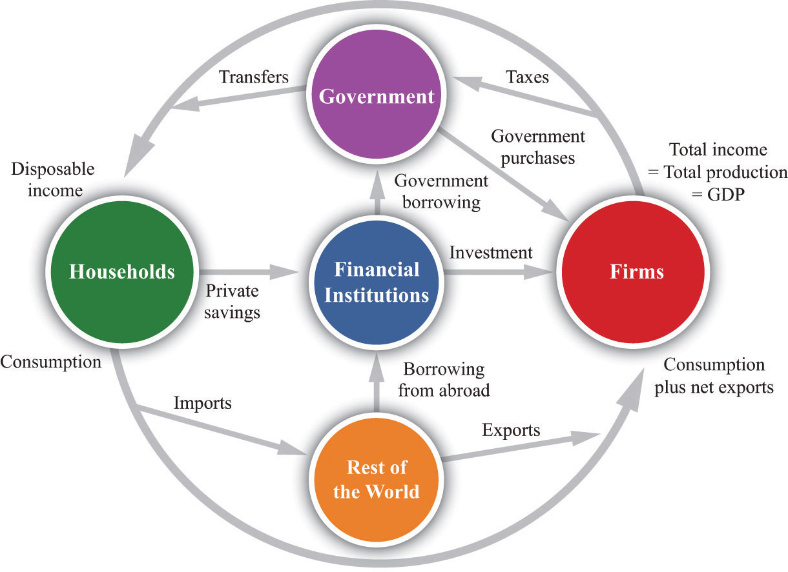
</center>

---

# Overview

## Overview

In the last four lectures, we studied the __goods market__ and the __money market__:

- Goods Market covers: Households, Firms, Government, RoW
  
--

- Money Market includes Financial Intermediaries.  

--

Neither the model of Goods Market nor the model of Money Market gives us __the complete picture of the economy__. 

--

This lecture: __IS-LM model__ combining both Goods Market Model and Money Market Model. 

---

# Overview

## IS-LM Meaning

- IS means __"Investment-Saving"__

- "Investment-Saving" is another way to solve for the __Goods Market Equilibrium__ (Lecture 3)

--

- LM means __"Liquidity Preference–Money Supply"__

- "Liquidity Preference–Money Supply" solves the __Money Market Equilibrium__ (Lecture 4-5)


  
---

# Overview

## Why IS-LM? 

- Both Output (Y) and interest rate (i) are endogenous. 

- The IS-LM model helps us study the __simultaneous determination__ of
output and the interest rate in the short-run equilibrium!

- A __General Equilibrium Model__ that gives us a __relatively realistic description__ of the __behavior of the economy__. 

---

# Overview

## Overview 

Question: What's the time scope IS-LM model falls into? 

- Short Run? 

- Medium Run?

- Long Run? 

---

# Overview

## Overview

__Question__: What's the time scope IS-LM model falls into? 

- .hi[Short Run!]

- ~~Medium Run?~~

- ~~Long Run?~~

--

Because IS-LM is based on Money Market and Goods Market, and __Goods Market is a short-run model__. 

---

# Overview

## Overview

__Question__: What are the variables of interest in the IS-LM model

--

 - Output (Y) and Interest Rate (i)
 
--

## History

Keynes - .mono[General Theory, 1936];

--

Hicks - summarized Keyens' contributions, .mono[1937];

- Joint description of Goods Market and Money Market
  
--

Hansen - extended Hicks Analysis, .mono[1938]. 

---

# Overview

## Overview

The IS-LM model 

- captures much of what happens in the economy in the __short run__

--

- helps us understand the __intuition__

--

- an __essential building block__ for more advanced models

---

class: inverse, middle, center

# The Goods Market: IS Relation

---

# The Goods Market: IS Relation

## Goods Market Review

Recall, Goods Market Equilibrium is given by (consider a closed-economy)

- Demand<sup>.pink[†]</sup>: $Z = f^C(Y - T) + \bar I + G$ 

- Supply: $Y = Z$

.footnote[
.pink[†] The consumption function could be linear but doesn't have to be linear, so here $f^C(Y - T)$ instead of $c_0 + c_1 (Y - T)$ is used. 
]

--

In the .hi[model of Goods Market], Investment ( $\bar I$ ) is exogeneous because we made __an simplifying assumption__ that investment is __independent of the variable of interest, output (Y)__

--

Now in the model of IS-LM, we __relax__ this simplifying assumption. 


---

# The Goods Market: IS Relation

## Investment and Output

Relax this simplifying assumption:

__Question__: Does Investment depend on output (Y)? 

--

- If sales are very high, firms will invest more in the capital.

- In the short run, the level of sales is equal to output Y. 

Conclusion: Investment is __an increasing function__ of output Y!

---

# The Goods Market: IS Relation

## Investment and Interest Rate

In the IS-LM model, there are two variables of interest:

- both __output Y__ and __interest rate i__

We have relaxed the assumption so that __Investment I depends on Y__

--

.hi[Does Investment depend on i?] 

---

# The Goods Market: IS Relation

## Investment and Interest Rate

.hi[Does Investment depend on i?] 

__Question__: If the interest rate (the price firms pay to borrow money) is low, will the firm invest more or less in the capital?

--
  
- Firms will invest more if the cost of borrowing (i) is low!

Conclusion: Investment is a __decreasing function of the interest rate__, i!

---

# The Goods Market: IS Relation

## Investment Function

In our IS-LM model, 

Instead of assuming $I = \bar I$ as in the Goods Market Model,

--

We write $I = f^I(Y, i)$, which means investment $I$ depends on both output $Y$ and interest rate $i$.

--

Also $f^I(\underbrace{Y}_{+}, \underbrace{i}_{-})$ <sup>.pink[†]</sup>, which means $f^I$ increases in $Y$ and decreases in $i$. 

.footnote[
.pink[†] Note $f^I(Y, i)$ could be but doesn't have to be a linear function. 
]
---

# The Goods Market: IS Relation

## Consumption Function

From Goods Market Model, we already know consumption depends on $Y$:  $C = f^C(Y - T)$

Does consumption also depend on the interest rate, $i$? 

When __interest rate $i$ is higher__, households __save more and consume less__ to earn more interest in the future. 

$C = f^C(\underbrace{Y - T}_{+}, \underbrace{i}_{-})$ which means consumption increases in disposable income $(Y - T)$ and decreases in interest rate $i$. 

---

# The Goods Market: IS Relation

## Derive the IS Curve - Graphically

As mentioned at the beginning, the IS Curve is derived from __the Goods Market Equilibrium__. 

Let's solve for the Goods Market Equilibrium again, but this time, with the modified consumption function and investment function. 

Goods Demand: $Z = f^C(Y - T, i) + f^I(Y, i) + G$

Goods Supply: $Y = Z$

---

# The Goods Market: IS Relation

## Derive the IS Curve - Graphically

__Two regularity assumptions__: 

- In Goods Market Model, the intercept of Z, $c_0$ is larger than 0. 

- In the IS-LM Model, Z is larger than 0 when Y is 0. 

--

- In Goods Market Model, the slope of Z, $c_1$, is between 0 and 1. 

- In the IS-LM model, the slope of Z at a given point is less than 1. 


---

# The Goods Market: IS Relation

## Derive the IS Curve - Graphically

Goods Demand: $Z = f^C(Y - T, i) + f^I(Y, i) + G$

Goods Supply: $Y = Z$

<center>
 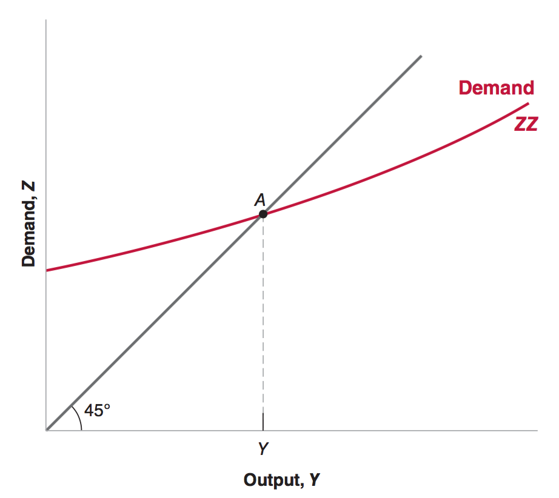
</center>

---

# The Goods Market: IS Relation

## Derive the IS Curve - Graphically

__Recall__: the demand curve (Z) is drawn for some fixed interest rate.

- There are infinitely many demand curves we could have drawn, __each
corresponding to a different interest rate__.

- Our goal is to derive the IS curve, which is a relationship between the interest rate and output implied by the Goods Market Equilibrium.

--

__What should we do?__

- We can draw the effect of increasing or decreasing the interest rate on goods market equilibrium output, and then map these changes to their own curve!

---

# The Goods Market: IS Relation

## Derive the IS Curve - Graphically

<center>
 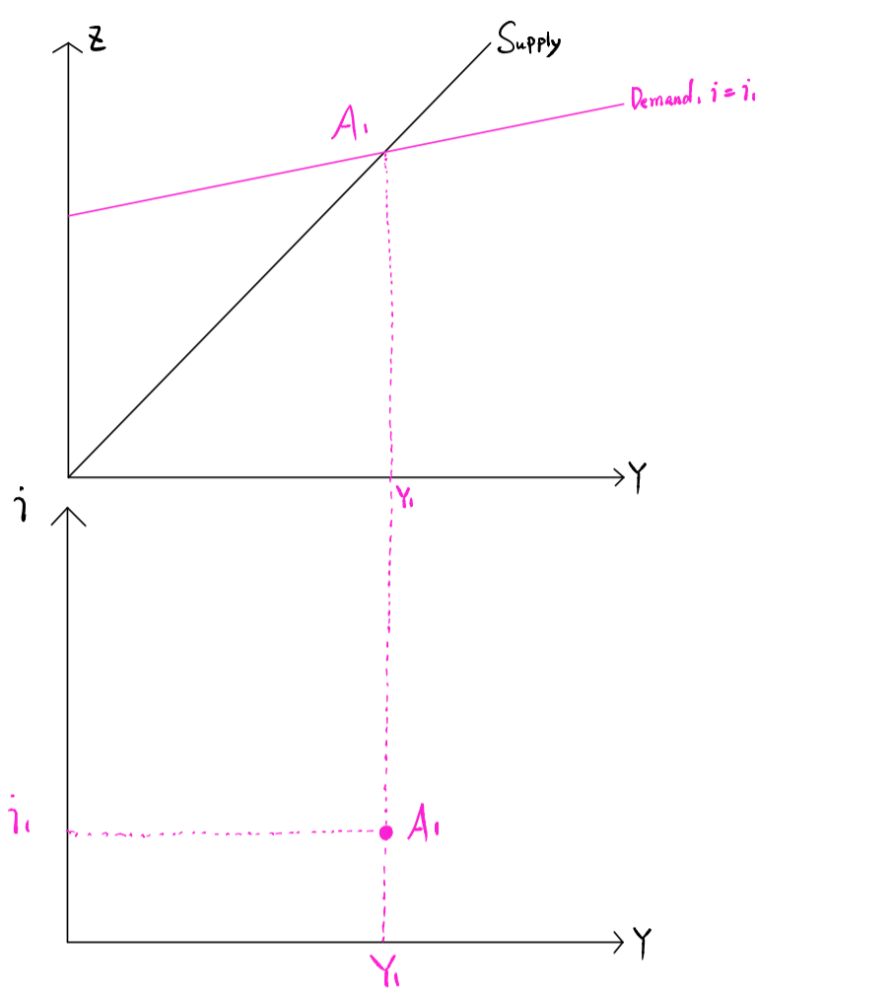
</center>

---

# The Goods Market: IS Relation

## Derive the IS Curve - Graphically

<center>
 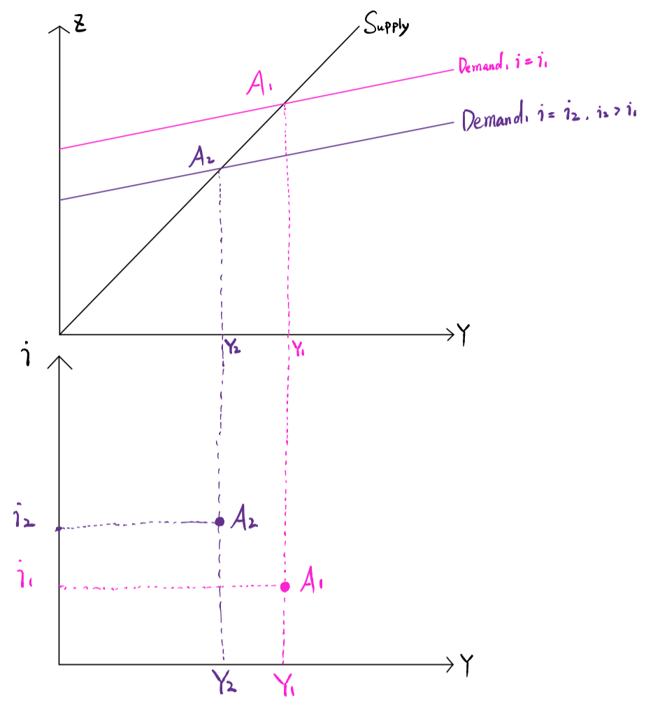
</center>

---

# The Goods Market: IS Relation

## Derive the IS Curve - Graphically

<center>
 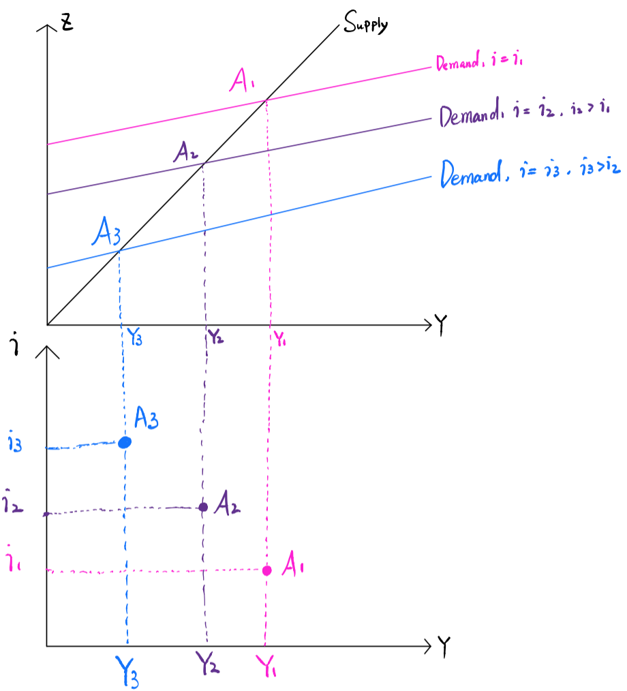
</center>

---

# The Goods Market: IS Relation

## Derive the IS Curve - Graphically

<center>
 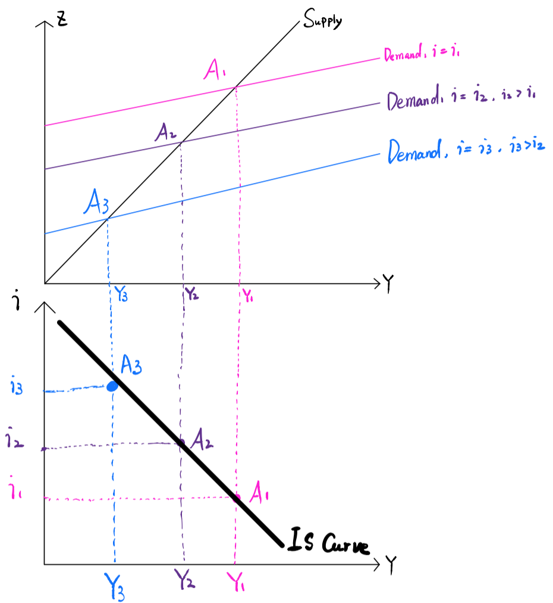
</center>

---

# The Goods Market: IS Relation

## Derive the IS Curve - Graphically

<center>
 
</center>

.hi[Every point on the IS curve represents an equilibrium in the Goods Market].

---

# The Goods Market: IS Relation

## Shift of IS Curve

We have just seen that the IS curve can be derived by varying $i$ and graphing the corresponding change in equilibrium $Y$ . This was all done for some fixed values of $T$ and $G$.

__Q__: What if $T$ or $G$ change?

__A__: The IS curve __Shifts__!

- For a fixed level of $i$, if $T$ increases, from Goods Market Equilibrium, $Y$ decreases. Thus, the IS curve __Shifts__ Left!.

- For a fixed level of $i$, if $G$ increases, from Goods Market Equilibrium, $Y$ increases. Thus, the IS curve __Shifts__ Right!.

---

# The Goods Market: IS Relation

## Shift of IS Curve

- Any factor change (except for $i$ or $Y$) that decreases equilibrium Y in the goods market will __Shift__ the IS curve left.

- Any factor change (except for $i$ or $Y$) that increases equilibrium Y in the goods market will __Shift__ the IS curve right.

__Question__: Suppose consumer confidence increases, and households would consume more even if they had no disposable income. Would the iS curve shift left or right? 

---

# The Goods Market: IS Relation

## IS Curve Recap

- The IS curve is the relationship between interest rates and output in the goods market.

- The IS curve shows the value of equilibrium output associated with ANY possible interest rate.

- Every point on the IS curve represents an equilibrium in the Goods Market.

- Changes in $i$ and $Y$ represent movements along the IS curve.

- Changes in $G$ and $T$ represent shifts in the IS curve.

---

class: inverse, middle, center

# The Money Market: LM Relation

---

# The Money Market: LM Relation

## Money Market Equilibrium

Recall, Money Market Equilibrium is given by .pink[†]

- Demand: 

$$M^D = $Y L(i)$$

- Supply:

$$M^S = M$$
---

# The Money Market: LM Relation

## Money Market Equilibrium

- Equilibrium:


$$M = $Y L(i) $$

- The IS curve relates the interest rate to __real income__, .hi[Y] . __But__ the money market relates the interest rate to __nomial income__, .hi[$Y]. What should we do?

.footnote[
.pink[†] This Money Market Equilibrium comes from lecture 4 without financial intermediaries.
]

---

# The Money Market: LM Relation

## GDP Deflator

Definition: The GDP deflator is given by 
\begin{align}
P = \frac{$Y}{Y}
\end{align}
or 
\begin{align}
\color{#e64173}{\underbrace{$Y}_{Nominal GDP} = \underbrace{Y}_{RealGDP} * \underbrace{P}_{GDP Deflator}}
\end{align}

---

# The Money Market: LM Relation

## Derive LM Relation - Math

We can rewrite Money Market Equilibrium as:
\begin{align}
M & = \color{#e64173}{$Y} L(i) \\
M & = \color{#e64173}{Y * P} L(i) \\
\frac{M}{P} & = Y L(i)
\end{align}

where $\frac{M}{P}$ is called the real money supply. 

---

# The Money Market: LM Relation

## Derive LM Relation - Math

The following equation gives the LM relation:

\begin{align}
\frac{M}{P} = Y L(i)
\end{align}

Recall that $L(i)$ is a decreasing function in $i$. Suppose $M$ and $P$ are held fixed and increase $Y$

- The left-hand side is fixed

- The right-hand side:  Y increases. To make the right-hand side fixed, $L(i)$ has to decrease, which means $i$ has to increase. 

Conclusion (LM Relation): 

According to Money Market Equilibrium, $i$ increases as $Y$ increases.

---

# The Money Market: LM Relation

## Derive LM Relation - Graphically

Real Money Demand
\begin{align}
M^D = Y L(i)
\end{align}

Real Money Supply
\begin{align}
M^S = \frac{M}{P}
\end{align}

---

# The Money Market: LM Relation

## Derive LM Relation - Graphically

__Recall__: the real demand curve $M^D$ is drawn for some fixed output $Y$.

- There are infinitely many real demand curves we could have drawn, __each
corresponding to a different output__.

- Our goal is to derive the LM curve, which is a relationship between the interest rate and output implied by the Money Market Equilibrium.

--

__What should we do?__

- We can draw the effect of increasing or decreasing the output $Y$ on money market equilibrium output, and then map these changes to their own curve!

---

# The Money Market: LM Relation

## Derive LM Relation - Graphically

<center>
 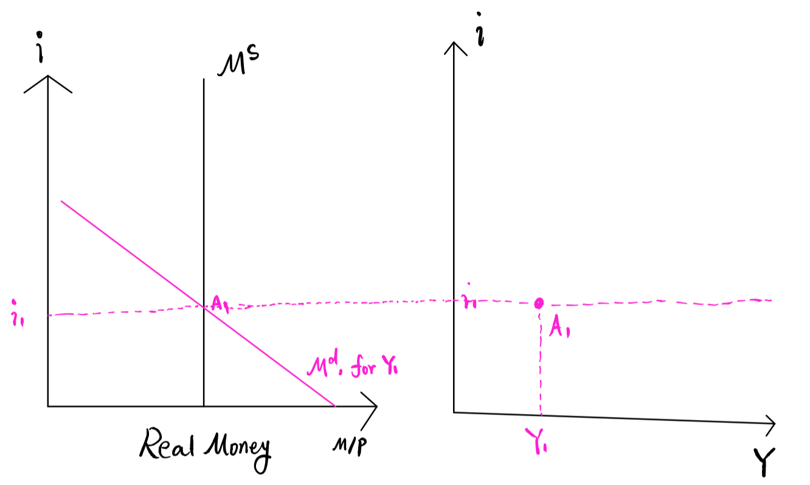
</center>


---

# The Money Market: LM Relation

## Derive LM Relation - Graphically

<center>
 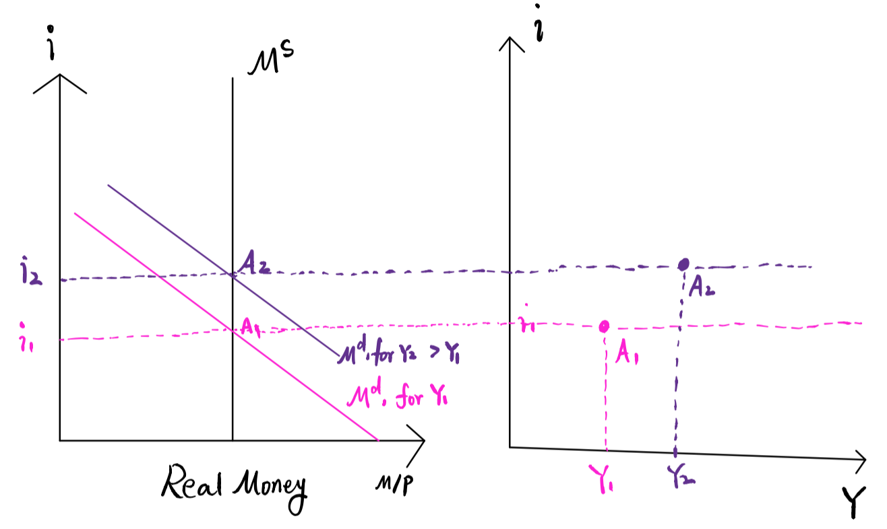
</center>

---

# The Money Market: LM Relation

## Derive LM Relation - Graphically

<center>
 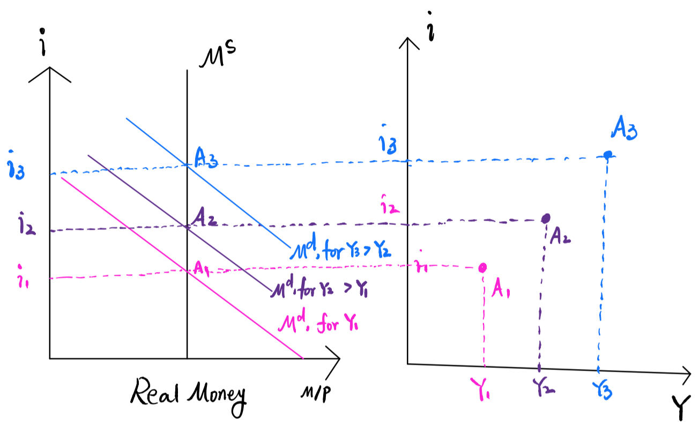
</center>

---

# The Money Market: LM Relation

## Derive LM Relation - Graphically

<center>
 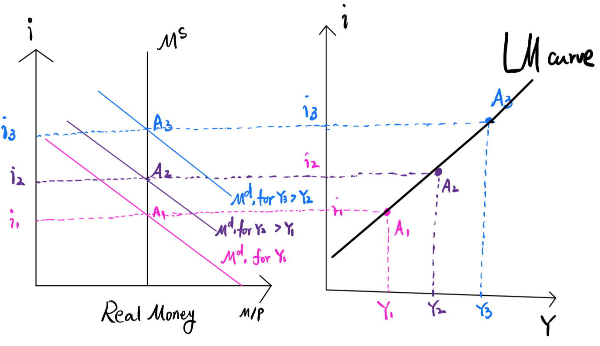
</center>

---

# The Money Market: LM Relation

## Derive LM Relation - Graphically

<center>
 
</center>

.hi[Every point on the LM curve represents an equilibrium in the Money Market].

---

# The Money Market: LM Relation

## Shift of LM Curve

We have just seen that the LM curve can be derived by varying $Y$ and graphing the corresponding change in equilibrium $i$ . This was all done for some fixed values of $M$ and $P$.

__Q__: What if $M$, or $P$ change?

__A__: The LM curve __Shifts__!

- For a fixed level of $Y$, if $M$ increases, from Money Market Equilibrium, $i$ decreases. Thus, the IS curve __Shifts__ Down!.

- For a fixed level of $i$, if $P$ increases, from Goods Market Equilibrium, $i$ increases. Thus, the IS curve __Shifts__ Up!.

---

# The Money Market: LM Relation

## Shift of LM Curve

<center>
 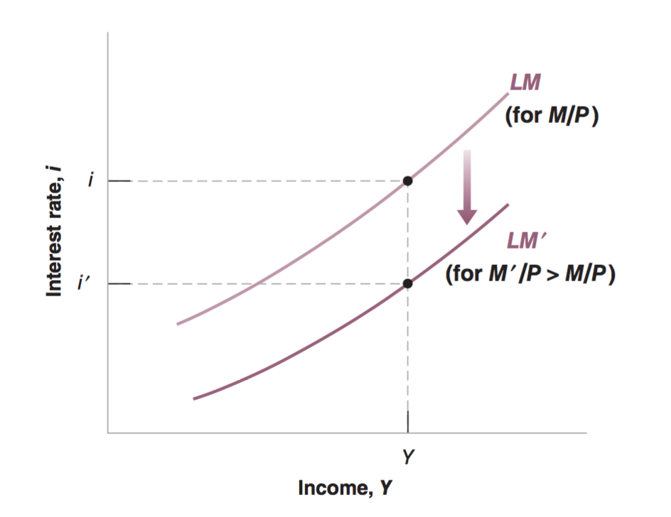
</center>


